<div align="center">
  
</div>

# K-Term Emulation Library v2.6.15
(c) 2026 Jacques Morel

For a comprehensive guide, please refer to [doc/kterm.md](doc/kterm.md).

<details>
<summary>Table of Contents</summary>

1.  [Description](#description)
2.  [Key Features](#key-features)
3.  [How It Works](#how-it-works)
    1.  [3.1. Main Loop and Initialization](#31-main-loop-and-initialization)
    2.  [3.2. Input Pipeline and Character Processing](#32-input-pipeline-and-character-processing)
    3.  [3.3. Escape Sequence Parsing](#33-escape-sequence-parsing)
    4.  [3.4. Keyboard and Mouse Handling](#34-keyboard-and-mouse-handling)
    5.  [3.5. GPU Rendering Pipeline](#35-gpu-rendering-pipeline)
    6.  [3.6. Callbacks](#36-callbacks)
4.  [How to Use](#how-to-use)
    1.  [4.1. Basic Setup](#41-basic-setup)
    2.  [4.2. Sending Data to the KTerm (Simulating Host Output)](#42-sending-data-to-the-terminal-simulating-host-output)
    3.  [4.3. Receiving Responses and Key Events from the Terminal](#43-receiving-responses-and-key-events-from-the-terminal)
    4.  [4.4. Configuring KTerm Behavior](#44-configuring-terminal-behavior)
    5.  [4.5. Advanced Features](#45-advanced-features)
    6.  [4.6. Window and Title Management](#46-window-and-title-management)
    7.  [4.7. Diagnostics and Testing](#47-diagnostics-and-testing)
    8.  [4.8. Scripting API](#48-scripting-api)
    9.  [4.9. Post-Flush Grid Access](#49-post-flush-grid-access)
5.  [Configuration Constants](#configuration-constants)
6.  [Key Data Structures](#key-data-structures)
7.  [Implementation Model](#implementation-model)
8.  [Dependencies](#dependencies)
9.  [License](#license)

</details>

## Quick Start

To build the included examples (Telnet Client, SSH Client, Server) using the provided Makefile:

```bash
make
```

> **Note:** This requires `libsituation` and standard build tools (`gcc`).
> - **`telnet_client`**: A full graphical Telnet client.
> - **`ssh_client`**: A reference SSH client (see crypto warning below).
> - **`net_server`**: A simple Telnet/TCP server.

## Description

**K-Term** (`kterm.h`) is a production-ready, single-header C library delivering the most comprehensive and faithful terminal emulation available today — spanning the full DEC lineage from VT52 to VT525, classic xterm behavior, and cutting-edge modern extensions.

With museum-grade legacy compliance, full Kitty graphics protocol support (animations, transparency, z-index layering, pane clipping), recursive arbitrary pane multiplexing (tmux-style tree layouts with dynamic splits and compositing), GPU-accelerated ReGIS/Tektronix/Sixel graphics, rich styling (curly/dotted/dashed underlines, colored underline/strikethrough, attribute stacking), independent blink rates, and authentic CRT effects (phosphor glow, scanlines, curvature), K-Term is unmatched for both historical accuracy and modern capability.

Designed for seamless embedding in embedded systems, development tools, IDE plugins, remote access clients, retro emulators, and GPU-accelerated applications, it leverages the **Situation** framework for cross-platform hardware-accelerated rendering and input while providing a thread-safe, lock-free architecture for massive throughput.

For a detailed compliance review, see [doc/DEC_COMPLIANCE_REVIEW.md](doc/DEC_COMPLIANCE_REVIEW.md).

**New in v2.6.0: Networking & Production Readiness**
This release consolidates the massive networking improvements introduced throughout the v2.5.x cycle, delivering a full-featured, non-blocking networking stack for building robust remote clients and servers. It finalizes the SSH/Telnet integration and introduces configuration controls for embedded use.

*   **Networking Core (`kt_net.h`):**
    *   **Async Architecture:** A completely non-blocking I/O state machine with event callbacks (`on_connect`, `on_data`, `on_error`) prevents UI freezes.
    *   **Client & Server:** Support for both initiating connections and listening for incoming TCP/Telnet clients (`KTerm_Net_Listen`) with authentication hooks.
    *   **Resilience:** Built-in Keep-Alive configuration, connection timeouts, automatic retries, and detailed status diagnostics (`KTerm_Net_GetStatus`).
    *   **Configuration:** New macros `KTERM_DISABLE_NET` and `KTERM_DISABLE_TELNET` allow stripping networking features for minimal or secure builds.

*   **Protocols & Security:**
    *   **SSH Integration:** A "Bring Your Own Crypto" architecture using `KTermNetSecurity` hooks. Includes a production-ready reference client (`ssh_client.c`) with a full RFC 4253 binary packet framer and RFC 4252 Authentication state machine (Public Key & Password).
    *   **Telnet Stack:** Full RFC 854 Telnet protocol support with an internal state machine for Option Negotiation (DO/DONT/WILL/WONT) and Subnegotiation (SB).
    *   **Sodium Example:** Added `example/ssh_sodium.c` demonstrating integration with `libsodium` (Curve25519/ChaCha20-Poly1305).

*   **Gateway & Session Routing:**
    *   **Session Multiplexing:** Network streams can be dynamically routed to specific local panes via the `ATTACH` command (`EXT;net;attach;SESSION=n`), enabling complex multi-session remote layouts.
    *   **Remote Control:** Full control via Gateway commands (`connect`, `disconnect`, `ping`, `myip`), with hardened parsing for IPv6 and complex credentials.

*   **Examples & Tools:**
    *   **Graphical Clients:** Upgraded `telnet_client.c` and `ssh_client.c` to fully graphical applications with window resizing, CRT effects, and status overlays.
    *   **Net Server:** Functional Telnet server example (`net_server.c`) with shell integration.

**New in v2.5.0: Feature Consolidation & Stabilization**
This major release consolidates the extensive feature set introduced throughout the v2.4.x development cycle, delivering a production-ready, high-performance terminal emulation engine. It marks the complete integration with the Situation framework and finalizes the advanced Gateway Grid system.

*   **Situation Integration:**
    *   **Backend Integration:** Seamless integration with the Situation framework for cross-platform windowing, input handling, and hardware-accelerated rendering.
    *   **Compute Pipeline:** A fully operational compute-shader-based rendering pipeline (SSBO) supporting text, Sixel, and vector graphics with advanced CRT effects.
    *   **Device Address Support:** Buffer device address support for shader access to terminal state.
    *   **Multi-Threaded Safety:** Atomic state management prevents initialization deadlocks.

*   **Advanced Grid Operations:**
    *   **Streaming:** Added `EXT;grid;stream` Gateway command for high-performance bulk binary updates (Base64), ideal for AI overlays or dynamic UIs.
    *   **Direct Manipulation:** GPU-side `copy`, `move`, and masked `fill` subcommands for efficient rectangular blit operations.
    *   **Shape Primitives:** Expanded `grid` extension with `fill_circle`, `fill_line` (directional spans), and `banner` (direct text plotting) subcommands.
    *   **Flexible Coordinates:** Support for relative coordinates (`x=+5`) and negative dimensions for mirroring/reversing direction.
    *   **Forms Mode:** Enhanced cursor navigation (`SKIP_PROTECT`) and focus management (`HOME_MODE`) for robust form building.

*   **Unified Input Pipeline:**
    *   **Architecture:** Replaced legacy input handling with a dynamic, lock-free Single-Producer Single-Consumer (SPSC) queue for high throughput and backpressure monitoring.
    *   **Direct Input:** `KTERM_MODE_DIRECT_INPUT` allows local editing without escape sequence round-trips.
    *   **Debugging:** `RAWDUMP` extension mirrors raw input bytes for inspection.
    *   **Key Translation:** Centralized `KTerm_TranslateKey` logic ensures consistent behavior across all input sources.

*   **Gateway Protocol Enhancements:**
    *   **Session Targeting:** Commands can now target specific sessions (`SET;SESSION`) regardless of the parsing source.
    *   **Flexible Params:** Support for optional/empty parameters and named attributes (`PROTECTED|BOLD`).
    *   **Modes:** Stencil Mode (masking CH) and Design Mode (bypassing PROTECTED) for advanced grid manipulation.

*   **Graphics & Visuals:**
    *   **Kitty Protocol:** Full support for the Kitty Graphics Protocol, including animations, compositing, z-index layering, and transparency.
    *   **Vector Graphics:** GPU-accelerated Sixel and ReGIS implementations with per-session isolation to prevent state bleeding.
    *   **Shader Effects:** Simulation of **Bold** (smear), **Italic** (skew), and authentic CRT effects (scanlines, curvature, glow).

*   **Safety & Stability:**
    *   **Mandatory Op Queue:** All grid mutations are unconditionally batched via `KTermOpQueue` for thread safety.
    *   **Sanitizer Compliance:** Codebase verified clean under AddressSanitizer (ASan) and Valgrind.
    *   **Fuzzing:** Continuous regression fuzzing infrastructure and hardened parser logic (signed params, safe allocations).

**v2.4.0 Core Advancement: Mandatory Op Queue Decoupling**
All grid mutations are batched atomically via a lock-free queue — direct writes have been eliminated for absolute thread-safety and efficiency. The post-flush grid is pure and directly addressable, ready for external simulation layers, bytecode hooks, or custom extensions.

**New in v2.4.0:** Major Architecture Overhaul, Safety Hardening, and Feature Consolidation.
This release represents the culmination of the decoupling architecture, delivering a fully thread-safe and robust engine.

*   **Mandatory Op Queue:** All mutations (text, scroll, rect ops, vertical ops, resize) are unconditionally queued via `KTermOpQueue`. This atomic batching ensures thread safety and removes all direct mutation paths.
*   **Grid Post-Flush Purity:** The cells array is guaranteed to be consistent and addressable after `KTerm_Update` (flush), allowing for safe external logic (simulation, bytecode, extensions) to read/write the grid.
*   **JIT Text Shaping:** Dynamic grouping of characters (e.g., base + combining marks) for correct rendering without complex grid storage.
*   **Sink Output Pattern:** Zero-copy, high-throughput data output via `KTerm_SetOutputSink`.
*   **Layout Engine:** Multiplexer logic decoupled into `kt_layout.h`, separating geometry management from the emulation core.
*   **Security & Stability:** Hardened parser using `StreamScanner`, memory safety wrappers, and structured error reporting.

*   **DEC Compliance & Emulation:**
    *   **Full VT500/VT525 Support:** Implemented esoteric features (DECRQTSR, DECRQUPSS, DECARR, DECRQDE), Soft Fonts (DECDLD), and Rectangular Operations (DECCRA, DECFRA, etc.).
    *   **Protected Cells:** Full support for DECSCA protected attributes in all destructive operations.
    *   **Unicode:** Opt-in `enable_wide_chars` mode with correct `wcwidth` logic for CJK and emoji.
    *   **Enhanced Modes:** Added support for Column Mode (DECCOLM), Page Mode, Sixel Display Mode, and Infinite Scrollback.

*   **Gateway Protocol & Visuals:**
    *   **Protocol Expansion:** Added commands for dynamic resizing (`SET;WIDTH`), session targeting (`SET;SESSION`), banners, and pipes.
    *   **Graphics:** Enhanced Sixel, ReGIS, and Kitty protocol support with robust reset mechanisms and session routing.
    *   **Styling:** Added SGR 51 (Framed), 52 (Encircled), curly/dotted underlines, and extended True Color support.

**v2.3 Major Update:** This release consolidates the extensive stability, thread-safety, and compliance improvements.

*   **Thread Safety & Architecture:**
    *   **Robust Locking:** Implemented Phase 3 Coarse-Grained Locking with `pthread` mutexes for `KTerm` and `KTermSession`, fixing race conditions in `KTerm_Resize` and `KTerm_Update`.
    *   **Lock-Free Input:** Converted the input pipeline to a lock-free Single-Producer Single-Consumer (SPSC) queue using C11 atomics (Phase 2), supporting high-throughput injection.
    *   **Session Isolation:** Decoupled background session processing from the global `active_session` state and refactored internal update logic for thread safety.
    *   **Memory Safety:** Added robust OOM checks during initialization and resizing.
    *   **Optimization:** Refactored character attributes to use bit flags (`uint32_t`), reducing memory footprint per cell.

*   **DEC Compliance & Emulation:**
    *   **Printing:** Implemented DEC Print Form Feed (DECPFF) and Printer Extent (DECPEX) modes.
    *   **Geometry:** Implemented Allow 80/132 Column Mode (Mode 40), DECCOLM (Mode 3) resizing, Left/Right Margins (DECLRMM), and No Clear on Switch (DECNCSM).
    *   **Sixel:** Added Sixel Display Mode (DECSDM) and Sixel Cursor Mode (Private Mode 8452).
    *   **Input/Editing:** Implemented Backarrow Key Mode (DECBKM), Extended Edit Mode (DECEDM), DEC Locator Enable (DECELR), and Numeric Keypad Mode (DECNKM).
    *   **Legacy:** Added ANSI/VT52 Mode Switching (DECANM) and IBM DOS ANSI Mode (ANSI.SYS emulation).
    *   **State:** Implemented Alt Screen Cursor Save Mode (Mode 1041) and fixed Tab Stop logic with dynamic allocation.

*   **Visuals, Graphics & Typography:**
    *   **Rich Styling:** Added support for Curly, Dotted, and Dashed underlines (SGR 4:x), plus extended colors for Underline and Strikethrough (SGR 58).
    *   **Attribute Stack:** Implemented `XTPUSHSGR`/`XTPOPSGR` to push/pop attributes.
    *   **Fonts:** Added `KTermFontMetric` for precise per-font ink bounds, OSC 50 font loading, and automatic glyph centering.
    *   **Blink:** Implemented independent Fast, Slow, and Background blink flavors.
    *   **Vector Graphics:** Fixed aspect ratio scaling for ReGIS vectors.

*   **Multiplexer & Session Management:**
    *   **Pane Management:** Implemented correct pane closure logic (`KTerm_ClosePane`) with tree pruning, and added `Ctrl+B x` keybinding.
    *   **Split Screen:** Corrected initialization visibility for split panes.
    *   **Performance:** Optimized resize operations to only copy populated history rows.

*   **Gateway Protocol & API:**
    *   **Modular Architecture:** The Gateway Protocol logic has been extracted to a separate `kt_gateway.h` module (Phase 1-3 completion). This reduces core complexity and allows the feature to be fully disabled via `KTERM_DISABLE_GATEWAY` for minimal builds.
    *   **Banners:** Added `PIPE;BANNER` command to generate ASCII-art banners with gradients, alignment, and font selection.
    *   **Configuration:** Added `SET;ATTR` (runtime attributes), `SET;GRID` (debug grid), `SET;CONCEAL`, `SET;OUTPUT`, and `GET;OUTPUT`.
    *   **Controls:** Added `SET`/`RESET` commands for global attributes and blink rates.
    *   **API:** Introduced `auto_process` mode for manual input handling and `KTerm_SetResponseEnabled`.

**v2.2.0 Major Update:** This release marks a significant milestone, delivering the complete **Multiplexer & Graphics Update**, consolidating all features developed throughout the v2.1.x cycle.
*   **Multiplexer & Compositor:**
    *   **Recursive Pane Layout:** Full support for arbitrary split-screen layouts using a recursive `KTermPane` tree structure.
    *   **Dynamic Resizing:** Robust resizing logic with `SessionResizeCallback` integration.
    *   **Compositor Engine:** Optimized recursive rendering pipeline with persistent scratch buffers and transparency support for background layering.
    *   **Session Management:** Support for up to 4 independent sessions (VT525 standard) with `Ctrl+B` keybindings for splitting (`%`, `"`), and navigation (`o`, `n`).
*   **Kitty Graphics Protocol:**
    *   **Full Implementation:** Complete support for the protocol, including chunked transmission (`m=1`), placement (`a=p`), and deletion (`a=d`).
    *   **Animation:** Automatic animation of multi-frame images (`a=f`) with frame delay handling.
    *   **Z-Index & Composition:** Proper layering with `z<0` (behind text) and `z>=0` (above text) support, including correct transparency handling.
    *   **Integration:** Features scrolling images, clipping to split panes, and intelligent default placement.
*   **Graphics & Rendering Improvements:**
    *   **ReGIS Resolution Independence:** The graphics engine now supports the ReGIS `S` (Screen) command with `E` (Erase) and `A` (Addressing) options for flexible logical coordinate systems.
    *   **Sixel Improvements:** Added HLS color support.
    *   **Correctness:** Improved string terminator logic for OSC/DCS/APC sequences and accurate CP437 mapping for the default font.
*   **Production Ready:** This release consolidates all Phase 1-4 features into a stable, high-performance terminal emulation solution.

**v2.1.0 Major Update:** This release focuses on **Architecture Decoupling** and **Visual Accuracy**, consolidating features that were incrementally released during the v2.0.x cycle.
*   **Architectural Decoupling:** The library has been significantly refactored to separate concerns, enabling easier porting.
    *   **Input Decoupling:** Input handling is now isolated in `kt_io_sit.h` with a hardened `KTermEvent` system, allowing the core logic to be window-system agnostic.
    *   **Render Decoupling:** Rendering logic now relies on the `kt_render_sit.h` abstraction layer, removing direct dependencies on the Situation library from the core header.
*   **Museum-Grade Visuals:** The default font has been updated to an authentic DEC VT220 8x10 font with precise G0/G1 charset mapping and Special Graphics character support for pixel-perfect historical accuracy.
*   **Enhanced Flexibility:** Support for flexible window resizing and restored printer controller functionality.

The library implements a complete set of historical and modern terminal standards, ensuring compatibility with **VT52, VT100, VT220, VT320, VT340, VT420, VT510, VT520, VT525, and xterm**.

Beyond standard text emulation, `kterm.h` features a **GPU-accelerated rendering pipeline** using Compute Shaders, enabling advanced visual capabilities such as:
*   **Vector Graphics:** Full support for Tektronix 4010/4014 and ReGIS (Remote Graphics Instruction Set).
*   **Raster Graphics:** Sixel bitmap graphics.
*   **Modern Visuals:** True Color (24-bit) support, dynamic Unicode glyph caching, and retro CRT effects.
*   **Multi-Session Management:** Simultaneous support for independent sessions (up to 4, depending on VT level) with split-screen compositing.

The library processes a stream of input characters (typically from a host application or PTY) and updates an internal screen buffer. This buffer, representing the terminal display, is then rendered to the screen via the GPU. It handles a wide range of escape sequences to control cursor movement, text attributes, colors, screen clearing, scrolling, and various terminal modes.

## Key Features

-   **Mandatory Op Queue Decoupling:** Atomic batching for all mutations — thread-safe, efficient, and robust.
-   **Post-Flush Grid Access:** Direct, safe poking for custom logic after the update cycle.
-   **Compute Shader Rendering:** High-performance SSBO-based text rendering pipeline.
-   **Multi-Session Support:** Independent terminal sessions (up to 4) with split-screen compositing and dynamic pane layouts (tmux-style).
-   **Gateway Protocol:** Runtime introspection and configuration via `DCS GATE` sequences (hardened in v2.3.24).
-   **Networking Module (`kt_net.h`):** Lightweight TCP/SSH client support with non-blocking I/O, TLS hooks, and Telnet protocol negotiation.
-   **Vector Graphics Engine:** GPU-accelerated Tektronix 4010/4014 and ReGIS graphics support with "storage tube" phosphor glow simulation.
-   **Sixel Graphics:** Full implementation including HLS color support.
-   **Kitty Graphics Protocol:** Complete support for animations, transparency, z-index layering, and pane clipping.
-   **Soft Fonts:** DECDLD (Down-Line Loadable) font support for custom typefaces.
-   **Rectangular Operations:** Full VT420 suite (DECCRA, DECFRA, DECERA, DECSERA, DECCARA, DECRARA).
-   **VT Compliance:** VT52, VT100, VT102, VT220, VT320, VT340, VT420, VT510, VT520, VT525, and xterm compatibility.
-   **True Color:** 24-bit True Color (RGB) support for text and styling.
-   **Internationalization:** ISO 2022, NRCS (National Replacement Character Sets), and UTF-8 with overlong encoding protection.
-   **Typography:** Accurate double-width/double-height lines, curly/dotted/dashed underlines, strikethrough, and colored attributes.
-   **Input Handling:** Software keyboard repeater, bracketed paste, and User-Defined Keys (DECUDK).
-   **Esoteric Features:** DECRQTSR, DECRQUPSS, DECARR, DECRQDE, DECST8C, DECXRLM, DECSNLS.
-   **Retro CRT Effects:** Configurable screen curvature, scanlines, and visual bell.
-   **Safety:** Hardened against buffer overflows and integer exploits using `StreamScanner` and safe parsing primitives.
-   **Diagnostics:** Built-in test suite and verbose debug logging.

## Known Limitations

-   **BiDirectional Text (BiDi):** Support is currently limited to visual reordering. Full `fribidi` parity for complex RTL text shaping is planned for a future release.
-   **SSH Cryptography:** The `ssh_client.c` reference implementation uses **mock cryptographic primitives** by default. For production use, you must integrate a real crypto library (e.g., libsodium, OpenSSL) into the provided `KTermNetSecurity` hooks.

## How It Works

The library operates around a central `Terminal` structure (`KTerm`) that manages global resources (GPU buffers, textures) and a set of `KTermSession` structures, each maintaining independent state for distinct terminal sessions. The API is instance-based (`KTerm*`), supporting multiple terminal instances within a single application.

```mermaid
graph TD
    UserApp["User Application"] -->|"KTerm_Create"| TerminalInstance
    UserApp -->|"KTerm_Update(term)"| UpdateLoop
    UserApp -->|"KTerm_ProcessEvent"| EventDispatcher

    subgraph Terminal_Internals ["KTerm Library Internals"]
        TerminalInstance["KTerm Instance (Heap)"]
        EventDispatcher["Event Dispatcher"]

        EventDispatcher -->|"BYTES"| InputPipeline["SPSC Input Queue (1MB)<br/>(Overflow/Backpressure)"]
        EventDispatcher -->|"KEY"| EventQueue["Key Queue"]
        EventDispatcher -->|"MOUSE/RESIZE/FOCUS"| EventQueue

        subgraph Layout_System ["Multiplexer & Session Management"]
            LayoutTree["KTermPane Layout Tree"]
            Sessions["Sessions (0..3)"]
            ActiveSession["Active Session Pointer"]

            LayoutTree -.->|"Manages"| Sessions
        end

        TerminalInstance --> Layout_System

        subgraph Update_Cycle ["Update Cycle"]
            UpdateLoop["KTerm_Update Loop"]
            InputProc["Input Processor"]
            KeyProc["Key Processor"]
            Parser["VT/ANSI/Gateway Parser"]
            DirectInput["Direct Input Logic"]
            OpQueue["Op Queue Batching"]
            StateMod["State Modification"]

            UpdateLoop -->|"For Each Session"| InputProc
            UpdateLoop -->|"Process Keys"| KeyProc

            InputPipeline -->|"Batch Pop"| InputProc
            EventQueue --> KeyProc

            InputProc -->|"Byte Stream"| Parser
            InputProc -->|"RAWDUMP"| DumpLogic["Raw Dump Mirror"]
            DumpLogic -->|"Queue Ops"| OpQueue

            KeyProc -->|"Standard Mode"| KeyTranslate["KTerm_TranslateKey"]
            KeyProc -->|"Direct Mode"| DirectInput

            KeyTranslate -->|"Generate Sequence"| ResponseRing["Per-Session Response Ring"]
            Parser -->|"Queue Response"| ResponseRing

            Parser -->|"DCS GATE"| GatewayRouter["Gateway Router"]
            GatewayRouter -->|"Route"| GatewayExt["Extensions & Callbacks"]
            GatewayExt -->|"Response"| ResponseRing
            GatewayExt -->|"Config"| StateMod

            ResponseRing -->|"Drain"| Response["Response Callback (To Host)"]
            ResponseRing -->|"Drain (Zero-Copy)"| OutputSink["Output Sink (Optional)"]

            Parser -->|"Queue Ops"| OpQueue
            DirectInput -->|"Queue Ops"| OpQueue

            OpQueue -->|"Flush & Apply"| StateMod
            StateMod -->|"Update"| ScreenGrid["Screen Buffer"]
            StateMod -->|"Update"| Cursor["Cursor State"]
            StateMod -->|"Update"| Sixel["Sixel State (Per-Session)"]
            StateMod -->|"Update"| ReGIS["ReGIS State (Per-Session)"]
            StateMod -->|"Update"| Tektronix["Tektronix State (Per-Session)"]
            StateMod -->|"Update"| Kitty["Kitty Graphics State (Per-Session)"]
        end

        subgraph Rendering_Pipeline ["GPU Rendering Pipeline"]
            DrawCall["KTerm_Draw"]
            SSBO_Upload["KTerm_UpdateSSBO"]
            Compute["Text Compute Shader"]
            TextureBlit["Texture Blit Shader (Kitty)"]

            DrawCall --> SSBO_Upload
            SSBO_Upload -->|"Recursive Walk"| LayoutTree
            SSBO_Upload -->|"Upload"| GPU_SSBO["GPU SSBO Buffer"]

            DrawCall --> TextureBlit
            DrawCall --> Compute

            GPU_SSBO --> Compute
            FontTex["Dynamic Font Atlas"] --> Compute
            SixelTex["Sixel Texture"] --> Compute
            VectorTex["Vector Layer"] --> Compute

            TextureBlit -->|"Compositing (Images)"| OutputImage["Output Image"]
            Compute -->|"Compositing (Text/Sixel/Vector)"| OutputImage
        end
    end

    OutputImage -->|"Present"| Screen["Screen / Window"]
```



### 3.1. Main Loop and Initialization

-   `KTerm_Create()`: Allocates and initializes a new `Terminal` instance. It sets up memory for `KTermSession`s and configures GPU resources via the **Situation** backend (Compute Shaders, SSBOs, Textures). It initializes the dynamic glyph cache and default session states.
-   `KTerm_Update(term)`: The main heartbeat. It iterates through active sessions, processing the **Input Pipeline** (host data) and **Event Queue** (local input). Critically, it flushes the **Op Queue**, ensuring all batched grid mutations are applied atomically before rendering. It also manages timers and flushes the response buffer.
-   `KTerm_Draw(term)`: Executes the rendering pipeline. It updates the SSBO with the current frame's cell data and dispatches Compute Shaders to render text, graphics, and effects.

### 3.2. Input Pipeline (Host to Terminal)

-   Data from the host (PTY or application) is written to a session-specific input buffer using `KTerm_WriteChar(term, ...)` or `KTerm_WriteCharToSession(term, ...)`.
-   `KTerm_ProcessEvents(term)` consumes bytes from this buffer.
-   `KTerm_ProcessChar()` acts as the primary state machine dispatcher, routing characters based on the current parsing state.
-   Mutations (e.g., printing text, scrolling) are not applied immediately; instead, they are pushed to the `KTermOpQueue`. This decoupling ensures thread safety and allows for optimization.

### 3.3. Escape Sequence Parsing

-   The library implements a robust state machine compatible with VT500-series standards.
-   **CSI sequences** (e.g., `CSI H`) are parsed by accumulating parameters into `escape_params`.
-   **DCS sequences** (Device Control Strings) trigger specialized parsers for Sixel, ReGIS, Soft Fonts, and the **Gateway Protocol**.
-   **OSC sequences** handle window title changes and palette manipulation.

### 3.4. Keyboard and Mouse Handling (Local to Host)

-   **Decoupled Architecture:** KTerm does not poll hardware directly. The application pushes events using `KTerm_QueueInputEvent(term, event)`.
-   **Situation Adapter:** For applications using the Situation framework, `kt_io_sit.h` provides `KTermSit_ProcessInput(term)`, which automatically captures keyboard/mouse state, translates it to `KTermEvent`s, and queues them.
-   **Translation:** Events are translated into standard VT escape sequences (e.g., `ESC [ A` for Up Arrow) based on current modes (DECCKM, Keypad Mode). These sequences are sent to the host via the `ResponseCallback`.

### 3.5. GPU Rendering Pipeline

-   **SSBO Upload (`KTerm_PrepareRenderBuffer`)**: The CPU gathers visible rows from the active session(s). In split-screen mode, it composites rows from the layout tree into a single GPU-accessible buffer (`KTermBuffer`).
-   **Compute Shaders (`shaders/terminal.comp`)**:
    -   **KTerm Shader:** Renders the text grid, sampling the **Dynamic Font Atlas** and mixing in Sixel/Vector layers. Applies attributes (bold, underline, blink) and CRT effects.
    -   **Vector Shader:** Renders Tektronix and ReGIS vector graphics using a "storage tube" accumulation technique.
    -   **Sixel Shader:** Renders Sixel strips to a dedicated texture.
-   **Dynamic Atlas:** Uses `stb_truetype` to rasterize Unicode glyphs on-the-fly into a texture atlas.

### 3.6. Callbacks

-   `ResponseCallback`: Sends data back to the "host" application (e.g., keystrokes, mouse reports, DA responses).
-   `TitleCallback`: Invoked when window/icon title changes (OSC 0/1/2).
-   `BellCallback`: Called on BEL (0x07).
-   `GatewayCallback`: Hook for handling custom or unhandled Gateway Protocol commands.

## How to Use

This library is designed as a single-header library.

### 4.1. Basic Setup

-   In one of your C files, define implementations. If using the Situation framework, also include the IO adapter:
    ```c
    #define KTERM_IMPLEMENTATION
    #include "kterm.h"

    // Optional: Input adapter for Situation
    #define KTERM_IO_SIT_IMPLEMENTATION
    #include "kt_io_sit.h"
    ```
-   In other files, just `#include "kterm.h"` (and `kt_io_sit.h` if needed).
-   Initialize Situation: `InitWindow(...)`.
-   Initialize the terminal:
    ```c
    KTermConfig config = {
        .width = 132,
        .height = 50,
        .response_callback = MyResponseCallback
    };
    KTerm* term = KTerm_Create(config);

    // Optional: Set a direct output sink for high-throughput zero-copy output
    // KTerm_SetOutputSink(term, MySinkCallback, my_context_ptr);
    ```
-   Set target FPS for Situation: `SetTargetFPS(60)`.
-   Optionally, set terminal performance: `KTerm_SetPipelineTargetFPS(term, 60)`, `KTerm_SetPipelineTimeBudget(term, 0.5)`.
-   In your main application loop:
    ```c
    // Process host inputs and terminal updates
    KTermSit_ProcessInput(term); // Translates Situation key/mouse events (kt_io_sit.h)
    KTerm_Update(term);          // Processes pipeline, timers, and callbacks

    // Render the terminal
    BeginDrawing();
        ClearBackground(BLACK); // Or your desired background color
        KTerm_Draw(term);
    EndDrawing();
    ```
-   On exit: `KTerm_Destroy(term)` and `CloseWindow()`.

### 4.2. Sending Data to the KTerm (Simulating Host Output)

-   `KTerm_WriteChar(term, unsigned char ch)`: Send a single byte.
-   `KTerm_WriteString(term, const char* str)`: Send a null-terminated string.
-   `KTerm_WriteFormat(term, const char* format, ...)`: Send a printf-style formatted string.

These functions add data to an internal buffer, which `KTerm_Update(term)` processes.

### 4.3. Receiving Responses and Key Events from the Terminal

-   `KTerm_SetResponseCallback(term, ResponseCallback callback)`: Register a function like `void my_response_handler(KTerm* term, const char* response, int length)` to receive data
    that the terminal emulator needs to send back (e.g., status reports, DA). This uses an internal ring buffer.
-   `KTerm_SetOutputSink(term, KTermOutputSink sink, void* ctx)`: Register a direct sink callback `void my_sink(void* ctx, const char* data, size_t len)`. This bypasses the internal buffer for zero-copy output, ideal for high-throughput scenarios. Setting a sink automatically flushes any data remaining in the legacy buffer.
-   `KTerm_GetKey(term, VTKeyEvent* event)`: Retrieve a fully processed `VTKeyEvent` from the keyboard buffer. The `event->sequence` field contains the string
    to be sent to the host or processed by a local application.
    > **Note:** Applications can call `KTerm_GetKey` before `KTerm_Update` to intercept and consume input events locally (e.g., for local editing or hotkeys) before they are sent to the terminal pipeline.

### 4.4. Configuring KTerm Behavior

Configuration can be applied via the C API (during setup) or the **Gateway Protocol** (runtime).

#### Programmatic Control (C API)
-   **VT Compliance Level:**
    -   `KTerm_SetLevel(term, session, VTLevel level)` (e.g., `VT_LEVEL_XTERM`, `VT_LEVEL_525`).
    -   Controls available feature sets, DA responses, and emulation quirks.
-   **Terminal Modes:**
    -   `KTerm_SetMode(term, const char* mode, bool enable)`: Manually toggle DEC/ANSI modes (e.g., "application_cursor", "origin_mode").
    -   Most modes are typically controlled by the host via `CSI ? h/l` sequences.
-   **Visuals:**
    -   `KTerm_SetCursorShape(term, CursorShape shape)`: Block, Underline, Bar (Steady/Blink).
    -   `KTerm_SetCursorColor(term, ExtendedColor color)`.
-   **Mouse Tracking:**
    -   `KTerm_SetMouseTracking(term, MouseTrackingMode mode)` (e.g., `MOUSE_TRACKING_SGR`).
    -   Also settable via `CSI ? Pn h/l` (e.g., `CSI ? 1000 h`, `CSI ? 1006 h`).

#### Runtime Control (Gateway Protocol)
The **Gateway Protocol** enables configuration via `DCS` sequences sent to the terminal.
**Sequence Format:** `DCS GATE KTERM;<ID>;<COMMAND>;<PARAMS> ST`

**Examples:**
-   **Resize:** `SET;SIZE;132;43` or `SET;WIDTH;80`
-   **Keyboard:** `SET;KEYBOARD;REPEAT_RATE=30;DELAY=250`
-   **Debugging:** `SET;DEBUG;ON` (Enables verbose logging)
-   **Styling:** `SET;ATTR;BOLD=1;FG=1` (Forces attributes)
-   **Reset:** `RESET;GRAPHICS` (Clears Sixel/ReGIS/Kitty state)
-   **Query:** `GET;VERSION` (Returns `DCS ... REPORT;VERSION=... ST`)

### 4.5. Advanced Features

-   **Graphics Protocols:**
    -   **Sixel:** Bitmap graphics (DEC standard). Send via `DCS q ... ST`.
    -   **ReGIS:** Vector graphics (DEC standard). Send via `DCS p ... ST`. Supports command sets P, V, C, T, W, S, L, @.
    -   **Kitty:** Modern graphics protocol for high-performance images and animations. Send via `APC G ... ST`.
    -   **Tektronix:** Storage tube emulation (4010/4014).
-   **Soft Fonts (DECDLD):**
    -   Load custom bitmap fonts into the terminal for specific character sets via `DCS`.
-   **Multiplexer & Sessions:**
    -   Built-in split-screen (tmux-like) capability.
    -   Control via C API (`KTerm_SplitPane`, `KTerm_ClosePane`) or user keybindings (Ctrl+B %, Ctrl+B ").
    -   Gateway Target: `DCS GATE KTERM;0;SET;SESSION;1 ST` switches context for subsequent commands.
-   **Banners & Text Effects:**
    -   Generate ASCII/ANSI art banners via Gateway:
        `DCS GATE KTERM;0;PIPE;BANNER;TEXT=Hello;FONT=Block ST`
-   **Programmable Keys (DECUDK):**
    -   Host-programmable function keys (F1-F20) via `DCS | ... ST`.
-   **Rectangular Operations:**
    -   Manipulate rectangular screen areas (Copy, Fill, Erase, Selective Erase) via VT420 sequences (DECCRA, etc.).

### 4.6. Window and Title Management

-   `KTerm_SetWindowTitle(term, const char* title)`, `KTerm_SetIconTitle(term, const char* title)`.
-   `KTerm_GetWindowTitle(term)`, `KTerm_GetIconTitle(term)`.
-   `KTerm_SetTitleCallback(term, TitleCallback callback)`: Register `void my_title_handler(KTerm* term, const char* title, bool is_icon)` to be notified of title changes (e.g., from OSC sequences `ESC ]0;...ST`).

### 4.7. Diagnostics and Testing

-   `KTerm_EnableDebug(term, bool enable)`: Toggles verbose logging of unsupported/unknown sequences.
-   `KTerm_GetStatus(term)`: Returns `KTermStatus` with pipeline buffer usage, key buffer usage, and overflow flags.
-   `KTerm_RunTest(term, const char* test_name)`: Executes built-in test sequences to verify terminal functionality.
    -   Available tests: `"cursor"`, `"colors"`, `"charset"`, `"mouse"`, `"modes"`, `"all"`.
-   `KTerm_ShowInfo(term)`: Prints current terminal state (dimensions, active modes, conformance level) to the terminal screen.

### 4.8. Scripting API

-   A set of `Script_` functions provide simple wrappers for common operations:
    `KTerm_Script_PutChar(term, ...)`, `KTerm_Script_Print(term, ...)`, `KTerm_KTerm_Script_Printf(term, ...)`, `KTerm_Script_Cls(term)`, `KTerm_Script_SetColor(term, ...)`.

### 4.9. Post-Flush Grid Access

Thanks to the **Mandatory Op Queue**, the grid state is guaranteed to be stable and consistent immediately after `KTerm_Update` returns. This allows external logic (e.g., test harnesses, game simulations, or accessibility tools) to safely read or modify the grid directly.

```c
// Process inputs and flush operations
KTerm_Update(term);

// Safe direct access to the grid (post-flush)
if (term->session) {
    int x = 10, y = 5;
    KTermCell* cell = &term->session->cells[y * term->width + x];

    // Read cell
    if (cell->rune == L'@') {
        printf("Player found at %d,%d\n", x, y);
    }

    // Modify cell (thread-safe until next Update)
    cell->rune = L'#';
    cell->fg_color = KTERM_COLOR_RED;

    // Mark region as dirty to ensure GPU upload
    KTermRect rect = {x, y, 1, 1};
    KTerm_MarkRegionDirty(term, rect);
}
```

### 4.10. Networking, Telnet & SSH

The `kt_net.h` module provides a lightweight, non-blocking networking stack for building remote clients (Telnet, SSH, Raw TCP) and servers.

**Features:**
*   **Client & Server Modes:** Connect to remote hosts or listen for incoming connections (`KTerm_Net_Listen`).
*   **Telnet State Machine:** Built-in RFC 854/857/858 negotiation handling (DO/DONT/WILL/WONT) and Subnegotiation (SB).
    > **Note:** Telnet is inherently insecure (plaintext). For real-world applications over the internet, we strongly recommend using the SSH integration or disabling Telnet via `KTERM_DISABLE_TELNET`.
*   **SSH Integration:** `ssh_client.c` (in root) provides a reference implementation of the SSH-2 protocol (RFC 4253), featuring:
    *   **Binary Packet Framing:** Correct handling of packet length, padding, and payload.
    *   **Authentication:** Full state machine for **Public Key** (Probe & Sign) and **Password** authentication.
    *   **Pluggable Crypto:** Clear `TODO` hooks for integrating your preferred crypto library (e.g., Sodium, BearSSL, OpenSSL) to create a fully working, dependency-free client.
    *   **Security Hooks:** `KTermNetSecurity` interface for plugging in custom transport layers.
*   **Gateway Extensions:** Built-in `EXT;net` commands for runtime network diagnostics:
    *   `PING`: Check connectivity to a host.
    *   `MYIP`: Retrieve the local public-facing IP address.

**Examples:**
*   `telnet_client.c`: A complete graphical Telnet client with negotiation support.
    *   *Compile:* `gcc telnet_client.c -o telnet_client -lkterm -lsituation -lm`
*   `example/net_server.c`: A functional Telnet server that accepts connections, negotiates options, and provides a shell.
*   `ssh_client.c`: A reference SSH client implementation demonstrating how to build a custom secure transport.
    *   *Compile:* `gcc ssh_client.c -o ssh_client -lkterm -lsituation -lm`

```c
// 1. Initialize Network Module
KTerm_Net_Init(term);

// 2. Define Callbacks
bool on_telnet(KTerm* term, KTermSession* s, unsigned char cmd, unsigned char opt) {
    if (cmd == KTERM_TELNET_WILL && opt == 1) { // ECHO
        KTerm_Net_SendTelnetCommand(term, s, KTERM_TELNET_DO, 1);
        return true; // Handled
    }
    return false; // Use default rejection
}

KTermNetCallbacks callbacks = {
    .on_connect = my_connect_handler,
    .on_data = my_data_handler, // Optional: term handles display automatically
    .on_telnet_command = on_telnet
};
KTerm_Net_SetCallbacks(term, session, callbacks);

// 3. Configure Protocol & Resilience
KTerm_Net_SetProtocol(term, session, KTERM_NET_PROTO_TELNET);
KTerm_Net_SetKeepAlive(term, session, true, 60); // Enable SO_KEEPALIVE

// 4. Connect
KTerm_Net_Connect(term, session, "towel.blinkenlights.nl", 23, NULL, NULL);
```

**Session Routing:**
Network connections are bound to specific `KTermSession` instances. In a multi-pane layout (multiplexer), you can map different connections to different sessions.
*   The **Gateway Protocol** allows dynamic routing via `EXT;net;attach;SESSION=n`, directing the active network stream to a target pane.
*   API: `KTerm_Net_SetTargetSession(term, session, target_idx)` allows programmatic redirection.

**Core Functions:**
*   `KTerm_Net_Init(term)`: Initializes the network subsystem (Winsock on Windows) and registers the output sink.
*   `KTerm_Net_Connect(...)`: Initiates a non-blocking connection.
*   `KTerm_Net_Listen(...)`: Starts a TCP server socket.
*   `KTerm_Net_Process(term)`: Polling function (call in your update loop) to handle socket I/O.
*   `KTerm_Net_SetProtocol(...)`: Switches between `KTERM_NET_PROTO_RAW`, `FRAMED` (binary packet), or `TELNET`.
*   `KTerm_Net_SetSecurity(...)`: Registers custom handshake/read/write/close hooks for secure protocols.

## Configuration Constants & Macros

The library uses several compile-time constants defined at the beginning of this
file (e.g., `DEFAULT_TERM_WIDTH`, `DEFAULT_TERM_HEIGHT`, `DEFAULT_CHAR_WIDTH`, `DEFAULT_CHAR_HEIGHT`, `DEFAULT_WINDOW_SCALE`,
`KTERM_OUTPUT_PIPELINE_SIZE`) to set default terminal dimensions, font size, rendering scale,
and buffer sizes. These can be modified before compilation.

### Feature Toggles
You can define the following macros to enable/disable specific subsystems:

*   `KTERM_DISABLE_GATEWAY`: Disables the Gateway Protocol (runtime introspection/configuration). Reduces code size and removes the overhead of parsing `DCS GATE` sequences.
*   `KTERM_DISABLE_NET`: Disables the networking module (`kt_net.h`) entirely for strictly local/offline builds.
*   `KTERM_DISABLE_TELNET`: Disables Telnet protocol support within the networking module, leaving only Raw TCP and custom SSH hooks active.
*   `KTERM_ENABLE_MT_ASSERTS`: Enables runtime checks to ensure main-thread-only functions are called correctly (Debug only).

## Key Data Structures

-   `Terminal`: The main struct encapsulating the entire terminal state. The API is instance-based, meaning all functions take a `KTerm*` pointer.
-   `EnhancedTermChar`: Represents a single character cell on the screen, including its Unicode codepoint, foreground/background `ExtendedColor`, and text attributes
    (bold, italic, underline, etc.).
-   `VTParseState`: Enum tracking the current state of the escape sequence parser.
-   `VTLevel`: Enum defining the VT compatibility level (e.g., VT100, VT220, VT420, XTERM).
-   `ExtendedColor`: Struct for representing colors, supporting both standard ANSI palette indices and 24-bit RGB true color values.
-   `VTKeyboard`: Struct managing keyboard input state, modifier keys, application modes (cursor keys, keypad), and a buffer for processed `VTKeyEvent`s.
-   `DECModes`, `ANSIModes`: Structs containing boolean flags for various DEC private and ANSI standard modes.
-   `EnhancedCursor`: Struct detailing cursor properties like position, visibility, shape (`CursorShape`), and blink status.
-   `CharsetState`: Manages the G0-G3 character sets and the active GL/GR mappings.
-   `MouseTrackingMode`: Enum for the various mouse reporting protocols.
-   `SixelGraphics`, `SoftFont`, `BracketedPaste`, `ProgrammableKeys`: Structs for managing state related to these advanced features.

## Implementation Model

This is a single-header library. To include the implementation, define `KTERM_IMPLEMENTATION` in exactly one C source file before including this header:
```c
#define KTERM_IMPLEMENTATION
#include "kterm.h"
```
Other source files can simply include "kterm.h" for declarations.

## Dependencies

-   **Backend Framework:** **Situation** (version 2.3.x or later) is required for windowing, input, and GPU context creation.
-   **Helper Headers:** The library is distributed as a set of headers:
    -   `kterm.h`: Main API.
    -   `kt_gateway.h`: Gateway Protocol implementation.
    -   `kt_net.h`: Networking module (TCP/SSH client).
    -   `kt_render_sit.h`: Rendering abstraction layer for Situation.
    -   `kt_io_sit.h`: Input adapter for Situation.
    -   `font_data.h`: Built-in bitmap fonts.
    -   `stb_truetype.h`: Font rasterization (bundled/vendored).
-   **Standard Libraries:** C11 standard library (`stdio.h`, `stdlib.h`, `string.h`, `stdbool.h`, `ctype.h`, `stdarg.h`, `math.h`, `time.h`).
-   **Runtime Resources:** The `shaders/` directory containing `terminal.comp`, `vector.comp`, and `sixel.comp` must be present in the application's working directory (or the path configured via `KTERM_TERMINAL_SHADER_PATH` etc.).

## License

MIT License
