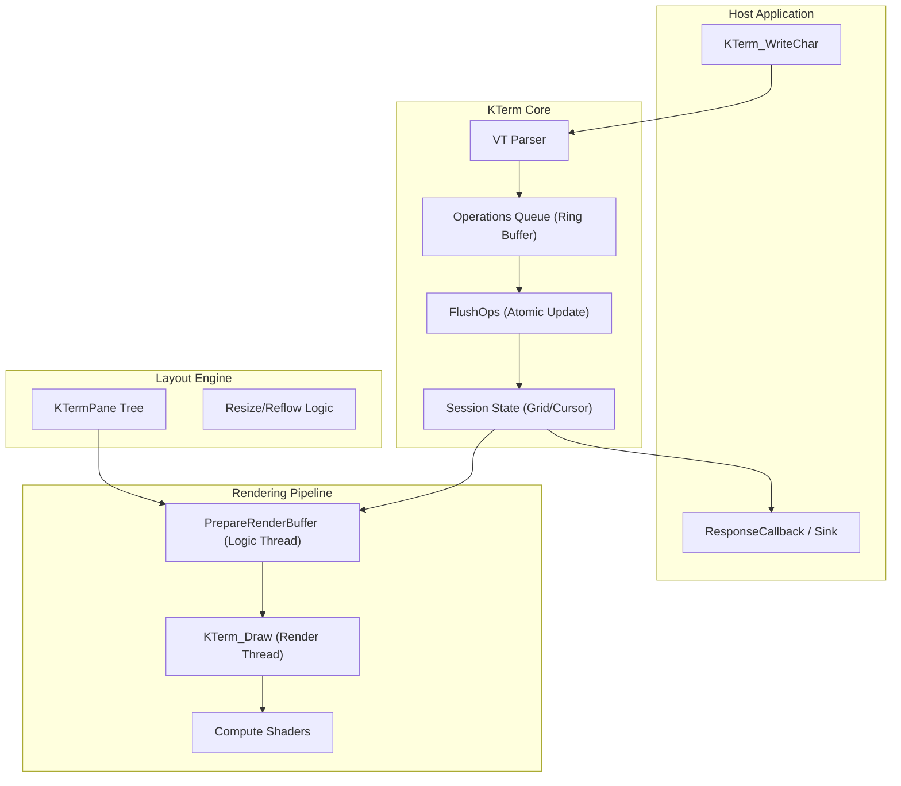

# kterm.h - Technical Reference Manual v2.6.16

**(c) 2026 Jacques Morel**

This document provides an exhaustive technical reference for `kterm.h`, an enhanced single-header terminal emulation library for C. It is intended for developers integrating the library into their applications and those who need a deep understanding of its capabilities, supported protocols, and internal architecture.

<details>
<summary>Table of Contents</summary>

*   [1. Overview](#1-overview)
    *   [1.1. Description](#11-description)
    *   [1.2. Key Features](#12-key-features)
    *   [1.3. Known Limitations (v2.6.16)](#13-known-limitations-v2616)
    *   [1.4. Architectural Deep Dive](#14-architectural-deep-dive)
        *   [1.4.1. Core Philosophy and The `KTerm` Struct](#141-core-philosophy-and-the-kterm-struct)
        *   [1.4.2. The Input Pipeline](#142-the-input-pipeline)
        *   [1.4.3. The Processing Loop and State Machine](#143-the-processing-loop-and-state-machine)
        *   [1.4.4. The Screen Buffer](#144-the-screen-buffer)
        *   [1.4.5. The Rendering Engine](#145-the-rendering-engine)
        *   [1.4.6. The Output Pipeline (Response System)](#146-the-output-pipeline-response-system)
        *   [1.4.7. Session Management](#147-session-management)

*   [2. Compliance and Emulation Levels](#2-compliance-and-emulation-levels)
    *   [2.1. Setting the Compliance Level](#21-setting-the-compliance-level)
    *   [2.2. Feature Breakdown by `VTLevel`](#22-feature-breakdown-by-vtlevel)
        *   [2.2.1. `VT_LEVEL_52`](#221-vt_level_52)
        *   [2.2.2. `VT_LEVEL_100`](#222-vt_level_100)
        *   [2.2.3. `VT_LEVEL_220`](#223-vt_level_220)
        *   [2.2.4. `VT_LEVEL_320`](#224-vt_level_320)
        *   [2.2.5. `VT_LEVEL_420`](#225-vt_level_420)
        *   [2.2.6. `VT_LEVEL_520`](#226-vt_level_520)
        *   [2.2.7. `VT_LEVEL_XTERM` (Default)](#227-vt_level_xterm-default)

*   [3. Control and Escape Sequences](#3-control-and-escape-sequences)
    *   [3.1. C0 Control Codes](#31-c0-control-codes)
    *   [3.2. C1 Control Codes (7-bit and 8-bit)](#32-c1-control-codes-7-bit-and-8-bit)
    *   [3.3. CSI - Control Sequence Introducer (`ESC [`)](#33-csi---control-sequence-introducer-esc-)
        *   [3.3.1. CSI Command Reference](#331-csi-command-reference)
        *   [3.3.2. SGR (Select Graphic Rendition) Parameters](#332-sgr-select-graphic-rendition-parameters)
        *   [3.3.3. Mode Setting Parameters](#333-mode-setting-parameters)
        *   [3.3.4. Multi-Session & Split Screen](#334-multi-session-and-split-screen)
    *   [3.4. OSC - Operating System Command (`ESC ]`)](#34-osc---operating-system-command-esc--)
    *   [3.5. DCS - Device Control String (`ESC P`)](#35-dcs---device-control-string-esc-p)
    *   [3.6. Other Escape Sequences](#36-other-escape-sequences)
    *   [3.7. VT52 Mode Sequences](#37-vt52-mode-sequences)

*   [4. Key Features In-Depth](#4-key-features-in-depth)
    *   [4.1. Color Support](#41-color-support)
    *   [4.2. Mouse Tracking](#42-mouse-tracking)
    *   [4.3. Character Sets](#43-character-sets)
    *   [4.4. Screen and Buffer Management](#44-screen-and-buffer-management)
    *   [4.5. Sixel Graphics](#45-sixel-graphics)
    *   [4.6. Bracketed Paste Mode](#46-bracketed-paste-mode)
    *   [4.7. Macros and Automation](#47-macros-and-automation)
    *   [4.8. Session Management](#48-session-management)
    *   [4.9. I/O Architecture Principle](#49-io-architecture-principle)
    *   [4.10. Retro Visual Effects](#410-retro-visual-effects)
    *   [4.11. ReGIS Graphics](#411-regis-graphics)
    *   [4.12. Gateway Protocol](#412-gateway-protocol)
        *   [4.12.1. Gateway Grid Extension (v2.4.21+)](#4121-gateway-grid-extension-v2421)
    *   [4.13. RAWDUMP (Raw Input Mirroring)](#413-rawdump-raw-input-mirroring)
    *   [4.14. Kitty Protocols (Graphics & Keyboard)](#414-kitty-protocols-graphics--keyboard)
        *   [4.14.1. Kitty Graphics Protocol](#4141-kitty-graphics-protocol)
        *   [4.14.2. Kitty Keyboard Protocol](#4142-kitty-keyboard-protocol)
    *   [4.15. IBM PC / DOS Compatibility Mode](#415-ibm-pc--dos-compatibility-mode)
    *   [4.16. Dynamic Font Switching & Glyph Centering](#416-dynamic-font-switching--glyph-centering)
    *   [4.17. Printer Controller Mode](#417-printer-controller-mode)
    *   [4.18. Rich Text Attributes (Extended SGR)](#418-rich-text-attributes-extended-sgr)
    *   [4.19. Tektronix 4010/4014 Emulation](#419-tektronix-40104014-emulation)
    *   [4.20. BiDirectional Text Support (BiDi)](#420-bidirectional-text-support-bidi)
    *   [4.21. DEC Locator Support](#421-dec-locator-support)
    *   [4.22. VT Pipe (Gateway Protocol)](#422-vt-pipe-gateway-protocol)
    *   [4.23. Networking & SSH](#423-networking--ssh)
    *   [4.24. Session Persistence](#424-session-persistence)

*   [5. API Reference](#5-api-reference)
    *   [5.1. Lifecycle Functions](#51-lifecycle-functions)
    *   [5.2. Host Input (Pipeline) Management](#52-host-input-pipeline-management)
    *   [5.3. Keyboard and Mouse Output](#53-keyboard-and-mouse-output)
    *   [5.4. Configuration and Mode Setting](#54-configuration-and-mode-setting)
    *   [5.5. Callbacks](#55-callbacks)
    *   [5.6. Diagnostics and Testing](#56-diagnostics-and-testing)
    *   [5.7. Advanced Control](#57-advanced-control)
    *   [5.8. Session Management](#58-session-management)

*   [6. Internal Operations and Data Flow](#6-internal-operations-and-data-flow)
    *   [6.1. Stage 1: Ingestion](#61-stage-1-ingestion)
    *   [6.2. Stage 2: Consumption and Parsing](#62-stage-2-consumption-and-parsing)
    *   [6.3. Stage 3: Character Processing and Screen Buffer Update](#63-stage-3-character-processing-and-screen-buffer-update)
    *   [6.4. Stage 4: Rendering](#64-stage-4-rendering)
    *   [6.5. Stage 5: Keyboard Input Processing](#65-stage-5-keyboard-input-processing)
    *   [6.6. The Operations Queue (Deferred Execution)](#66-the-operations-queue-deferred-execution)

*   [7. Data Structures Reference](#7-data-structures-reference)
    *   [7.1. Enums](#71-enums)
        *   [7.1.1. `VTLevel`](#711-vtlevel)
        *   [7.1.2. `VTParseState`](#712-vtparsestate)
        *   [7.1.3. `MouseTrackingMode`](#713-mousetrackingmode)
        *   [7.1.4. `CursorShape`](#714-cursorshape)
        *   [7.1.5. `CharacterSet`](#715-characterset)
    *   [7.2. Core Structs](#72-core-structs)
        *   [7.2.1. `KTerm`](#721-kterm)
        *   [7.2.2. `KTermSession`](#722-ktermsession)
        *   [7.2.3. `KTermPane`](#723-ktermpane)
        *   [7.2.4. `EnhancedTermChar`](#724-enhancedtermchar)
        *   [7.2.5. `ExtendedColor`](#725-extendedcolor)
        *   [7.2.6. `EnhancedCursor`](#726-enhancedcursor)
        *   [7.2.7. `DECModes` and `ANSIModes`](#727-decmodes-and-ansimodes)
        *   [7.2.8. `VTKeyEvent`](#728-vtkeyevent)
        *   [7.2.9. `CharsetState`](#729-charsetstate)
        *   [7.2.10. `KittyGraphics` and `KittyImageBuffer`](#7210-kittygraphics-and-kittyimagebuffer)

*   [8. Configuration Constants](#8-configuration-constants)

*   [9. License](#9-license)

</details>

---

## 1. Overview

### 1.1. Description

`kterm.h` is a comprehensive, single-header C library for terminal emulation. It is designed for integration into applications requiring a text-based user interface, such as embedded systems, remote access clients, or development tools. The library uses [Situation](https://www.Situation.com/) for rendering, windowing, and input handling, providing a complete solution out of the box.

The library emulates a wide range of historical and modern terminal standards, from the DEC VT52 to contemporary xterm extensions. It processes a stream of bytes, interprets control codes and escape sequences, and maintains an internal model of the terminal screen, which is then rendered to the display.

### 1.2. Key Features

-   **Broad Compatibility:** Emulates VT52, VT100, VT220, VT320, VT420, VT520, and xterm.
-   **Advanced Color Support:**
    -   16-color ANSI (standard and bright).
    -   256-color indexed palette.
    -   24-bit RGB True Color.
-   **Modern UI Features:**
    -   Advanced mouse tracking (X10, VT200, SGR, and more).
    -   Bracketed paste mode (`CSI ? 2004 h/l`).
    -   **Sixel Graphics Rendering:** Full support for Sixel graphics (`DCS P q ... ST`), enabling bitmap images directly in the terminal.
    -   **User-Defined Keys (DECUDK):** The terminal supports defining custom sequences for keys (VT320+).
    -   Customizable cursor styles (block, underline, bar, with blink).
-   **Multiplexer & Session Management (v2.2):**
    -   **Tree-Based Layout:** Manage up to 4 independent terminal sessions arranged in arbitrary recursive split layouts (Horizontal/Vertical).
    -   **Session Switching:** Focus control routes user input to specific panes while background sessions continue to update.
    -   **Input Interceptor:** Integrated keybindings (Default: `Ctrl+B`) for managing splits (`%`, `"`), navigation (`o`, `n`), and focus without leaving the keyboard.
    -   **Dynamic Resizing:** Panes can be resized dynamically, triggering reflow in the contained sessions.
-   **Rich Graphics:**
    -   **Kitty Graphics Protocol:** Full implementation of the Kitty graphics protocol for displaying high-resolution images, animations, and transparency directly in the terminal.
    -   **Sixel Graphics:** Full support for Sixel graphics (`DCS P q ... ST`) including scrolling modes and cursor placement.
    -   **ReGIS Graphics:** Resolution-independent vector graphics.
    -   **Tektronix 4010/4014:** Vector graphics emulation mode.
    -   **Modern Input:** Full implementation of the **Kitty Keyboard Protocol** for unambiguous key events (modifiers, release events).
-   **Rich Text Styling:**
    -   **Underline Styles:** Support for Curly, Dotted, and Dashed underlines via SGR 4:x.
    -   **Attribute Stack:** Push/Pop SGR state (`CSI # {` / `CSI # }`) for robust styling in nested TUI contexts.
-   **Visual Effects:**
    -   **CRT Simulation:** Configurable curvature and scanline effects for a retro aesthetic.
-   **Comprehensive KTerm Emulation:**
    -   Alternate screen buffer.
    -   Scrolling regions and margins (including vertical and horizontal).
    -   Character sets (ASCII, DEC Special Graphics, NRCS).
    -   Soft fonts (DECDLD).
    -   User-Defined Keys (DECUDK).
    -   **Dynamic Font Switching:** Change terminal fonts at runtime via `OSC 50` or the Gateway Protocol.
    -   Window title and icon name control via OSC sequences.
    -   Rich set of text attributes (bold, faint, italic, underline, blink, reverse, etc.).
-   **Performance and Diagnostics:**
    -   Tunable input pipeline for performance management.
    -   Callback system for host responses, title changes, and bell.
    -   Debugging utilities for logging unsupported sequences.
-   **Device Support:**
    -   **Printer Controller:** Full support for Media Copy (`MC`) and Printer Controller modes, including Print Extent and Form Feed control.
    -   **DEC Locator:** Support for DEC Locator mouse input reporting (rectangular coordinates).

### 1.3. Known Limitations (v2.6.16)

While K-Term is production-ready, users should be aware of the following limitations in the v2.6.16 release:

1.  **BiDirectional Text (BiDi):**
    -   Support is currently limited to an internal visual reordering algorithm (`BiDiReorderRow`).
    -   It lacks full `fribidi` parity for complex text shaping and implicit paragraph direction handling.
    -   This may affect rendering accuracy for Right-to-Left languages (e.g., Arabic, Hebrew) in complex contexts.

2.  **SSH Security Modes:**
    -   The `ssh_client.c` reference implementation supports two modes:
        -   **Production (Recommended):** Compiling with `KTERM_USE_LIBSSH` links against `libssh`, providing industry-standard security (encryption, authentication, key exchange).
        -   **Reference/Mock (Default):** Without this macro, it uses internal mock cryptographic primitives for testing and education. **This mode is not secure.**

3.  **Unicode Coverage:**
    -   Glyph rendering relies on the `stb_truetype` rasterizer. While it supports the Basic Multilingual Plane (BMP), specialized rendering for complex scripts (Devanagari, etc.) beyond basic shaping is not yet fully implemented.

### 1.4. Architectural Deep Dive

This section provides a more detailed examination of the library's internal components and data flow, expanding on the brief overview. Understanding this architecture is key to extending the library or diagnosing complex emulation issues.

#### 1.4.1. Core Philosophy and The `KTerm` Struct

The library's design is centered on a single, comprehensive data structure: the `KTerm` struct. This monolithic struct, defined in `kterm.h`, encapsulates the entire state of the emulated device.

In **v2.4**, `KTerm` acts as a thread-safe hypervisor/multiplexer. Instead of managing a single state, it holds:
-   An array of `KTermSession` structs (up to `MAX_SESSIONS`), each representing a virtual terminal with its own screen buffer, cursor, parser state, and **mutex lock**.
-   A `KTermLayout` containing the `KTermPane` tree, defining how these sessions are tiled on the screen.
-   Global resources like the GPU pipeline, font texture, and shared input/output buffers.

The API remains **instance-based** (`KTerm*`), allowing multiple independent multiplexer instances to coexist.

#### 1.4.2. The Input Pipeline

The terminal is a consumer of sequential character data. The entry point for all incoming data from a host application (e.g., a shell, a remote server) is the input pipeline.

-   **Mechanism:** A fixed-size circular buffer (`input_pipeline`) of `unsigned char`.
-   **Ingestion:** Host applications use `KTerm_WriteChar(term, ...)`, `KTerm_WriteString(term, ...)` to append data to this buffer. These functions are intended for use from the main application thread.
-   **Flow Control:** The pipeline has a fixed size (`16384` bytes). If the host writes data faster than the terminal can process it, an overflow flag (`pipeline_overflow`) is set. This allows the host application to detect the overflow and potentially pause data transmission.

#### 1.4.3. The Processing Loop and State Machine

The heart of the emulation is the main processing loop within `KTerm_Update(term)`, which drives a sophisticated state machine.

-   **Consumption:** `KTerm_Update(term)` calls `KTerm_ProcessEvents(term)`, which consumes a tunable number of characters from the input pipeline each frame. This prevents the emulation from freezing the application when large amounts of data are received. The number of characters processed can be adjusted for performance (`VTperformance` struct).
-   **Parsing:** Each character is fed into `KTerm_ProcessChar()`, which acts as a dispatcher based on the current `VTParseState`.
    -   `VT_PARSE_NORMAL`: In the default state, printable characters are sent to the screen, and control characters (like `ESC` or C0 codes) change the parser's state.
    -   `VT_PARSE_ESCAPE`: After an `ESC` (`0x1B`) is received, the parser enters this state, waiting for the next character to determine the type of sequence (e.g., `[` for CSI, `]` for OSC).
    -   `PARSE_CSI`, `PARSE_OSC`, `PARSE_DCS`, etc.: In these states, the parser accumulates parameters and intermediate bytes into `escape_buffer` until a final character (terminator) is received.
    -   **Execution:** Once a sequence is complete, a corresponding `Execute...()` function is called (e.g., `KTerm_ExecuteCSICommand`, `KTerm_ExecuteOSCCommand`).
    -   **Deferred Operations:** Unlike previous versions, execution does **not** modify the grid directly. Instead, it queues a `KTermOp` (Operation) into the session's **Op Queue**. This ensures atomicity and thread safety.

#### 1.4.4. The Screen Buffer

The visual state of the terminal is stored in one of two screen buffers, both of which are 2D arrays of `EnhancedTermChar`.

   **`EnhancedTermChar`:** This crucial struct represents a single character cell on the screen. It goes far beyond a simple `char`, storing:
    -   The Unicode codepoint (`ch`).
    -   Foreground and background colors (`ExtendedColor`), which can be an indexed palette color or a 24-bit RGB color.
    -   A comprehensive set of boolean flags for attributes like `bold`, `italic`, `underline`, `blink`, `reverse`, `strikethrough`, `conceal`, and more.
    -   Flags for DEC special modes like double-width or double-height characters (currently unsupported).
-   **Primary vs. Alternate Buffer:** The terminal maintains `screen` and `alt_screen`. Applications like `vim` or `less` switch to the alternate buffer (`CSI ?1049 h`) to create a temporary full-screen interface. When they exit, they switch back (`CSI ?1049 l`), restoring the original screen content and scrollback.

#### 1.4.5. The Rendering Engine (The Compositor)

The v2.4 rendering engine operates as a decoupled, thread-safe **Compositor**. The Logic Thread prepares a double-buffered `KTermRenderBuffer`, while the Render Thread consumes it. The `KTerm_Draw()` function orchestrates a multi-pass GPU pipeline:

1.  **Layout Traversal:** It iterates through the `layout` tree (`KTermPane`) to calculate the absolute screen viewport for each visible leaf pane.
2.  **SSBO Update:** `RecursiveUpdateSSBO()` uploads content from each visible session into a global `GPUCell` staging buffer, respecting pane boundaries.
3.  **Compute Dispatch (Text):** The core `terminal.comp` shader renders the text grid for the entire screen in one pass.
4.  **Overlay Pass (Graphics):** A new `texture_blit.comp` pipeline is dispatched to draw media elements:
    -   **Sixel Graphics:** Rendered from a dedicated texture.
    -   **Kitty Graphics:** Images are composited with full Alpha Blending and Z-Index support (background images behind text, foreground images on top).
    -   **ReGIS/Vectors:** Vector graphics are drawn as an overlay layer.
5.  **Presentation:** The final composited image is presented to the screen.



#### 1.4.6. The Output Pipeline (Response System)

The terminal needs to send data back to the host in response to certain queries or events. This is handled by the output pipeline, or response system.

-   **Mechanism:** In v2.4.4, each `KTermSession` maintains its own lock-free **Response Ring Buffer** (`response_ring`). This ensures that responses from multiple sessions (e.g., background queries) are safely queued without contention or blocking.
-   **Events:** The following events generate responses:
    -   **User Input:** Keystrokes (`KTerm_UpdateKeyboard(term)`) and mouse events (`KTerm_UpdateMouse(term)`) are translated into the appropriate VT sequences and queued.
    -   **Status Reports:** Commands like `DSR` (Device Status Report) or `DA` (Device Attributes) queue their predefined response strings.
-   **Sink (Modern):** Applications can register an `OutputSink` using `KTerm_SetOutputSink`. This flushes the ring buffer and subsequently bypasses it, delivering response data directly to the callback as it is generated (zero-copy). This is the preferred method for high-performance integration.

#### 1.4.7. Session Management (Multiplexer)

Version 2.4 decouples the tiling multiplexer into `kt_layout.h`.

-   **Sessions:** Independent `KTermSession` contexts (up to 4) maintain their own state (screen, history, cursor) and thread locks.
-   **Layout Tree:** The screen is divided into non-overlapping rectangles using a recursive `KTermPane` tree structure. Splits can be Horizontal or Vertical.
-   **Input Routing:** User input (Keyboard/Mouse) is routed exclusively to the session in the `focused_pane`.
-   **Reflow:** When a pane is resized, the session within it automatically reflows its text buffer to fit the new dimensions via `KTerm_ResizeSession`, preserving history.

---

## 2. Compliance and Emulation Levels

The library's behavior can be tailored to match historical and modern terminal standards by setting a compliance level. This is managed through a "logic grid" that explicitly defines which features are available at each level. This approach ensures that emulation is accurate, predictable, and easy to maintain.

### 2.1. The `VTFeatures` Logic Grid

At the core of the compliance system is the `VTFeatures` struct, a collection of boolean flags, where each flag represents a specific terminal capability (e.g., `sixel_graphics`, `true_color`, `mouse_tracking`).

The `KTerm_SetLevel()` function works by looking up the requested level in a static `vt_feature_grid` array. This array acts as the logic grid, containing a pre-defined `VTFeatures` configuration for every supported `VTLevel`. When a level is set, the corresponding feature set is copied into the active `terminal.conformance.features` struct, instantly enabling or disabling dozens of features to match the target standard. This also updates the device attribute strings that the terminal reports to the host. Additionally, setting the level automatically updates the **Answerback** string (e.g., "ANSI.SYS" for `VT_LEVEL_ANSI_SYS`, "kterm xterm" for `VT_LEVEL_XTERM`).

### 2.2. Feature Breakdown by `VTLevel`

This section details the key features enabled at each `VTLevel`. The `VTLevel` enum now uses semantic numbering (e.g., `VT_LEVEL_100 = 100`) to avoid breaking changes. The logic grid ensures that higher levels inherit features from lower ones.

| Level | Key Features Added |
| :--- | :--- |
| **`VT_LEVEL_52`** | Basic cursor movement (`ESC A/B/C/D`), direct cursor addressing, simple erase commands, alternate keypad mode. Emulates the DEC VT52. |
| **`VT_LEVEL_100`** | Introduces ANSI CSI sequences, SGR attributes (bold, underline, reverse), scrolling regions (`DECSTBM`), and DEC Special Graphics. |
| **`VT_LEVEL_102`** | Functionally identical to VT100 in this library. |
| **`VT_LEVEL_132`** | Functionally identical to VT102 in this library. |
| **`VT_LEVEL_220`** | 8-bit controls, soft fonts (`DECDLD`), User-Defined Keys (`DECUDK`). |
| **`VT_LEVEL_340`** | Sixel graphics (`DCS Pq...ST`). |
| **`VT_LEVEL_420`** | Rectangular area operations (`DECCRA`, `DECFRA`), selective erase (`DECSERA`), ANSI Text Locator (`DECSLE`, `DECRQLP`). |
| **`VT_LEVEL_510`** | Windowing support queries and PC-style function keys. |
| **`VT_LEVEL_520`** | 98% Compliance with VT520 extensions. Includes multi-session management, enhanced printer controls, and advanced status reporting. |
| **`VT_LEVEL_525`** | Color extensions to the VT520 standard. |
| **`VT_LEVEL_XTERM`** | Superset of all VT features plus: **Kitty Graphics**, 256-color and True Color, advanced mouse tracking (`SGR`), window manipulation (OSC titles), bracketed paste, focus reporting. (95% xterm compliance). |
| **`VT_LEVEL_K95`**| Placeholder for k95 protocol features. |
| **`VT_LEVEL_TT`**| Placeholder for tt protocol features. |
| **`VT_LEVEL_PUTTY`**| Placeholder for PuTTY-specific features. |

---

## 3. Control and Escape Sequences

The terminal's behavior is controlled by a stream of characters, including printable text and non-printable control sequences.

### 3.1. C0 Control Codes

These are single-byte codes in the range `0x00-0x1F`.

| Code | Hex | Name | Description                                                  |
| :--- | :-- | :--- | :----------------------------------------------------------- |
| `NUL`| 0x00| Null | Ignored.                                                     |
| `ENQ`| 0x05| Enquiry| Triggers the answerback message.                             |
| `BEL`| 0x07| Bell | Triggers the bell callback or a visual bell flash.           |
| `BS` | 0x08| Backspace| Moves the cursor one position to the left.                 |
| `HT` | 0x09| Horizontal Tab| Moves the cursor to the next tab stop.                |
| `LF` | 0x0A| Line Feed| Moves cursor down one line. Also performs a carriage return if LNM is set. |
| `VT` | 0x0B| Vertical Tab| Same as Line Feed.                                     |
| `FF` | 0x0C| Form Feed| Same as Line Feed.                                     |
| `CR` | 0x0D| Carriage Return| Moves cursor to the beginning of the current line.    |
| `SO` | 0x0E| Shift Out| Invokes the G1 character set into GL.                    |
| `SI` | 0x0F| Shift In | Invokes the G0 character set into GL.                    |
| `CAN`| 0x18| Cancel | Cancels the current escape sequence.                       |
| `SUB`| 0x1A| Substitute| Same as Cancel.                                        |
| `ESC`| 0x1B| Escape | Begins an escape sequence.                                 |
| `DEL`| 0x7F| Delete | Ignored.                                                     |

### 3.2. C1 Control Codes (7-bit and 8-bit)

In a 7-bit environment, C1 codes (`0x80-0x9F`) are represented by `ESC` followed by a character in the range `0x40-0x5F`. The library primarily uses the 7-bit form.

| Sequence | Name | Description                                           |
| :------- | :--- | :---------------------------------------------------- |
| `ESC D`  | IND  | Index: Moves cursor down one line.                    |
| `ESC E`  | NEL  | Next Line: Moves cursor to start of next line.        |
| `ESC H`  | HTS  | Horizontal Tabulation Set: Sets a tab stop at the current cursor column. |
| `ESC M`  | RI   | Reverse Index: Moves cursor up one line.              |
| `ESC N`  | SS2  | Single Shift 2: Uses G2 charset for the next character only. |
| `ESC O`  | SS3  | Single Shift 3: Uses G3 charset for the next character only. |
| `ESC P`  | DCS  | Device Control String: Begins a device-specific command. |
| `ESC Z`  | DECID| DEPRECATED - Return Device Attributes. Use `CSI c`.   |
| `ESC [`  | CSI  | Control Sequence Introducer: Begins a CSI sequence.   |
| `ESC \`  | ST   | String Terminator: Ends DCS, OSC, APC, PM strings.    |
| `ESC ]`  | OSC  | Operating System Command: Begins an OS-level command (e.g., set title). |
| `ESC ^`  | PM   | Privacy Message: Begins a privacy message string.     |
| `ESC _`  | APC  | Application Program Command: Begins an application command string. |
| `ESC SP F`| S7C1T| **Announce Code Structure 6.** Switch to 7-bit C1 controls (ESC Fe). |
| `ESC SP G`| S8C1T| **Announce Code Structure 7.** Switch to 8-bit C1 controls (0x80-0x9F). |
| `ESC # 3`| DECDHL| **Double-Height Line (Top).** Makes the current line double-height (top half). |
| `ESC # 4`| DECDHL| **Double-Height Line (Bottom).** Makes the current line double-height (bottom half). |
| `ESC # 5`| DECSWL| **Single-Width Line.** Makes the current line single-width, single-height. |
| `ESC # 6`| DECDWL| **Double-Width Line.** Makes the current line double-width, single-height. |
| `ESC # 8`| DECALN| **Screen Alignment Pattern.** Fills the screen with 'E's. |
| `ESC %`  | -    | Select Character Set (ISO 2022): Followed by `@` (Default) or `G` (UTF-8). |
| `ESC n`  | LS2  | Lock Shift 2: Invokes G2 into GL. |
| `ESC o`  | LS3  | Lock Shift 3: Invokes G3 into GL. |
| `ESC \|` | LS3R | Lock Shift 3 Right: Invokes G3 into GR. |
| `ESC }`  | LS2R | Lock Shift 2 Right: Invokes G2 into GR. |
| `ESC ~`  | LS1R | Lock Shift 1 Right: Invokes G1 into GR. |

### 3.3. CSI - Control Sequence Introducer (`ESC [`)

CSI sequences are the most common type of control sequence. They follow the format `CSI [private] [params] [intermediate] final`.

-   **Private Marker (`?`)**: A `?` after the `[` indicates a DEC Private Mode sequence.
-   **Parameters (`Pn`)**: A series of semicolon-separated numbers (e.g., `1;5`). Default is 1 or 0 depending on context.
-   **Intermediate Bytes**: Characters in the range `0x20-0x2F` (e.g., ` ` (space), `$`, `"`).
-   **Final Byte**: A character in the range `0x40-0x7E`.

#### 3.3.1. CSI Command Reference

This section provides a comprehensive list of all supported CSI sequences, categorized by function. `Pn`, `Pm`, `Ps`, `Pt`, `Pb`, `Pl`, `Pr` represent numeric parameters.

| Command | Final Byte | Name | Description |
| :--- | :--- | :--- | :--- |
| **Cursor Movement** | | | |
| `CSI Pn A` | `A` | CUU | **Cursor Up.** Moves cursor up by `Pn` lines. Default `Pn=1`. |
| `CSI Pn B` | `B` | CUD | **Cursor Down.** Moves cursor down by `Pn` lines. Default `Pn=1`. |
| `CSI Pn C` | `C` | CUF | **Cursor Forward.** Moves cursor right by `Pn` columns. Default `Pn=1`. |
| `CSI Pn D` | `D` | CUB | **Cursor Back.** Moves cursor left by `Pn` columns. Default `Pn=1`. |
| `CSI Pn E` | `E` | CNL | **Cursor Next Line.** Moves cursor to the start of the line `Pn` lines down. Default `Pn=1`. |
| `CSI Pn F` | `F` | CPL | **Cursor Previous Line.** Moves cursor to the start of the line `Pn` lines up. Default `Pn=1`. |
| `CSI Pn G` | `G` | CHA | **Cursor Horizontal Absolute.** Moves cursor to column `Pn`. Default `Pn=1`. |
| `CSI Pn ` ` | `\`` | HPA | **Horizontal Position Absolute.** Same as CHA. |
| `CSI Pn a` | `a` | HPR | **Horizontal Position Relative.** Moves cursor right by `Pn` columns. |
| `CSI Pn;Pm H` | `H` | CUP | **Cursor Position.** Moves cursor to row `Pn`, column `Pm`. Defaults `Pn=1`, `Pm=1`. |
| `CSI Pn;Pm f` | `f` | HVP | **Horizontal and Vertical Position.** Same as CUP. |
| `CSI Pn d` | `d` | VPA | **Vertical Position Absolute.** Moves cursor to row `Pn`. Default `Pn=1`. |
| `CSI Pn e` | `e` | VPR | **Vertical Position Relative.** Moves cursor down `Pn` lines. |
| `CSI s` | `s` | ANSISYSSC | **Save Cursor Position (ANSI.SYS/SCO).** Saves the cursor position. Use with `CSI u`. |
| `CSI u` | `u` | ANSISYSRC | **Restore Cursor Position (ANSI.SYS/SCO).** Restores the cursor position. |
| **Erasing & Editing** | | | |
| `CSI Ps J` | `J` | ED | **Erase In Display.** `Ps=0`: cursor to end. `Ps=1`: start to cursor. `Ps=2`: entire screen (ANSI.SYS: also homes cursor). `Ps=3`: entire buffer (xterm). |
| `CSI Ps K` | `K` | EL | **Erase In Line.** `Ps=0`: from cursor to end. `Ps=1`: from start to cursor. `Ps=2`: entire line. |
| `CSI Pn L` | `L` | IL | **Insert Lines.** Inserts `Pn` blank lines at the cursor. Default `Pn=1`. Respects margins. Pushes lines down. |
| `CSI Pn M` | `M` | DL | **Delete Lines.** Deletes `Pn` lines at the cursor. Default `Pn=1`. Respects margins. Pulls lines up. |
| `CSI Pn P` | `P` | DCH | **Delete Characters.** Deletes `Pn` characters at the cursor. Default `Pn=1`. |
| `CSI Pn X` | `X` | ECH | **Erase Characters.** Erases `Pn` characters from the cursor without deleting them. Default `Pn=1`. |
| `CSI Pn @` | `@` | ICH | **Insert Characters.** Inserts `Pn` blank spaces at the cursor. Default `Pn=1`. |
| `CSI Pn b` | `b` | REP | **Repeat Preceding Character.** Repeats the previous graphic character `Pn` times. |
| **Scrolling** | | | |
| `CSI Pn S` | `S` | SU | **Scroll Up.** Scrolls the active region up by `Pn` lines. Default `Pn=1`. |
| `CSI Pn T` | `T` | SD | **Scroll Down.** Scrolls the active region down by `Pn` lines. Default `Pn=1`. |
| `CSI Pt;Pb r` | `r` | DECSTBM | **Set Top And Bottom Margins.** Defines the scrollable area from row `Pt` to `Pb`. |
| `CSI ? Pl;Pr s`| `s` | DECSLRM | **Set Left And Right Margins.** Defines horizontal margins (VT420+). |
| `CSI Ps * \|` | `\|` | DECSNLS | **Set Number of Lines per Screen.** Resizes the physical screen rows (VT510). |
| `CSI Ps * {` | `{` | DECSLPP | **Set Lines Per Page.** Sets the logical page size (lines per page). |
| **Tabulation** | | | |
| `CSI Pn I` | `I` | CHT | **Cursor Horizontal Tab.** Moves cursor forward `Pn` tab stops. Default `Pn=1`. |
| `CSI Pn Z` | `Z` | CBT | **Cursor Backward Tab.** Moves cursor backward `Pn` tab stops. Default `Pn=1`. |
| `CSI Ps g` | `g` | TBC | **Tabulation Clear.** `Ps=0`: clear stop at current column. `Ps=3`: clear all stops. |
| **Rectangular Area Operations (VT420+)** | | | |
| `CSI Pts;Pls;Pbs;Prs;Pps;Ptd;Pld;Ppd $ v` | `v` | DECCRA | **Copy Rectangular Area.** Copies from source rect (Top, Left, Bottom, Right) to Dest (Top, Left). `Pps`/`Ppd` are source/dest page (ignored). Respects DECOM. |
| `CSI Pts;Ptd;Pcs * y` | `y` | DECRQCRA | **Request Rectangular Area Checksum.** Requests a checksum of the area. Response: `DCS Pid ! ~ Checksum ST`. |
| `CSI Pt ; Pc z` | `z` | DECECR | **Enable Checksum Report.** `Pc=1` enables, `0` disables DECRQCRA responses. |
| `CSI Pt;Pl;Pb;Pr $ x` | `x` | DECERA | **Erase Rectangular Area.** Erases the specified rectangle to space with current background attributes. |
| `CSI Pch;Pt;Pl;Pb;Pr $ x` | `x` | DECFRA | **Fill Rectangular Area.** Fills the rectangle with character `Pch` (ASCII/Unicode). |
| `CSI Ps;Pt;Pl;Pb;Pr $ {` | `{` | DECSERA | **Selective Erase Rectangular Area.** Erases only erasable characters (not Protected via `DECSCA`) in the area. |
| `CSI Pt;Pl;Pb;Pr;Ps1;... $ t`| `t` | DECCARA | **Change Attributes in Rectangular Area.** Applies SGR attributes `Ps...` to the region. 0=Clear All, 1=Bold, 4=Underline, 5=Blink, 7=Reverse. |
| `CSI Pt;Pl;Pb;Pr;Ps1;... $ u`| `u` | DECRARA | **Reverse Attributes in Rectangular Area.** Toggles SGR attributes `Ps...` in the region. |
| `CSI Ps " q` | `q` | DECSCA | **Select Character Protection Attribute.** `Ps=1`: Protected. `Ps=0` or `2`: Unprotected. Protected cells are ignored by `DECERA`, `DECSERA` (partially), and `DECSEL`. |
| `CSI # {` | `{` | XTPUSHSGR | **Push SGR.** Saves current text attributes to the stack. |
| `CSI # }` | `}` | XTPOPSGR | **Pop SGR.** Restores text attributes from the stack. |
| **Text Attributes (SGR)** | | | |
| `CSI Pm m` | `m` | SGR | **Select Graphic Rendition.** Sets text attributes. See SGR table below for `Pm` values. |
| **Modes** | | | |
| `CSI Pm h` | `h` | SM | **Set Mode.** Enables an ANSI or DEC private mode. See Mode table below. |
| `CSI Pm l` | `l` | RM | **Reset Mode.** Disables an ANSI or DEC private mode. See Mode table below. |
| **Device & Status Reporting**| | | |
| `CSI Ps c` | `c` | DA | **Device Attributes.** `Ps=0` (or omitted) for Primary DA. `>c` for Secondary DA. `=c` for Tertiary DA. |
| `CSI Ps n` | `n` | DSR | **Device Status Report.** `Ps=5`: Status OK (`CSI 0 n`). `Ps=6`: Cursor Position Report (`CSI r;c R`). `Ps=98`: Error Count. |
| `CSI ? Ps n` | `n` | DSR (DEC)| **DEC-Specific DSR.** `?10n`: Graphics Caps. `?20n`: Macro Storage. `?30n`: Session State. `?15n`: Printer. `?26n`: Keyboard. `?63n`: Checksum. |
| `CSI ? 26 ; Ps u`| `u` | DECRQPKU | **Request Programmed Key.** Queries UDK definition for key `Ps`. |
| `CSI Ps x` | `x` | DECREQTPARM | **Request KTerm Parameters.** Reports terminal settings. |
| `CSI $ u` | `u` | DECRQPSR | **Request Presentation State Report.** E.g., Sixel or ReGIS state. |
| `CSI Ps $ t` | `t` | DECRQTSR | **Request Terminal State Report.** Requests VT420 terminal state report. |
| **Miscellaneous** | | | |
| `CSI Pi i` | `i` | MC | **Media Copy.** `Pi=0`: Print screen. `Pi=4`: Disable auto-print. `Pi=5`: Enable auto-print. |
| `CSI ? Pi i`| `i` | MC (DEC) | **DEC Media Copy.** `?4i`: Disable printer controller. `?5i`: Enable printer controller. `?1i`: Print cursor line. |
| `CSI Ps q` | `q` | DECLL | **Load LEDs.** `Ps` is a bitmask for keyboard LEDs (VT220+). |
| `CSI Ps SP q`| `q` | DECSCUSR | **Set Cursor Style.** `Ps` selects cursor shape (block, underline, bar) and blink. |
| `CSI ! p` | `p` | DECSTR | **Soft KTerm Reset.** Resets many modes to their default values, including clearing all graphics resources. |
| `CSI " p` | `p` | DECSCL | **Select Conformance Level.** Sets the terminal's strict VT emulation level. |
| `CSI $ q` | `q` | DECRQM | **Request Mode (DEC).** An alias for `DECRQM` using `$` instead of `y`. |
| `CSI $ u` | `u` | DECRQPSR | **Request Presentation State Report.** E.g., Sixel or ReGIS state. |
| `CSI ? Ps y`| `y` | DECTST | **Invoke Confidence Test.** Performs a self-test (e.g., screen fill). |
| `CSI ? Ps ; Pv $ z` | `z` | DECVERP | **Verify Parity.** (currently unsupported) |
| `CSI Pn $ \|` | `\|` | DECSCPP | **Select Columns Per Page.** `Pn=0` or `80` for 80 columns; `Pn=132` for 132 columns. Requires Mode 40. |
| `CSI ? Psl {` | `{` | DECSLE | **Select Locator Events.** `Psl`: 0=Req, 1=Down, 2=Cancel Down, 3=Up, 4=Cancel Up. |
| `CSI Ps \|` | `\|` | DECRQLP | **Request Locator Position.** Requests the current position of the locator. Response: `CSI 1;r;c;1 ! |`. |
| `CSI Ps SP =` | `=` | DECSKCV | **Select Keyboard Variant.** Sets the keyboard layout variant. |
| `CSI ? Ps $ u` | `u` | DECRQTSR | **Request Terminal State Report.** `Ps=1`: Report All. `Ps=53`: Report Factory Defaults (DECRQDE). Response is DCS. |
| `CSI ? 26 u` | `u` | DECRQUPSS| **Request User-Preferred Supplemental Set.** Reports current preferred set (DCS). |
| `CSI Ps SP r` | `r` | DECARR | **Auto Repeat Rate.** Sets keyboard repeat rate (0-30Hz). 31=Off. |
| `CSI ? 5 W` | `W` | DECST8C | **Set Tab Stops 8 Columns.** Resets all tab stops to every 8 columns. |

#### 3.3.2. SGR (Select Graphic Rendition) Parameters
The `CSI Pm m` command sets display attributes based on the numeric parameter `Pm`. Multiple parameters can be combined in a single sequence, separated by semicolons (e.g., `CSI 1;31m`).

| Code | Effect                       | Reset Code |
| :--- | :--------------------------- | :--------- |
| 0    | Reset all attributes         | -          |
| 1    | Bold / Bright                | 22         |
| 2    | Faint / Dim                  | 22         |
| 3    | Italic                       | 23         |
| 4    | Underline (See 4.16.1)       | 24         |
| 5    | Blink (Slow)                 | 25         |
| 7    | Reverse Video                | 27         |
| 8    | Conceal / Hide               | 28         |
| 9    | Strikethrough                | 29         |
| 21   | Double Underline             | 24         |
| 30-37| Set Foreground (ANSI Colors 0-7) | 39         |
| 40-47| Set Background (ANSI Colors 0-7) | 49         |
| 90-97| Set Bright Foreground (8-15) | 39         |
| 100-107| Set Bright Background (8-15)| 49         |
| 38;5;Pn | Set 256-color Foreground     | 39         |
| 48;5;Pn | Set 256-color Background     | 49         |
| 38;2;Pr;Pg;Pb | Set True Color Foreground | 39         |
| 48;2;Pr;Pg;Pb | Set True Color Background | 49         |
| 51   | Framed                       | 54         |
| 52   | Encircled                    | 54         |
| 53   | Overline                     | 55         |
| 54   | Not Framed or Encircled      | -          |
| 55   | Not Overlined                | -          |
| 58   | Set Underline Color          | 59         |
| 59   | Reset Underline Color        | -          |
| 62   | Background Faint (Private Use)| 22         |
| 66   | Background Blink (Private Use)| 25         |
| 73   | Superscript                  | 75         |
| 74   | Subscript                    | 75         |
| 75   | Not Superscript or Subscript | -          |

#### 3.3.3. Mode Setting Parameters
The `CSI Pm h` (Set Mode) and `CSI Pm l` (Reset Mode) commands control various terminal behaviors. Sequences starting with `?` are DEC Private Modes.

| Mode (`Pm`) | Name | Description |
| :--- | :--- | :--- |
| **ANSI Modes** | | |
| 4 | `IRM`| **Insert/Replace Mode.** When set (`h`), new characters shift existing text right. When reset (`l`), they overwrite existing text. |
| 20 | `LNM`| **Linefeed/New Line Mode.** When set (`h`), `LF` is treated as `CRLF`. |
| **DEC Private Modes (`?`)** | | |
| 1 | `DECCKM`| **Application Cursor Keys.** `h` enables, `l` disables. When enabled, cursor keys send `ESC O` sequences. |
| 2 | `DECANM`| **ANSI/VT52 Mode.** `l` switches to VT52 mode (legacy). `h` returns to ANSI mode. Use `ESC <` to exit VT52 mode. |
| 3 | `DECCOLM`| **132 Column Mode.** `h` switches to 132 columns, `l` to 80. Clears screen unless `DECNCSM` (Mode 95) is enabled. |
| 4 | `DECSCLM`| **Scrolling Mode.** `h` enables smooth scroll, `l` enables jump scroll. |
| 5 | `DECSCNM`| **Reverse Video Screen.** `h` swaps default foreground/background, `l` returns to normal. |
| 6 | `DECOM`| **Origin Mode.** `h` makes cursor movements relative to the scrolling region, `l` makes them relative to the window. |
| 7 | `DECAWM`| **Auto-Wrap Mode.** `h` enables auto-wrap, `l` disables it. |
| 8 | `DECARM`| **Auto-Repeat Mode.** `h` enables key auto-repeat, `l` disables it. |
| 9 | `-`| **X10 Mouse Reporting.** `h` enables basic X10 mouse reporting, `l` disables all mouse tracking. |
| 10 | `DECAKM`| **ANSI Keypad Mode.** Alias to Mode 66 (DECNKM). |
| 12 | `-`| **Blinking Cursor.** `h` enables cursor blink, `l` disables it. |
| 18 | `DECPFF`| **Print Form Feed.** `h` appends FF to print operations. `l` disables. |
| 19 | `DECPEX`| **Print Extent.** `h` prints full screen, `l` prints scrolling region only. |
| 25 | `DECTCEM`| **Text Cursor Enable Mode.** `h` shows the cursor, `l` hides it. |
| 38 | `DECTEK`| **Tektronix Mode.** `h` enters Tektronix 4010/4014 emulation mode. |
| 40 | `-`| **Allow 80/132 Column Switching.** `h` allows `DECCOLM` to work. |
| 41 | `DECELR`| **Locator Enable.** `h` enables DEC Locator (Mouse) reporting. |
| 42 | `DECNRCM`| **National Replacement Charsets.** `h` enables NRCS support. |
| 45 | `DECEDM`| **Extended Edit Mode.** `h` enables extended editing features. |
| 47 | `-`| **Alternate Screen Buffer.** `h` switches to alternate buffer, `l` restores (compatibility). |
| 66 | `DECNKM`| **Numeric Keypad Mode.** `h` Application Keypad, `l` Numeric Keypad. |
| 67 | `DECBKM`| **Backarrow Key Mode.** `h` sends BS, `l` sends DEL. |
| 69 | `DECLRMM`| **Left Right Margin Mode.** `h` enables use of `DECSLRM` (set left/right margins). `l` disables. |
| 80 | `DECSDM`| **Sixel Display Mode.** `h` disables scrolling (images discard), `l` enables scrolling. |
| 88 | `DECXRLM`| **Transmit Rate Limit.** `h` enables flow control (XOFF at 75% usage), `l` disables. |
| 95 | `DECNCSM`| **No Clear Screen on Column Change.** `h` prevents screen clear during `DECCOLM` switch. |
| 1000 | `-`| **VT200 Mouse Tracking.** `h` enables reporting of button press/release. `l` disables. |
| 1001 | `-`| **VT200 Highlight Mouse Tracking.** `h` enables reporting on mouse drag. `l` disables. |
| 1002 | `-`| **Button-Event Mouse Tracking.** `h` enables reporting of press, release, and drag. `l` disables. |
| 1003 | `-`| **Any-Event Mouse Tracking.** `h` enables reporting all mouse motion. `l` disables. |
| 1004 | `-`| **Focus In/Out Reporting.** `h` enables reporting window focus events. `l` disables. |
| 1005 | `-`| **UTF-8 Mouse Mode.** (Not implemented). |
| 1006 | `-`| **SGR Extended Mouse Reporting.** `h` enables the modern SGR mouse protocol. `l` disables it. |
| 1015 | `-`| **URXVT Mouse Mode.** `h` enables an alternative extended mouse protocol. `l` disables. |
| 1016 | `-`| **Pixel Position Mouse Mode.** `h` enables reporting mouse position in pixels. `l` disables. |
| 1041 | `-`| **Alt Screen Cursor Save.** `h` saves cursor pos when switching to alt screen. |
| 1047 | `-`| **Alternate Screen Buffer.** `h` switches to alternate buffer (xterm). |
| 1048 | `-`| **Save/Restore Cursor.** `h` saves, `l` restores cursor position (xterm). |
| 1049 | `-`| **Alternate Screen With Save.** Combines `?1047` and `?1048` (xterm). `h` saves cursor and switches to alternate buffer, `l` restores. |
| 1070 | `-`| **Private Colors.** `h` uses private color palette for Sixel/ReGIS. |
| 2004 | `-`| **Bracketed Paste Mode.** `h` enables, `l` disables. Wraps pasted text with control sequences. |
| 8246 | `BDSM`| **Bi-Directional Support Mode.** `h` enables internal BiDi reordering. |
| 8452 | `-`| **Sixel Cursor Mode.** `h` places cursor at end of graphic. `l` moves to next line. |


#### 3.3.4. Multi-Session & Split Screen
These commands control the VT520-style multi-session and split screen features. **Note:** In v2.2+, legacy VT520 session commands are mapped to the tiling layout engine (focus change instead of full session switch).

| Command | Name | Description |
| :--- | :--- | :--- |
| `CSI Ps ! ~` | `DECSN` | **Select Session Number.** Switches the active session to `Ps`. `Ps` is 1-based (1-3). |
| `CSI ? Ps n` | `DECRSN` | **Report Session Number.** If `Ps=12`, reports the active session as `CSI ? 12 ; {session} n`. |
| `CSI ? 21 n` | `DECRS` | **Report Session Status.** Reports availability of sessions via a DCS string. |
| `CSI Ps $ }` | `DECSASD`| **Select Active Status Display.** `Ps=0`: Main display. `Ps=1`: Status line. |
| `CSI Ps $ ~` | `DECSSDT`| **Select Split Definition Type.** `Ps=0`: No split. `Ps=1`: Horizontal split (50/50). |

### 3.4. OSC - Operating System Command (`ESC ]`)

OSC sequences are used for interacting with the host operating system or terminal window manager. The format is `ESC ] Ps ; Pt BEL` or `ESC ] Ps ; Pt ST`, where `Ps` is the command parameter and `Pt` is the command string.

| `Ps` | Command | `Pt` (Parameters) | Description |
| :--- | :--- | :--- | :--- |
| 0 | Set Icon and Window Title | `string` | Sets both the window and icon titles to the given string. |
| 1 | Set Icon Title | `string` | Sets the icon title. |
| 2 | Set Window Title | `string` | Sets the main window title. |
| 4 | Set/Query Color Palette | `c;spec` | `c` is the color index (0-255). `spec` can be `?` to query, or `rgb:RR/GG/BB` to set. |
| 10 | Set/Query Foreground Color | `?` or `color`| Sets the default text color. `?` queries the current color. |
| 11 | Set/Query Background Color | `?` or `color`| Sets the default background color. `?` queries the current color. |
| 12 | Set/Query Cursor Color | `?` or `color`| Sets the text cursor color. `?` queries the current color. |
| 50 | Set Font | `font_spec` | Sets the terminal font to `font_spec`. This triggers the dynamic loading of the specified font file (e.g., a TTF) if it exists in the configured paths or internal registry. Queries (`?`) are currently ignored. |
| 52 | Clipboard Operations | `c;data` | `c` specifies the clipboard (`c` for clipboard, `p` for primary). `data` is the base64-encoded string to set, or `?` to query. (Query is a no-op). |
| 104| Reset Color Palette | `c1;c2;...` | Resets the specified color indices to their default values. If no parameters are given, resets the entire palette. |
| 110| Reset Foreground Color | (none) | Resets the default foreground color to the initial default. |
| 111| Reset Background Color | (none) | Resets the default background color to the initial default. |
| 112| Reset Cursor Color | (none) | Resets the cursor color to its initial default. |

### 3.5. DCS - Device Control String (`ESC P`)

DCS sequences are for device-specific commands, often with complex data payloads. They are terminated by `ST` (`ESC \`).

| Introduction | Name | Description |
| :--- | :--- | :--- |
| `DCS 1;1\|... ST` | `DECUDK` | **Program User-Defined Keys.** The payload `...` is a list of `key/hex_string` pairs separated by semicolons, where `key` is the keycode and `hex_string` is the hexadecimal representation of the string it should send. Requires VT320+ mode. When a key with a user-defined sequence is pressed, the terminal's keyboard handler (`KTerm_UpdateKeyboard`) will prioritize this sequence, sending it to the host instead of the key's default behavior. |
| `DCS 0;1\|... ST` | `DECUDK` | **Clear User-Defined Keys.** |
| `DCS 2;1\|... ST` | `DECDLD` | **Download Soft Font.** (Partially Implemented). Downloads custom character glyphs into the terminal's memory. Requires VT220+ mode. |
| `DCS $q... ST` | `DECRQSS` | **Request Status String.** Queries the status of a specific setting. The payload `...` is the setting to query:<br>- `m`: SGR (Select Graphic Rendition).<br>- `r`: DECSTBM (Scrolling Region).<br>- `s`: DECSLRM (Left/Right Margins).<br>- `t`: DECSLPP (Lines Per Page).<br>- `|`: DECSCPP (Columns Per Page).<br>- `q` or `state`: Gateway State Snapshot.<br>Response: `DCS 1 $ r <Response> ST`. |
| `DCS +q... ST` | `XTGETTCAP` | **Request Termcap/Terminfo String.** An xterm feature to query termcap capabilities like `Co` (colors) or `lines`. |
| `DCS Pq... ST`| `SIXEL` | **Sixel Graphics.** The payload contains Sixel image data to be rendered on the screen. The parser correctly handles raster attributes, color selection, repeats, and positioning. Requires VT320+ mode. |
| `DCS GATE... ST`| `GATEWAY` | **Gateway Protocol.** Allows the host to communicate with the embedding application. Format: `DCS GATE <Class>;<ID>;<Command>[;<Params>] ST`. |

### 3.6. Other Escape Sequences

This table covers common non-CSI escape sequences.

| Sequence | Name | Description |
| :--- | :--- | :--- |
| `ESC c` | `RIS` | **Hard Reset.** Resets the terminal to its initial power-on state, including clearing all graphics resources. |
| `ESC =` | `DECKPAM` | **Keypad Application Mode.** Sets the numeric keypad to send application-specific sequences. |
| `ESC >` | `DECKPNM` | **Keypad Numeric Mode.** Sets the numeric keypad to send numeric characters. |
| `ESC (` C | `SCS` | **Select G0 Character Set.** Designates character set `C` (e.g., `B` for ASCII, `0` for DEC Special Graphics) to the G0 slot. |
| `ESC )` C | `SCS` | **Select G1 Character Set.** Designates a character set to the G1 slot. |
| `ESC *` C | `SCS` | **Select G2 Character Set.** Designates a character set to the G2 slot. |
| `ESC +` C | `SCS` | **Select G3 Character Set.** Designates a character set to the G3 slot. |

### 3.7. VT52 Mode Sequences

When the terminal is in VT52 mode (`KTerm_SetLevel(VT_LEVEL_52)` or by sending `ESC <`), it uses a different, simpler set of non-ANSI commands.

| Command | Description |
| :--- | :--- |
| `ESC A` | **Cursor Up.** Moves cursor up one line. |
| `ESC B` | **Cursor Down.** Moves cursor down one line. |
| `ESC C` | **Cursor Right.** Moves cursor right one column. |
| `ESC D` | **Cursor Left.** Moves cursor left one column. |
| `ESC H` | **Cursor Home.** Moves cursor to row 0, column 0. |
| `ESC Y r c`| **Direct Cursor Address.** Moves the cursor to the specified row and column. `r` and `c` are single characters with a value of `32 + coordinate`. |
| `ESC I` | **Reverse Line Feed.** Moves the cursor up one line, scrolling the screen down if at the top margin. |
| `ESC J` | **Erase to End of Screen.** Clears from the cursor to the end of the display. |
| `ESC K` | **Erase to End of Line.** Clears from the cursor to the end of the current line. |
| `ESC Z` | **Identify.** The terminal responds with its VT52 identifier: `ESC / Z`. |
| `ESC =` | **Enter Alternate Keypad Mode.** The numeric keypad sends application sequences. |
| `ESC >` | **Exit Alternate Keypad Mode.** The numeric keypad sends numeric characters. |
| `ESC <` | **Enter ANSI Mode.** Switches the terminal back to its configured VT100+ emulation level. |
| `ESC F` | **Enter Graphics Mode.** Selects the DEC Special Graphics character set. |
| `ESC G` | **Exit Graphics Mode.** Selects the default US ASCII character set. |

---

## 4. Key Features In-Depth

### 4.1. Color Support

The library supports three color modes, selected via SGR sequences:

1.  **ANSI 16-color:** SGR codes `30-37`, `40-47`, `90-97`, `100-107`. The exact appearance is determined by the `ansi_colors` array.
2.  **256-color:** `CSI 38;5;Pn m` (foreground) and `CSI 48;5;Pn m` (background). The 256-color palette is a standard xterm palette.
3.  **True Color (24-bit):** `CSI 38;2;R;G;B m` (foreground) and `CSI 48;2;R;G;B m` (background).

### 4.2. Mouse Tracking

Mouse tracking must be enabled by the host application sending the appropriate CSI sequence. When enabled, mouse events are translated into byte sequences and sent to the host via the `ResponseCallback`.

-   **Modes:**
    -   `X10`: Basic button press reporting.
    -   `VT200`: Reports on both button press and release.
    -   `Button-Event`: Reports press, release, and motion while a button is held.
    -   `Any-Event`: Reports all mouse events, including motion.
    -   `SGR`: A modern, more robust protocol that supports higher-resolution coordinates and more modifier keys.
-   **Enabling:** Use `CSI ?{mode} h` (e.g., `CSI ?1003 h` for Any-Event tracking).
-   **Focus Reporting:** `CSI ?1004 h` enables reporting of window focus gain/loss events (`CSI I` and `CSI O`).

### 4.3. Character Sets

The terminal supports multiple character sets (G0-G3) and can map them to the active GL (left) and GR (right) slots.

-   **`ESC ( C`**: Designates character set `C` to G0.
-   **`ESC ) C`**: Designates character set `C` to G1.
-   **`SO` (`^N`) / `SI` (`^O`)**: Switch between G0 and G1 for the active GL set.
-   **Supported Sets (`C`):**
    -   `B`: US ASCII (Default)
    -   `A`: UK National
    -   `0`: DEC Special Graphics & Line Drawing
    -   `<`: DEC Multinational Character Set (MCS)

### 4.4. Screen and Buffer Management

-   **Alternate Screen Buffer:** Enabled with `CSI ?1049 h`. This saves the current screen state, clears the screen, and switches to a new buffer. `CSI ?1049 l` restores the original screen. This is commonly used by full-screen applications like `vim` or `less`.
-   **Scrolling Region:** `CSI Pt;Pb r` confines scrolling operations to the lines between `Pt` and `Pb`.
-   **Margins:** `CSI ? Pl;Pr s` confines the cursor to the columns between `Pl` and `Pr`. Requires Mode 69 (`DECLRMM`).

### 4.5. Sixel Graphics

Sixel is a bitmap graphics format designed for terminals, allowing for the display of raster images directly in the character grid. The library provides robust support for parsing and rendering Sixel data, enabling applications to display complex images and figures.

-   **Sequence:** The Sixel data stream is initiated with a Device Control String (DCS) sequence, typically of the form `DCS P1;P2;P3 q <sixel_data> ST`. The parameters `P1`, `P2`, and `P3` control aspects like the background color policy and horizontal grid size. The sequence is terminated by the String Terminator (`ST`).
-   **Enabling:** VT340+ recommended, available from `VT_LEVEL_320` in this library (including `VT_LEVEL_XTERM`).
-   **Functionality:** The internal Sixel parser (`KTerm_ProcessSixelChar`) processes the data stream character by character. It correctly interprets:
    -   **Raster Attributes (`"`)**: To define image geometry.
    -   **Color Introducers (`#`)**: To select from the active 256-color palette. Note: Mode `?1070` can be used to enable a private palette for Sixel/ReGIS.
    -   **Repeat Introducers (`!`)**: To efficiently encode runs of identical sixel data.
    -   **Carriage Return (`$`) and New Line (`-`)**: For positioning the sixel "cursor".
    -   **Sixel Data Characters (`?`-`~`)**: Each character encodes a 6-pixel vertical strip.
-   **Scrolling:** Controlled by `DECSDM` (Mode 80). If enabled (`?80h`), images that exceed the bottom margin are discarded (no scroll). If disabled (`?80l`), the screen scrolls to accommodate the image.
-   **Cursor Placement:** Controlled by Mode 8452. If enabled, the cursor is placed at the end of the graphic. If disabled (default), it moves to the next line.
-   **Rendering:** The parsed Sixel data is written into a pixel buffer (`terminal.sixel.data`). This buffer is uploaded to a GPU texture (`sixel_texture`) and composited over the text grid by the compute shader.
-   **Termination:** The Sixel parser correctly handles the `ST` (`ESC \`) sequence to terminate the Sixel data stream and return to the normal parsing state.

### 4.6. Bracketed Paste Mode

-   **Sequence:** `CSI ?2004 h`
-   **Functionality:** When enabled, pasted text is bracketed by `CSI 200~` and `CSI 201~`. This allows the host application to distinguish between typed and pasted text, preventing accidental execution of commands within the pasted content.

### 4.7. Macros and Automation

**v2.3.10** adds support for terminal macros, allowing the host to define and replay sequences of input.

-   **Define Macro (DECDMAC):** `DCS Pid ; Pst ; Penc ! z <content> ST`
    -   `Pid`: Macro ID.
    -   `Pst`: Storage location (0=Volatile, 1=Non-volatile). KTerm currently stores all macros in session memory (volatile).
    -   `Penc`: Encoding (0=Text, 1=Hex Pairs).
    -   `content`: The sequence to be stored.
    -   **Response:** `DCS > Pid ; Status ST` (0=Success, 1=Storage Full, 2=Error).
-   **Invoke Macro (DECINVM):** `CSI Pid * z`
    -   Replays the content of the macro with ID `Pid` into the input pipeline.
-   **Refresh Rate (DECSRFR):** `CSI Ps " t`
    -   Accepted as a no-op to support legacy VT510 software that requests refresh rate changes.

### 4.8. Session Management

v2.2 implements a true tiling multiplexer, moving beyond simple split-screen.

-   **Independent State:** Each session maintains its own screen buffer (with scrollback), cursor, modes, input pipeline, and parser state.
-   **Panes:** Sessions are displayed in "Panes". The screen is divided into non-overlapping rectangles using a recursive `KTermPane` tree structure. Splits can be Horizontal or Vertical.
    -   **API:** `KTerm_SplitPane(target, type, ratio)` allows dynamic subdivision of the screen.
-   **Focus:** Input is directed to the `focused_pane`.
    -   **API:** `KTerm_SetActiveSession(index)` or modifying `term->focused_pane` changes focus.
    -   **Cursor:** Only the focused pane renders the active hardware cursor. Other panes may show a hollow "inactive" cursor.
-   **Reflow:** When a pane is resized, the session within it automatically reflows its text buffer to fit the new dimensions, preserving as much scrollback history as possible (trimming excess from the top).
-   **Background Processing:** All sessions, visible or not, continue to process data from their input pipelines, update timers, and manage state in the background.
-   **Keybindings:** The multiplexer features an input interceptor (Prefix: `Ctrl+B`):
    -   `%`: Split vertically (Left/Right).
    -   `"`: Split horizontally (Top/Bottom).
    -   `o` / `n`: Cycle focus to the next pane.
    -   `x`: Close current pane (Planned).
-   **VT520 Compatibility:** The multiplexer still honors legacy VT520 commands like `DECSN` (Select Session) and `DECSSDT` (Split Definition) by mapping them to the new layout engine.

### 4.9. I/O Architecture Principle

The terminal operates on a strict **Single I/O Path** principle to ensure security and predictability.

1.  **Single Input Path:** The emulation engine is fed exclusively through the `Input Pipeline` via `KTerm_WriteChar`. Even local echo is typically handled by the host echoing characters back into this pipeline.
2.  **Single Output Path:** All communication to the hostwhether it is user input (keystrokes) or device reports (DA/DSR)is aggregated into the `Response Queue` and delivered via the single `ResponseCallback`.
3.  **Input Transformation:** Physical hardware events are intercepted by the Adapter, immediately transformed into standard Escape Sequences, and routed to the Output Path. They do not directly manipulate the emulation state.


### 4.10. Retro Visual Effects

To mimic the look of classic CRT terminals, the rendering engine includes configurable visual effects:

-   **Curvature:** `terminal.visual_effects.curvature` controls the barrel distortion of the screen.
-   **Scanlines:** `terminal.visual_effects.scanline_intensity` adds horizontal scanline darkening patterns.
-   These are applied in the Compute Shader (`TERMINAL_COMPUTE_SHADER_SRC`) during the final composition step.

### 4.11. ReGIS Graphics

ReGIS (Remote Graphics Instruction Set) is a vector graphics protocol used by DEC terminals. `kterm.h` provides a complete implementation of ReGIS, allowing host applications to draw complex shapes, lines, and text using a specialized command language.

-   **Sequence:** ReGIS commands are encapsulated in a DCS sequence: `DCS p ... ST` (or `ESC P p ... ESC \`).
-   **Supported Commands:**
    -   `P`: **Position**. Moves the graphics cursor.
    -   `V`: **Vector**. Draws lines.
    -   `C`: **Curve**. Draws circles, arcs, and interpolated B-splines.
    -   `T`: **Text**. Draws text strings with configurable size and rotation.
    -   `W`: **Write Control**. Sets writing modes (overlay, replace, erase, complement/XOR) and foreground color.
    -   `S`: **Screen Control**. Clears the screen.
    -   `L`: **Load Alphabet**. Defines custom character patterns for ReGIS text.
    -   `@`: **Macrographs**. Defines and executes macros (sequences of ReGIS commands).
    -   `F`: **Polygon Fill**. Fills arbitrary shapes.
-   **Architecture:** ReGIS rendering is handled by a dedicated "Vector Engine" compute shader. Vector instructions are accumulated into a buffer and rendered as an overlay on top of the text layer.
-   **Enabling:** Enabled for `VT_LEVEL_340`, `VT_LEVEL_525`, and `VT_LEVEL_XTERM`.

### 4.12. Gateway Protocol

The Gateway Protocol is a custom mechanism allowing the host system (e.g., a shell script or backend service) to send structured commands to the application embedding `kterm.h`. This is useful for integrating the terminal with external UI elements, resource managers, or custom hardware.

> **Note:** As of v2.3.1, the Gateway Protocol logic resides in `kt_gateway.h`. It is enabled by default but can be disabled by defining `KTERM_DISABLE_GATEWAY` before including `kterm.h` to reduce binary size.

-   **Sequence:** `DCS GATE <Class> ; <ID> ; <Command> [ ; <Params> ] ST`
-   **Mechanism:** When the terminal parses this sequence, it invokes the user-registered `GatewayCallback`.
-   **Parsing:** The payload is tokenized by semicolons.
    -   `Class`: Category of the command (e.g., "UI", "AUDIO", "MAT").
    -   `ID`: Target object identifier.
    -   `Command`: The action to perform (e.g., "PLAY", "SET").
    -   `Params`: Optional parameters for the command.
-   **Example:** `\033PGATE;AUDIO;BGM;PLAY;TRACK1\033\` might tell a game engine to play a music track.

**Internal Commands (KTERM Class):**
The class ID `KTERM` is reserved for internal configuration.

| Command | Params | Description |
| :--- | :--- | :--- |
| `SET;LEVEL` | `<Level>` | Sets VT emulation level (e.g., `100`, `525`, `1000` for XTERM, `1003` for ANSI.SYS). |
| `SET;DEBUG` | `1`/`0` | Enables or disables debug logging. |
| `SET;FONT` | `<Name>` | Switches the terminal font (e.g., `DEC`, `IBM`). |
| `SET;SIZE` | `<Cols>;<Rows>` | Resizes the terminal grid. |
| `SET;ATTR` | `KEY=VAL;...` | Sets active attributes. Keys: `BOLD`, `DIM`, `ITALIC`, `UNDERLINE`, `BLINK`, `REVERSE`, `HIDDEN`, `STRIKE`, `FG`, `BG`, `UL`, `ST`. Values: `1`=On, `0`=Off. For `FG`/`BG`/`UL`/`ST`, value can be ANSI color index (0-255) or `R,G,B`. |
| `SET;BLINK` | `FAST=slot;SLOW=slot;BG=slot` | Sets oscillator slots (0-255) for Fast, Slow, and Background blink. See Oscillator Period Table. |
| `SET;KEYBOARD`| `REPEAT_RATE=<0-31>;DELAY=<ms>;REPEAT=<SOFTWARE\|HOST>` | Configures keyboard repeat behavior. `REPEAT_RATE`: 0 (Fast, 30Hz) to 30 (Slow, 2Hz), 31=Off. `DELAY`: Initial delay in milliseconds (default 500). `REPEAT`: Selects repeat engine (`SOFTWARE` for authentic VT timing, `HOST` for low-latency OS repeats). |
| `SET;CURSOR`  | `SKIP_PROTECT=<1\|0>;HOME_MODE=<Mode>` | "Forms Mode" control.<br>- `SKIP_PROTECT`: If `1`, cursor movement (Arrow keys, Tab, Backspace) automatically skips protected cells (`DECSCA 1`).<br>- `HOME_MODE`: Defines behavior when cursor loops or no cells are valid. Options: `ABSOLUTE` (0,0), `FIRST_UNPROTECTED` (Scan from top), `FIRST_UNPROTECTED_LINE` (Scan current line), `LAST_FOCUSED` (Return to last known valid cell). |
| `RESET;TABS` | `DEFAULT8` | Resets tab stops to every 8 columns (DECST8C behavior). |
| `SET;OUTPUT` | `ON`/`OFF` | Enables or disables the transmission of response data (e.g., status reports, keystrokes) to the host. Useful for silencing the terminal. |
| `SET;GRID` | `ON`/`OFF`;`R=val`;`G=val`;... | Controls the Debug Grid overlay. Use `ON`/`OFF` to enable/disable. Set color with `R`, `G`, `B`, `A` keys (Values 0-255). Default is White (255,255,255,255). |
| `SET;CONCEAL`| `<Value>` | Sets the character code (0-255 or unicode) to display when the **Conceal** (Hidden) attribute is active. Default is `0` (hide text). Setting a value > 0 (e.g., `42` for `*`) renders that character instead. |
| `PIPE;BANNER`| `[Params]` | Injects a large ASCII-art banner into the input pipeline. Supports two formats:<br>1. **Legacy:** `<Mode>;<Text>` where `<Mode>` is `FIXED` or `KERNED`.<br>2. **Extended:** Key-Value pairs separated by semicolons.<br>- `TEXT=...`: The content to render.<br>- `FONT=...`: Font name (e.g., `VCR`, `IBM`). Uses default if omitted.<br>- `ALIGN=...`: Alignment (`LEFT`, `CENTER`, `RIGHT`).<br>- `GRADIENT=Start|End`: Applies RGB gradient (e.g., `#FF0000|#0000FF`).<br>- `MODE=...`: Spacing mode (`FIXED` or `KERNED`). |
| `PIPE;VT`    | `<Enc>;<Data>` | Injects raw Virtual Terminal (VT) data into the input pipeline. Useful for automated testing or remote control.<br> - `<Enc>`: Encoding format (`B64`, `HEX`, `RAW`).<br> - `<Data>`: The encoded payload string. |
| `EXT;net`    | `connect;<target>[;pass]`| Initiates connection. Target format: `[user[:pass]@]host[:port]`. |
| `EXT;net`    | `disconnect` | Closes the connection. |
| `EXT;net`    | `ping;<host>` | Checks system connectivity to a host. Returns command output. |
| `EXT;net`    | `myip` | Returns the local public-facing IP address. |
| `EXT;net`    | `traceroute` | `host=...;maxhops=30;timeout=2000`. Async traceroute (UDP/ICMP). Returns `HOP;...` events. |
| `EXT;net`    | `responsetime`| `host=...;count=10;interval=1;timeout=2000`. Async latency/jitter test. Returns `OK;SENT=...` stats. |
| `EXT;automate`| `trigger;add;pat;act`| Adds an automation trigger (Pattern -> Action). |
| `EXT;automate`| `trigger;list`| Lists active triggers. |
| `EXT;ssh`    | `connect;...` | Alias for `EXT;net`. |
| `SET;SESSION`| `<ID>` | Sets the target session for subsequent Gateway commands. `<ID>` is the session index (0-3). Commands will apply to this session regardless of origin. |
| `SET;REGIS_SESSION` | `<ID>` | Sets the target session for ReGIS graphics. Subsequent ReGIS sequences (input via standard PTY) will be routed to session `<ID>`. |
| `SET;TEKTRONIX_SESSION` | `<ID>` | Sets the target session for Tektronix graphics. |
| `SET;KITTY_SESSION` | `<ID>` | Sets the target session for Kitty graphics. |
| `SET;SIXEL_SESSION` | `<ID>` | Sets the target session for Sixel graphics. |
| `INIT;REGIS_SESSION` | `<ID>` | Sets the target session for ReGIS graphics AND resets the ReGIS protocol state on that session. |
| `INIT;TEKTRONIX_SESSION` | `<ID>` | Sets the target session for Tektronix graphics AND resets the Tektronix protocol state. |
| `INIT;KITTY_SESSION` | `<ID>` | Sets the target session for Kitty graphics AND resets the Kitty protocol state. |
| `INIT;SIXEL_SESSION` | `<ID>` | Sets the target session for Sixel graphics AND resets the Sixel protocol state. |
| `RESET;SESSION`| - | Resets the target session to default (commands apply to the session that received them). |
| `RESET;REGIS_SESSION`| - | Resets the ReGIS target session to default (source session). |
| `RESET;TEKTRONIX_SESSION`| - | Resets the Tektronix target session to default. |
| `RESET;KITTY_SESSION`| - | Resets the Kitty target session to default. |
| `RESET;SIXEL_SESSION`| - | Resets the Sixel target session to default. |
| `RESET;GRAPHICS` | - | Resets all graphics states (Sixel, Kitty, ReGIS, Tektronix). Alias: `ALL_GRAPHICS`. |
| `RESET;KITTY` | - | Resets Kitty graphics state (clears images) for the target session. |
| `RESET;REGIS` | - | Resets ReGIS graphics state. |
| `RESET;TEK` | - | Resets Tektronix graphics state. Alias: `TEKTRONIX`. |
| `RESET;SIXEL` | - | Resets Sixel graphics state. |
| `RESET;ATTR` | - | Resets all text attributes and colors to default. |
| `RESET;BLINK`| - | Resets blink oscillators to defaults (Fast=Slot 30, Slow/BG=Slot 35). |
| `GET;LEVEL` | - | Responds with `DCS GATE;KTERM;0;REPORT;LEVEL=<Level> ST`. |
| `GET;VERSION` | - | Responds with `DCS GATE;KTERM;0;REPORT;VERSION=<Ver> ST`. |
| `GET;STATE`   | - | Responds with `DCS GATE;KTERM;0;STATE;CURSOR:x,y\|SCROLL:t,b\|... ST`. |
| `GET;OUTPUT` | - | Responds with `DCS GATE;KTERM;0;REPORT;OUTPUT=<1|0> ST`. |
| `GET;FONTS` | - | Responds with a comma-separated list of available fonts. |
| `GET;UNDERLINE_COLOR` | - | Responds with `...;REPORT;UNDERLINE_COLOR=<R,G,B|Index|DEFAULT> ST`. |
| `GET;STRIKE_COLOR` | - | Responds with `...;REPORT;STRIKE_COLOR=<R,G,B|Index|DEFAULT> ST`. |
| `SET;SHADER` | `KEY=VAL;...` | Sets visual effect parameters. Keys: `CRT_CURVATURE`, `SCANLINE_INTENSITY`, `GLOW_INTENSITY`, `NOISE_INTENSITY` (float 0.0-1.0), and flags `CRT_ENABLE`, `SCANLINE_ENABLE`, `GLOW_ENABLE`, `NOISE_ENABLE` (1/0). |
| `GET;SHADER` | - | Responds with `...;REPORT;SHADER=CRT_CURVATURE:...,FLAGS:... ST` containing current settings. |

#### Gateway Extensions (v2.4.18+)

Introduced in **v2.4.18**, Gateway Extensions provide a modular way to extend the terminal's capabilities without modifying the core library. This system allows the host application to register custom handlers for `EXT` commands sent via the Gateway Protocol.

*   **Command:** `DCS GATE KTERM ; <ID> ; EXT ; <Name> ; <Args> ST`
*   **Registration API:** `KTerm_RegisterGatewayExtension(KTerm* term, const char* name, GatewayExtHandler handler);`
*   **Built-in Extensions:**
    *   **`broadcast`**: Sends input characters to all active sessions. Usage: `EXT;broadcast;Hello`
    *   **`themes`**: Sets terminal colors. Usage: `EXT;themes;set;bg=#RRGGBB`
    *   **`icat`**: Injects an image using the Kitty Graphics Protocol (basic wrapper). Usage: `EXT;icat;<Base64Data>`
    *   **`clipboard`**: A placeholder for clipboard integration.
    *   **`direct`**: Toggles Direct Input mode (Local Editing). Usage: `EXT;direct;1` (On) or `EXT;direct;0` (Off).
    *   **`rawdump`**: Mirrors raw input bytes to a target session. Usage: `EXT;rawdump;START;SESSION=n`.
    *   **`grid`**: (v2.4.21+) Bulk screen manipulation extension. See section 4.12.1 for details.

#### 4.12.1. Gateway Grid Extension (v2.4.21+)

The **grid** extension provides high-performance primitives for bulk manipulation of the terminal screen buffer. It allows host applications to paint regions with specific characters, colors, and attributes without sending large volumes of text.

**Base Command:** `DCS GATE KTERM ; <ID> ; EXT ; grid ; <Subcommand> ; <SessionID> ; <Params...> ST`

*   **SessionID:** The target session index (0-3). Use active session if set to `-1` or if omitted in some contexts (though explicit ID is recommended).

**Subcommands:**

1.  **`banner` (Large Text Banner) - v2.4.23**
    *   **Syntax:** `banner ; <sid> ; <x> ; <y> ; <text> ; <scale> ; <mask> ; <ch> ; <fg> ; <bg> ; <ul> ; <st> ; <flags> [; <opts...>]`
    *   **Description:** Plots a large, scaled text banner directly onto the grid using the built-in 8x8 bitmap font. This bypasses VT parsing for high-performance dashboard or overlay construction.
    *   **Parameters:**
        *   `x, y`: Anchor coordinate (Top-Left of the first character, adjusted by alignment).
        *   `text`: The string to render. Supports `\n` for newlines.
        *   `scale`: Integer scaling factor (e.g., `2` makes 8x8 glyphs into 16x16 blocks).
        *   `mask`: Bitmask indicating which properties to update (usually `1` for char, or `1|2` for char+color).
        *   `ch`: The character used to "paint" the bits (e.g., `#` or ``).
        *   `fg, bg...`: Styling for the painted cells.
        *   `opts`: Semicolon-separated options.
            *   `align=left` (Default): Text starts at `x`.
            *   `align=center`: Each line is centered horizontally around `x`.
            *   `align=right`: Each line ends at `x`.
            *   `kern=1`: Enables intelligent kerning (proportional spacing) for the built-in font, reducing gaps between characters.

2.  **`fill` (Rectangular Fill)**
    *   **Syntax:** `fill ; <sid> ; <x> ; <y> ; <w> ; <h> ; <mask> ; <ch> ; <fg> ; <bg> ; <ul> ; <st> ; <flags>`
    *   **Description:** Fills a rectangular region defined by `x,y,w,h` with the specified character and attributes.
    *   **Parameters:**
        *   `x, y`: Top-left coordinate (0-based).
        *   `w, h`: Width and Height.
        *   `mask`: Bitmask indicating which properties to update (see below).
        *   `ch`: Unicode codepoint (decimal).
        *   `fg, bg, ul, st`: Colors for Foreground, Background, Underline, Strikethrough. Format: `rgb:R/G/B`, `pal:Index`, `def` (default).
        *   `flags`: Integer bitmask OR string of pipe-separated attribute names (e.g., `BOLD|PROTECTED`).
            *   Supported names: `BOLD`, `DIM` (or `FAINT`), `ITALIC`, `UNDERLINE`, `BLINK`, `REVERSE` (or `INVERSE`), `HIDDEN` (or `CONCEAL`), `STRIKE`, `PROTECTED`.
            *   Passing `0` or an empty string clears the flags if masking bit 32 is set.

3.  **`stream` (Streamed Packed Data) - v2.4.27**
    *   **Syntax:** `stream ; <sid> ; <x> ; <y> ; <w> ; <h> ; <mask> ; <count> ; <compress> ; <data_base64>`
    *   **Description:** Efficiently updates a large number of cells with varying content via a packed binary stream. Flushes pending ops to ensure concurrency safety.
    *   **Parameters:**
        *   `x, y`: Start coordinate (Top-Left).
        *   `w, h`: Rect dimensions. Used for wrapping (row-major order).
        *   `mask`: Bitmask indicating fields present in the packed stream (Same bits as `fill`).
        *   `count`: Number of cells to process.
        *   `compress`: `0` (None). Compression is currently reserved/unsupported.
        *   `data_base64`: Base64-encoded packed binary data.
    *   **Packed Format:** For each cell, fields are packed sequentially based on `mask` bits:
        *   `CH` (Bit 0): 4 bytes (uint32_t LE).
        *   `Colors` (Bits 1-4): Variable length per color:
            *   `Mode` (1 byte): 0=Index, 1=RGB, 2=Default.
            *   `Value`: 1 byte (Index) or 3 bytes (RGB). None for Default.
        *   `Flags` (Bit 5): 4 bytes (uint32_t LE).

4.  **`copy` / `move` (Rectangular Copy) - v2.4.27**
    *   **Syntax:** `copy ; <sid> ; <sx> ; <sy> ; <dx> ; <dy> ; <w> ; <h> ; <mode>`
    *   **Syntax:** `move ; <sid> ; <sx> ; <sy> ; <dx> ; <dy> ; <w> ; <h> ; <mode>`
    *   **Description:** Copies or moves a rectangular block of cells from source `(sx,sy)` to destination `(dx,dy)`. `move` automatically clears the source rectangle after copying.
    *   **Parameters:**
        *   `sx, sy`: Source Top-Left.
        *   `dx, dy`: Destination Top-Left.
        *   `w, h`: Dimensions.
        *   `mode`: Bitmask. `1` = Overwrite Protected Cells. `2` = Clear Source (Implicit for `move`).

5.  **`fill_circle` (Circular Fill) - v2.4.22**
    *   **Syntax:** `fill_circle ; <sid> ; <cx> ; <cy> ; <radius> ; <mask> ; <ch> ; <fg> ; <bg> ; <ul> ; <st> ; <flags>`
    *   **Description:** Fills a circle centered at `cx,cy` with `radius` using the integer midpoint algorithm.
    *   **Parameters:**
        *   `cx, cy`: Center coordinate (0-based).
        *   `radius`: Radius in cells.

6.  **`fill_line` (Linear Span) - v2.4.22**
    *   **Syntax:** `fill_line ; <sid> ; <sx> ; <sy> ; <dir> ; <len> ; <mask> ; <ch> ; <fg> ; <bg> ; <ul> ; <st> ; <flags> [; <wrap>]`
    *   **Description:** Fills a linear span of `len` cells starting at `sx,sy` in direction `dir`.
    *   **Parameters:**
        *   `sx, sy`: Start coordinate.
        *   `dir`: Direction char: `h` (Horizontal Right), `v` (Vertical Down), `l` (Left), `u` (Up). Numeric aliases: `0`=h, `1`=v, `2`=l, `3`=u.
        *   `len`: Length in cells.
        *   `wrap`: (Optional) `1` to wrap to the next line (for horizontal fills), `0` to clip at edge.

**Mask Bits (Decimal/Hex):**
The `mask` parameter determines which fields are actually applied to the grid.
*   `1` (0x01): Character (`ch`)
*   `2` (0x02): Foreground Color (`fg`)
*   `4` (0x04): Background Color (`bg`)
*   `8` (0x08): Underline Color (`ul`)
*   `16` (0x10): Strikethrough Color (`st`)
*   `32` (0x20): Attribute Flags (`flags`)

**Optional Parameters & Defaults:**
All style parameters (`ch`, `fg`, `bg`, `ul`, `st`, `flags`) are optional in the syntax.
*   If a parameter is omitted (e.g., `;;` empty field) but its bit is set in the `mask`, the current session's default value for that attribute is used.
*   If a parameter is omitted and its bit is *not* set in the `mask`, it is ignored (grid cell value preserved).
*   If `mask` is `0` (or omitted), the command is treated as a no-op to prevent accidental overwrites.

**Relative & Signed Coordinates (v2.4.26+):**
Grid operations support relative and signed coordinates for flexible positioning.
*   **Relative Offset:** Prefixing a coordinate with `+` or `-` makes it relative to the current cursor position.
    *   `x=+5`: 5 cells to the right of the cursor.
    *   `y=-2`: 2 cells above the cursor.
*   **Negative Dimensions:** Passing a negative value for width (`w`), height (`h`), radius (`r`), or length (`len`) reverses the drawing direction (mirroring).
    *   `w=-10`: Draws 10 cells to the left of `x`.
    *   `h=-5`: Draws 5 cells upwards from `y`.
    *   `len=-20`: In `fill_line`, reverses the direction logic (e.g., Right becomes Left).
*   **Strict Mode:** If `strict_mode` is enabled in `KTermConfig`, absolute negative coordinates are clamped to 0. Explicit relative coordinates (`-5`) remain valid.

**Safe Plotting (Out-of-Bounds):**
All grid operations are safe against out-of-bounds coordinates.
*   **Ignore:** Plots that fall completely outside the terminal grid (negative coordinates or beyond width/height) are silently ignored. No error is generated.
*   **Clipping:** Shapes (rectangles, circles, lines) that partially intersect the visible area are automatically clipped. Only the visible portion is drawn.
*   **Response:** The Gateway `OK;QUEUED;<Count>` response reports the number of *actual* cells modified (in-bounds), allowing the host to detect if a shape was clipped or fully off-screen.

**Stencil Mode (Overlay):**
If the `mask` excludes the Character bit (`1` / `0x01`), the command acts as a stencil overlay.
*   **Banner:** Applies the specified colors/attributes only to the cells where the text pattern is solid, preserving the existing characters on the grid.
*   **Fill/Shapes:** Updates the colors/attributes of the region without changing the text content.

**Protection Override:**
Gateway Grid commands bypass the `PROTECTED` attribute (DECSCA). This enables powerful "Form Design" workflows:
1.  **Fill Background:** Fill the entire screen with `PROTECTED` attribute and a background color.
2.  **Carve Fields:** Use stencil mode (masking out `PROTECTED`) to clear specific regions for user input.

**Example:**
To fill a 10x10 red square with 'X' at (5,5) on Session 0:
`DCS GATE KTERM;0;EXT;grid;fill;0;5;5;10;10;7;88;pal:1;pal:0;0;0;0 ST`
(Mask 7 = 1+2+4 -> Char + FG + BG).

**Example: Form Design:**
1. Fill screen with Blue Protected background:
   `fill;0;0;0;80;24;36;;;rgb:0000AA;;;PROTECTED` (Mask 36 = BG+Flags)
2. Carve out White Unprotected input field:
   `fill;0;10;5;20;1;36;;;rgb:FFFFFF;;;0` (Flags=0 clears protected)

#### Oscillator Period Table (Slots 0-63)

This table lists the calculated periods and frequencies for the first 64 oscillator slots.
Slots 64-255 are fixed at a period of 1.0 seconds.

| Slot | Period (s) | Period (ms) | Frequency (Hz) |
| :--- | :--- | :--- | :--- |
| 0 | 0.016667 | 16.667 | 60.000 |
| 1 | 0.016944 | 16.944 | 59.016 |
| 2 | 0.017273 | 17.273 | 57.894 |
| 3 | 0.017662 | 17.662 | 56.620 |
| 4 | 0.018122 | 18.122 | 55.183 |
| 5 | 0.018666 | 18.666 | 53.575 |
| 6 | 0.019309 | 19.309 | 51.789 |
| 7 | 0.020070 | 20.070 | 49.825 |
| 8 | 0.020971 | 20.971 | 47.686 |
| 9 | 0.022036 | 22.036 | 45.381 |
| 10 | 0.023296 | 23.296 | 42.927 |
| 11 | 0.024786 | 24.786 | 40.345 |
| 12 | 0.026549 | 26.549 | 37.666 |
| 13 | 0.028635 | 28.635 | 34.922 |
| 14 | 0.031102 | 31.102 | 32.152 |
| 15 | 0.034021 | 34.021 | 29.394 |
| 16 | 0.037473 | 37.473 | 26.686 |
| 17 | 0.041557 | 41.557 | 24.063 |
| 18 | 0.046389 | 46.389 | 21.557 |
| 19 | 0.052104 | 52.104 | 19.192 |
| 20 | 0.058865 | 58.865 | 16.988 |
| 21 | 0.066862 | 66.862 | 14.956 |
| 22 | 0.076323 | 76.323 | 13.102 |
| 23 | 0.087514 | 87.514 | 11.427 |
| 24 | 0.100752 | 100.752 | 9.925 |
| 25 | 0.116413 | 116.413 | 8.590 |
| 26 | 0.134938 | 134.938 | 7.411 |
| 27 | 0.156852 | 156.852 | 6.375 |
| 28 | 0.182776 | 182.776 | 5.471 |
| 29 | 0.213442 | 213.442 | 4.685 |
| 30 | 0.249717 | 249.717 | 4.005 |
| 31 | 0.292630 | 292.630 | 3.417 |
| 32 | 0.343392 | 343.392 | 2.912 |
| 33 | 0.403441 | 403.441 | 2.479 |
| 34 | 0.474475 | 474.475 | 2.108 |
| 35 | 0.558505 | 558.505 | 1.790 |
| 36 | 0.657906 | 657.906 | 1.520 |
| 37 | 0.775492 | 775.492 | 1.290 |
| 38 | 0.914590 | 914.590 | 1.093 |
| 39 | 1.079134 | 1079.134 | 0.927 |
| 40 | 1.273779 | 1273.779 | 0.785 |
| 41 | 1.504033 | 1504.033 | 0.665 |
| 42 | 1.776410 | 1776.410 | 0.563 |
| 43 | 2.098616 | 2098.616 | 0.477 |
| 44 | 2.479765 | 2479.765 | 0.403 |
| 45 | 2.930642 | 2930.642 | 0.341 |
| 46 | 3.464003 | 3464.003 | 0.289 |
| 47 | 4.094937 | 4094.937 | 0.244 |
| 48 | 4.841294 | 4841.294 | 0.207 |
| 49 | 5.724189 | 5724.189 | 0.175 |
| 50 | 6.768602 | 6768.602 | 0.148 |
| 51 | 8.004079 | 8004.079 | 0.125 |
| 52 | 9.465574 | 9465.574 | 0.106 |
| 53 | 11.194436 | 11194.436 | 0.089 |
| 54 | 13.239576 | 13239.576 | 0.076 |
| 55 | 15.658854 | 15658.854 | 0.064 |
| 56 | 18.520714 | 18520.714 | 0.054 |
| 57 | 21.906124 | 21906.124 | 0.046 |
| 58 | 25.910861 | 25910.861 | 0.039 |
| 59 | 30.648224 | 30648.224 | 0.033 |
| 60 | 36.252242 | 36252.242 | 0.028 |
| 61 | 42.881458 | 42881.458 | 0.023 |
| 62 | 50.723424 | 50723.424 | 0.020 |
| 63 | 60.000000 | 60000.000 | 0.017 |

### 4.13. RAWDUMP (Raw Input Mirroring)

Introduced in **v2.4.20**, the **RAWDUMP** Gateway extension allows the terminal to mirror incoming raw input bytes from the host (or PTY) to a specific target session's grid as literal single-byte characters. This bypasses the standard VT parser for the target session, allowing for the visualization of control codes and escape sequences exactly as they are received.

*   **Command:** `DCS GATE KTERM ; <ID> ; RAWDUMP ; <Params> ST`
*   **Parameters (Semicolon Separated):**
    *   `START`: Enables mirroring.
    *   `STOP`: Disables mirroring.
    *   `TOGGLE`: Toggles the state.
    *   `SESSION=<ID>`: Specifies the target session ID (0-3) to receive the raw bytes. If omitted, defaults to the active session.
    *   `FORCE_WOB=<1|0>`: "Force White on Black". If set to 1 (default), the target session is cleared and set to white text on black background when mirroring starts.

**Use Cases:**
*   **Debugging:** Inspecting raw escape sequences sent by a remote host.
*   **Education:** Visualizing the VT stream.
*   **Telemetry:** Logging raw input to a secondary "monitor" session.

**Example:**
To dump the input of Session 0 to Session 1:
```bash
# Send to KTerm (via Session 0)
printf "\033PGATE;KTERM;0;RAWDUMP;START;SESSION=1\033\\"
```

### 4.14. Kitty Protocols (Graphics & Keyboard)

KTerm implements both the visual and input protocols defined by the Kitty terminal emulator, bringing modern capabilities to the emulation engine.

#### 4.14.1. Kitty Graphics Protocol

v2.2 adds full support for the Kitty Graphics Protocol, a modern standard for displaying high-performance raster graphics in the terminal.

-   **Mechanism:** Uses APC sequences: `ESC _ G [key=value;...] <payload> ST`.
-   **Features Supported:**
    -   **Transmission:** `a=t` (Transmit), `a=T` (Transmit & Display), `a=q` (Query), `a=p` (Place). Supports direct (RGB/RGBA) and Base64-encoded payloads.
    -   **Chunking:** Handles chunked transmission (`m=1`) for large images.
    -   **Placement:** Detailed control over `x`, `y` position (relative to cell or window) and `z-index`.
    -   **Z-Ordering:**
        -   `z < 0`: Drawn in the background (behind text). Transparency in the text layer (default background color) allows these to show through.
        -   `z >= 0`: Drawn in the foreground (over text).
    -   **Animation:** Fully supports multi-frame animations (`a=f`) with configurable frame delays (`z` parameter).
    -   **Composition:** Images are composited using a dedicated `texture_blit.comp` compute shader, ensuring correct alpha blending and clipping to the specific split-pane they belong to.
    -   **Memory Safety:** Enforces strict VRAM limits (default 64MB) per session to prevent denial-of-service attacks via graphics spam.
    -   **Delete/Clear:** Supports `a=d` (Delete) command with various actions (e.g., `d=a` for all, `d=i` by ID, `d=p` by placement).

#### 4.14.2. Kitty Keyboard Protocol

**v2.4.5** implements the Kitty Keyboard Protocol, a progressive enhancement to standard VT keyboard handling that solves longstanding ambiguity issues (e.g., distinguishing `Tab` from `Ctrl+I`, or `Enter` from `Ctrl+Enter`).

-   **Mechanism:** Applications enable this mode using CSI sequences. Once active, KTerm reports key events using the `CSI u` format.
-   **Sequences:**
    -   `CSI > flags u`: Push current flags to a stack and set new flags (Enable).
    -   `CSI < u`: Pop flags from the stack (Disable/Restore).
    -   `CSI = flags ; mode u`: Set or modify flags directly.
    -   `CSI ? flags u`: Query support.
-   **Format:** `CSI key ; modifiers u`
    -   `key`: Unicode codepoint or functional key code (from Kitty's Private Use Area).
    -   `modifiers`: Bitmask + 1 (`1=None`, `2=Shift`, `3=Alt`, `4=Alt+Shift`, `5=Ctrl`, ...).
-   **Features:**
    -   **Disambiguation:** Keys like `Tab`, `Escape`, `Enter` are reported distinctly from their control-code equivalents.
    -   **Modifiers:** Shift, Alt, Ctrl, and Super are reported reliably for all keys.
    -   **Release Events:** Can optionally report key release events (if requested via flags).

### 4.15. IBM PC / DOS Compatibility Mode

**v2.2.2** introduces a dedicated emulation mode for running legacy DOS applications (e.g., via DOSEMU or remote connection). This mode is activated by setting the compliance level to `VT_LEVEL_ANSI_SYS` (1003).

*   **ANSI.SYS Emulation:** Implements the behavior of the standard MS-DOS `ANSI.SYS` driver.
    *   **Cursor Save/Restore:** Maps standard ANSI `CSI s` and `CSI u` to Save/Restore Cursor (overriding typical DEC usage).
    *   **Line Wrap:** Enforces "Standard Mode 7" (Line Wrap) by default.
    *   **Device Attributes:** Suppresses DA responses to prevents confusion in non-VT aware apps.
*   **Visual Authenticity:**
    *   **CGA Palette:** Enforces the authentic 16-color IBM CGA palette (e.g., Brown `0xAA5500` instead of Yellow).
    *   **IBM Font:** Automatically switches the terminal font to the internal "IBM" raster font (Code Page 437) for correct box-drawing characters.

### 4.16. Dynamic Font Switching & Glyph Centering

**v2.2.1** introduces a dynamic font management system allowing runtime switching between internal fonts.

*   **Mechanism:**
    *   **API:** `KTerm_SetFont(term, "Name")`.
    *   **Gateway Protocol:** `SET;FONT;Name`.
    *   **OSC 50:** `ESC ] 50 ; Name ST`.
*   **Centering:** The renderer automatically calculates centering offsets. If a font's glyph data (e.g., 8x8) is smaller than the terminal cell size (e.g., 9x16), the glyph is perfectly centered within the cell.
*   **Supported Fonts:** Includes "DEC" (VT220 8x10), "IBM" (VGA 9x16), and any TrueType font loaded via `KTerm_LoadFont`.

### 4.17. Printer Controller Mode

The library supports the DEC Printer Controller Mode (or Media Copy), allowing the host to send data directly to an attached printer (or callback function) without displaying it on the screen.

*   **Enable:** `CSI 5 i` (Auto Print) or `CSI ? 5 i` (Printer Controller).
*   **Disable:** `CSI 4 i` or `CSI ? 4 i`.
*   **Print Form Feed (Mode 18):** When `DECPFF` (`CSI ? 18 h`) is enabled, a Form Feed character (0x0C) is appended to the data stream after a screen print operation.
*   **Print Extent (Mode 19):** Controls the scope of the `Print Screen` (`CSI i`) command.
    *   `DECPEX` Enabled (`CSI ? 19 h`): Prints the full screen.
    *   `DECPEX` Disabled (`CSI ? 19 l`): Prints only the scrolling region.
*   **Callback:** Data is routed to the user-registered `PrinterCallback`.

### 4.18. Rich Text Attributes (Extended SGR)

KTerm supports extended SGR attributes for advanced text styling, including multiple underline styles and colors.

*   **Underline Styles (SGR 4:x):**
    *   `4:1`: Single Underline
    *   `4:2`: Double Underline
    *   `4:3`: Curly Underline (Wave)
    *   `4:4`: Dotted Underline
    *   `4:5`: Dashed Underline
*   **Attribute Colors (SGR 58/59):**
    *   `58;5;Pn`: Set Underline Color (Indexed)
    *   `58;2;R;G;B`: Set Underline Color (TrueColor)
    *   `59`: Reset Underline Color to Default (Foreground)
*   **Strikethrough Color:** Accessible via the Gateway Protocol or API.

### 4.19. Tektronix 4010/4014 Emulation

KTerm includes full emulation of the Tektronix 4010 and 4014 vector graphics terminals.

*   **Entry:** `CSI ? 38 h` (DECTEK) switches the terminal into Tektronix mode.
*   **Exit:** `ESC \x03` (ETX) or similar mode reset sequences return to ANSI/VT mode.
*   **Features:**
    *   **Alpha Mode:** Text rendering.
    *   **Graph Mode:** Vector drawing logic using High/Low X/Y byte encoding.
    *   **GIN Mode:** Graphic Input (Crosshair cursor) reporting.
    *   **Vector Layer:** Renders to the same vector overlay used by ReGIS, ensuring consistent visual blending.

### 4.20. BiDirectional Text Support (BiDi)

KTerm implements basic BiDirectional text support via the `BDSM` (Bi-Directional Support Mode) private mode `8246`.

*   **Mechanism:** When enabled (`CSI ? 8246 h`), the terminal performs an internal "visual reordering" of text on a per-row basis before rendering.
*   **Capabilities:**
    *   Detects RTL characters (e.g., Hebrew, Arabic).
    *   Reverses RTL runs for correct display.
    *   Mirrors characters like parenthesis `()` and brackets `[]` within reversed runs.
*   **Limitation:** This is a simplified internal implementation (`BiDiReorderRow`) and does not currently use the full `fribidi` library for complex shaping or implicit paragraph direction handling.

### 4.21. DEC Locator Support

The DEC Locator (Mouse) input model provides an alternative to standard xterm mouse tracking, reporting rectangular coordinates and specific events.

*   **Enable:** `CSI ? 41 h` (`DECELR` - Enable Locator Reporting).
*   **Events:** Controlled by `DECSLE` (`CSI ? Ps {`). Can report button down, button up, or only on request.
*   **Request:** `DECRQLP` (`CSI Ps |`) allows the host to query the current locator position instantly.
*   **Status:** `CSI ? 53 n` reports locator availability.

### 4.22. VT Pipe (Gateway Protocol)

Added in **v2.3.2**, the **VT Pipe** feature allows a host application (or test harness) to inject arbitrary data directly into the terminal's input pipeline via the Gateway Protocol. This is particularly useful for automated testing, where sending raw escape sequences (containing control characters like `ESC`) via standard shell pipes can be brittle or unsafe.

*   **Command:** `DCS GATE KTERM ; <ID> ; PIPE ; VT ; <Encoding> ; <Payload> ST`
*   **Encodings:**
    *   `RAW`: Direct text injection. Not suitable for payloads containing `;` or `ESC`.
    *   `HEX`: Hexadecimal string (e.g., `1B5B33316D` for `ESC [ 3 1 m`). Safe for binary data.
    *   **`B64`**: Base64 encoding. The most efficient safe transport for complex sequences.

**Workflow:**


**Example: Remote Color Change**
To set the text color to Red (`ESC [ 31 m`) safely:
1.  **Encode:** `\x1B[31m` -> Base64 `G1szMW0=`
2.  **Send:** `\033PGATE;KTERM;0;PIPE;VT;B64;G1szMW0=\033\`
3.  **Result:** The terminal decodes the payload and executes `ESC [ 31 m` as if it were typed locally.

### 4.23. Networking & SSH

The `kt_net.h` module (fully integrated into `kterm.h` in v2.6.0) provides a lightweight, non-blocking networking abstraction. It enables KTerm instances to connect to remote hosts via TCP (raw sockets) or SSH, seamlessly integrating with the KTerm event loop and Gateway Protocol.

**Features:**
- **Client Mode:** Connect to remote TCP servers or SSH hosts.
- **Server Mode:** Accept incoming connections (`KTerm_Net_Listen`) with optional authentication.
- **Non-Blocking Architecture:** Connection attempts and I/O are fully async to prevent UI freezes.
- **Event-Driven:** Callbacks for connection status (`on_connect`, `on_disconnect`), data reception, and errors.
- **Security Hooks:** Interface (`KTermNetSecurity`) for plugging in TLS/SSL (e.g., OpenSSL) or custom encryption (SSH).
- **Protocol Support:**
    - `KTERM_NET_PROTO_RAW`: Raw byte stream.
    - `KTERM_NET_PROTO_FRAMED`: Binary framing for multiplexing resizing, gateway commands, and data.
    - `KTERM_NET_PROTO_TELNET`: Full Telnet protocol (RFC 854) support with state machine and negotiation callbacks.

#### 4.23.1. Configuration Macros

You can disable networking features at compile time to reduce binary size or enforce security policies:
*   `KTERM_DISABLE_NET`: Disables the entire networking module (`kt_net.h`) and associated Gateway commands.
*   `KTERM_DISABLE_TELNET`: Disables the Telnet protocol logic (state machine and callbacks) while keeping Raw TCP and SSH support active.

#### 4.23.2. Initialization & Event Loop

The networking subsystem is initialized automatically by `KTerm_Init`. However, to handle network I/O, you must ensure your main loop calls `KTerm_Update` (which internally calls `KTerm_Net_Process`):

```c
while (running) {
    // KTerm_Update processes Network I/O, timers, and logic
    KTerm_Update(term);
    // ... Render ...
}
```

To handle network events asynchronously, register callbacks:

```c
void my_connect(KTerm* term, KTermSession* session) {
    printf("Connected!\n");
}

void my_error(KTerm* term, KTermSession* session, const char* msg) {
    printf("Net Error: %s\n", msg);
}

KTermNetCallbacks callbacks = {
    .on_connect = my_connect,
    .on_disconnect = my_disconnect,
    .on_data = NULL, // If NULL, data is automatically written to the terminal
    .on_error = my_error,
    // Optional: Handle Telnet Negotiation
    .on_telnet_command = my_telnet_negotiation,
    // Optional: Handle Telnet Subnegotiation (SB)
    .on_telnet_sb = my_telnet_sb_handler
};

KTerm_Net_SetCallbacks(term, session, callbacks);
```

#### 4.23.3. Client Mode

**Programmatic:**
```c
KTermSession* session = &term->sessions[0];
// Connects asynchronously. 'on_connect' called when ready.
KTerm_Net_Connect(term, session, "192.168.1.50", 23, "user", "password");
```

**Gateway Command:**
```
DCS GATE;KTERM;1;EXT;net;connect;192.168.1.50:23 ST
```

**Diagnostics:**
Use `KTerm_Net_GetStatus` to retrieve detailed connection state (Host, Port, Retry Count, Last Error).

#### 4.23.4. Server Mode

KTerm can listen for incoming connections, effectively acting as a terminal server.

```c
// Callback to verify credentials (simple auth)
bool my_auth(KTerm* term, KTermSession* session, const char* user, const char* pass) {
    return (strcmp(user, "admin") == 0 && strcmp(pass, "secret") == 0);
}

KTermNetCallbacks cbs = { .on_connect = my_on_client, .on_auth = my_auth };
KTerm_Net_SetCallbacks(term, session, cbs);

// Start Server on port 2323
KTerm_Net_Listen(term, session, 2323);
```

#### 4.23.5. SSH Reference Client & Custom Security

**Reference Implementation (`ssh_client.c`):**
The `ssh_client.c` example serves as the official reference for a "Bring Your Own Crypto" SSH-2 client. It features a complete RFC 4253 state machine and supports:
*   **Authentication:** Public Key (Probe/Sign) with fallback to Password (RFC 4252).
*   **Transport:** Binary packet framing.
*   **Command Line Arguments:**
    *   `--durable`: Enables auto-reconnection on disconnect.
    *   `--persist`: Saves session state to disk on exit and restores on start.
    *   `--config <file>`: Loads a specific configuration file (default `ssh_config`).
    *   `--term <type>`: Sets the terminal type string (e.g., `xterm-256color`).
*   **Configuration File:**
    *   Directives: `Host`, `HostName`, `User`, `Port`, `Durable`, `Term`.
    *   **Triggers:** `Trigger "pattern" "action"` (v2.6.4+) allows simple automation by scanning incoming text.

**Security Hooks:**
KTerm provides an interface (`KTermNetSecurity`) for plugging in TLS/SSL (e.g., OpenSSL) or custom encryption (SSH).

```c
KTermNetSecurity ssh_sec = {
    .ctx = my_ssh_context,
    .handshake = my_ssh_handshake, // Returns KTERM_SEC_OK, AGAIN, or ERROR
    .read = my_ssh_read,           // Decrypts and handles SSH packets
    .write = my_ssh_write,         // Encrypts and frames data
    .close = my_ssh_close
};
KTerm_Net_SetSecurity(term, session, ssh_sec);
```

#### 4.23.6. Telnet Protocol Support

To enable Telnet support (RFC 854 processing), set the protocol to `KTERM_NET_PROTO_TELNET`. This automatically filters IAC sequences and triggers callbacks for negotiation.

```c
KTerm_Net_SetProtocol(term, session, KTERM_NET_PROTO_TELNET);
```

You can handle negotiation (WILL/WONT/DO/DONT) via the `on_telnet_command` callback. If the callback returns `false` (or is NULL), the library automatically rejects requests (sends DONT/WONT) to ensure compliance.

```c
bool my_telnet_handler(KTerm* term, KTermSession* session, unsigned char cmd, unsigned char opt) {
    if (cmd == KTERM_TELNET_WILL && opt == TELNET_OPT_ECHO) {
        // Accept remote echo
        KTerm_Net_SendTelnetCommand(term, session, KTERM_TELNET_DO, opt);
        return true;
    }
    return false; // Reject everything else
}
```
> **Warning:** Telnet transmits data in plaintext. Use `KTERM_DISABLE_TELNET` to disable this feature in secure environments.

#### 4.23.7. Custom Protocol Framing

The `KTERM_NET_PROTO_FRAMED` mode supports binary multiplexing of data and out-of-band events over a single TCP stream.

```c
KTerm_Net_SetProtocol(term, session, KTERM_NET_PROTO_FRAMED);
```

**Packet Format:** `[TYPE:1][LEN:4 (Big Endian)][PAYLOAD:LEN]`

| Type | Name | Payload |
|---|---|---|
| `0x01` | DATA | Raw terminal I/O bytes |
| `0x02` | RESIZE | `[Width:4][Height:4]` (Big Endian) |
| `0x03` | GATEWAY | Gateway Command String (e.g. `EXT;grid;fill...`) |
| `0x04` | ATTACH | `[SessionID:1]` (Routes future traffic to session N) |

#### 4.23.8. Session Routing

Network connections are bound to specific `KTermSession` instances. In a multi-pane layout (multiplexer), you can map different connections to different sessions dynamically.

*   **Gateway:** `DCS GATE;KTERM;1;ATTACH;SESSION=2 ST` directs all subsequent data received on the current connection to Session 2.
*   **API:** `KTerm_Net_SetTargetSession(term, session, target_idx)`.

#### 4.23.9. Gateway Control Commands

Networking can be inspected and controlled via `DCS GATE` commands (Extension `EXT`):

*   `EXT;net;connect;<target>`: Initiates a connection. Target: `[user[:pass]@]host[:port]`.
*   `EXT;net;disconnect`: Closes the connection.
*   `EXT;net;ping;<host>`: Checks system connectivity to a host. Returns command output.
*   `EXT;net;myip`: Returns the local public-facing IP address.
*   `EXT;net;traceroute;host=...`: Runs an asynchronous traceroute.
*   `EXT;net;responsetime;host=...`: Measures latency and jitter.
*   `EXT;net;dns;host`: Synchronously resolves a hostname to an IP address. Returns `OK;IP=...` or `ERR`.
*   `EXT;net;portscan;host=...;ports=...`: Runs an asynchronous TCP port scan on a comma-separated list of ports. Returns `HOST=...;PORT=...;STATUS=...` for each port.
*   `EXT;net;whois;host=...`: Runs an asynchronous WHOIS query. Returns `DATA;...` (sanitized) and `DONE`.
*   `EXT;automate;trigger;...`: Manages automation triggers.

**Top-Level Network Diagnostics (v2.6.12):**
In addition to `EXT;net;...`, these diagnostics are available as top-level Gateway commands for easier access:
*   `PING;host;[count;interval;timeout]`: Measures response time (same as `EXT;net;responsetime`).
*   `DNS;host`: Resolves hostname.
*   `PORTSCAN;host;ports;[timeout]`: Scans TCP ports.
*   `WHOIS;host;[query]`: Performs WHOIS lookup.
*   `EXT;ssh;...`: Alias for `EXT;net`.

**Speedtest Client (v2.6.16):**
The `speedtest_client` example demonstrates a full network diagnostic application:
*   **Auto-Server List:** Fetches server list via HTTP from `c.speedtest.net` and auto-selects a target.
*   **Jitter Graph:** Visualizes latency variance using a text-based bar chart of sequential probes.
*   **Throughput:** Multi-stream (x4) download and upload testing.

#### 4.23.10. Standalone Networking API (kt_net.h)

While Gateway commands provide easy access, `kt_net.h` offers a rich C API for deeper integration without relying on escape sequences.

*   `KTerm_Net_Init(term)`: Initializes the network subsystem.
*   `KTerm_Net_Connect(term, session, host, port, user, pass)`: Initiates an asynchronous connection.
*   `KTerm_Net_Resolve(host, output_ip, max_len)`: Synchronously resolves a hostname to an IP address string.
*   `KTerm_Net_PortScan(term, session, host, ports, timeout, cb, user_data)`: Initiates an asynchronous TCP port scan.
*   `KTerm_Net_Whois(term, session, host, query, cb, user_data)`: Initiates an asynchronous WHOIS query.
*   `KTerm_Net_SetAutoReconnect(term, session, enable, max_retries, delay_ms)`: Configures automatic connection retry logic for transient errors (e.g., resolving failures).
*   `KTerm_Net_SetCallbacks(term, session, callbacks)`: Registers hooks for data reception (`on_data`), connection state changes (`on_connect`, `on_disconnect`), and error reporting (`on_error`).
*   `KTerm_Net_SetSecurity(term, session, security)`: Plugs in custom cryptographic providers (TLS/SSH) via function pointers.
*   `KTerm_Net_SetProtocol(term, session, proto)`: Selects the active protocol mode: `KTERM_NET_PROTO_RAW` (TCP), `KTERM_NET_PROTO_FRAMED` (Binary Packet), or `KTERM_NET_PROTO_TELNET` (RFC 854).

### 4.24. Session Persistence

KTerm v2.6.1 introduces `kt_serialize.h`, a header-only library for persisting and restoring `KTermSession` state. This enables "Durable" sessions that survive application restarts.

*   **Header:** `kt_serialize.h` (Must define `KTERM_SERIALIZE_IMPLEMENTATION` in one source file).
*   **Format:** Custom binary format with "KTERM_SES_V1" header.
*   **Data Saved:**
    *   Screen Buffer (Text, Colors, Attributes)
    *   Alternate Buffer
    *   Cursor Position
    *   Scrolling Region
    *   View Offset / Scrollback
*   **API:**
    *   `bool KTerm_SerializeSession(KTermSession* session, void** out_buf, size_t* out_len);`
    *   `bool KTerm_DeserializeSession(KTermSession* session, const void* buf, size_t len);`

---

## 5. API Reference

This section provides a comprehensive reference for the public API of `kterm.h`.

### 5.1. Lifecycle Functions

The lifecycle of a K-Term instance follows a clear pattern: creation, initialization, runtime updates, and cleanup. This section documents all functions involved in managing the terminal's lifecycle.

#### Initialization Phase

When creating a new terminal instance, you must first create the instance, then initialize it.

##### `KTerm_Create()`

**Signature:**
```c
KTerm* KTerm_Create(KTermConfig config);
```

**Description:**
Allocates and initializes a new `KTerm` instance with the specified configuration. This function allocates memory for the terminal emulator and initializes all internal structures.

**Parameters:**
- `config`: A `KTermConfig` struct containing terminal configuration options (width, height, compliance level, callbacks, etc.)

**Return Value:**
Returns a pointer to the newly created `KTerm` instance on success, or `NULL` if memory allocation fails.

**Example:**
```c
KTermConfig config = {
    .width = 80,
    .height = 25,
    .level = VT_LEVEL_XTERM
};

KTerm* term = KTerm_Create(config);
if (!term) {
    fprintf(stderr, "Failed to create terminal\n");
    return false;
}
```

**See Also:**
- `KTerm_Init()` - Initialize terminal after creation
- `KTerm_Destroy()` - Destroy terminal instance
- `KTermConfig` - Configuration structure

**Notes:**
- This function does NOT initialize the terminal. Call `KTerm_Init()` after creation.
- Multiple instances can coexist independently.

##### `KTerm_Init()`

**Signature:**
```c
void KTerm_Init(KTerm* term);
```

**Description:**
Initializes a previously created K-Term instance. This must be called after `KTerm_Create()` and before any other operations.

**Parameters:**
- `term`: Pointer to the K-Term instance to initialize

**Example:**
```c
KTerm* term = KTerm_Create(config);
KTerm_Init(term);
```

**See Also:**
- `KTerm_Create()` - Create terminal instance
- `KTerm_Cleanup()` - Cleanup before destruction

**Notes:**
- Must be called after `KTerm_Create()`.
- Sets up GPU resources and rendering pipeline.
- Called internally by `KTerm_Create()` in most cases.

#### Runtime Phase

Once initialized, the terminal operates in a continuous cycle of updates and rendering.

##### `KTerm_Update()`

**Signature:**
```c
void KTerm_Update(KTerm* term);
```

**Description:**
Processes pending events and updates terminal state. This is the main "tick" function for the terminal and should be called once per frame in your main loop. It drives all ongoing processes including input processing, timer updates, and event polling.

**Parameters:**
- `term`: Pointer to the K-Term instance

**Behavior:**
- Processes a batch of characters from the input pipeline
- Updates internal timers for cursor and text blinking
- Polls Situation for keyboard and mouse input and translates them into VT events
- Invokes the `ResponseCallback` if any data is queued to be sent to the host

**Example:**
```c
while (running) {
    KTerm_Update(term);
    KTerm_Draw(term);
    // ... present to screen
}
```

**See Also:**
- `KTerm_Draw()` - Render terminal to screen
- `KTerm_ProcessEvents()` - Process input pipeline manually

**Notes:**
- Safe to call from main thread only.
- Should be called once per frame for optimal performance.

##### `KTerm_Draw()`

**Signature:**
```c
void KTerm_Draw(KTerm* term);
```

**Description:**
Renders the terminal state to the GPU. This should be called once per frame after `KTerm_Update()`. It iterates over the screen buffer, drawing each character with its correct attributes, and handles drawing the cursor, Sixel graphics, and visual bell.

**Parameters:**
- `term`: Pointer to the K-Term instance

**Example:**
```c
while (running) {
    KTerm_Update(term);
    KTerm_Draw(term);
    // ... present to screen
}
```

**See Also:**
- `KTerm_Update()` - Update terminal state
- `KTerm_Create()` - Create terminal instance

**Notes:**
- Must be called after `KTerm_Update()`.
- Must be called within a Situation `BeginDrawing()` / `EndDrawing()` block.
- Dispatches compute shaders to GPU.

#### Cleanup Phase

When done with the terminal, you must clean up resources in the correct order.

##### `KTerm_Cleanup()`

**Signature:**
```c
void KTerm_Cleanup(KTerm* term);
```

**Description:**
Cleans up terminal resources before destruction. This should be called before `KTerm_Destroy()`.

**Parameters:**
- `term`: Pointer to the K-Term instance

**Example:**
```c
KTerm_Cleanup(term);
KTerm_Destroy(term);
```

**See Also:**
- `KTerm_Destroy()` - Destroy terminal instance
- `KTerm_Init()` - Initialize terminal

**Notes:**
- Must be called before `KTerm_Destroy()`.
- Frees GPU resources and buffers.

##### `KTerm_Destroy()`

**Signature:**
```c
void KTerm_Destroy(KTerm* term);
```

**Description:**
Destroys a K-Term instance and frees all associated memory. This should be called after `KTerm_Cleanup()`.

**Parameters:**
- `term`: Pointer to the K-Term instance

**Example:**
```c
KTerm_Cleanup(term);
KTerm_Destroy(term);
term = NULL;
```

**See Also:**
- `KTerm_Cleanup()` - Cleanup before destruction
- `KTerm_Create()` - Create terminal instance

**Notes:**
- Must be called after `KTerm_Cleanup()`.
- Frees all allocated memory including font texture, programmable keys, and dynamically allocated buffers.

#### Complete Lifecycle Example

```c
// Create
KTermConfig config = {
    .width = 80,
    .height = 25,
    .level = VT_LEVEL_XTERM
};
KTerm* term = KTerm_Create(config);
if (!term) return false;

// Initialize
KTerm_Init(term);

// Runtime loop
while (running) {
    KTerm_Update(term);
    KTerm_Draw(term);
    // ... present to screen
}

// Cleanup
KTerm_Cleanup(term);
KTerm_Destroy(term);
```

### 5.2. Host Input (Pipeline) Management

The input pipeline is the primary mechanism for feeding data into the terminal emulator. This section documents all functions for writing data to the terminal and processing it.

#### Basic Input Methods

The simplest way to send data to the terminal is character-by-character or string-by-string.

##### `KTerm_WriteChar()`

**Signature:**
```c
bool KTerm_WriteChar(KTerm* term, unsigned char ch);
```

**Description:**
Writes a single character to the terminal's input pipeline. This is the most basic input method.

**Parameters:**
- `term`: Pointer to the K-Term instance
- `ch`: The character to write

**Return Value:**
Returns `true` on success, `false` if the pipeline is full.

**Example:**
```c
if (!KTerm_WriteChar(term, 'A')) {
    fprintf(stderr, "Input pipeline full\n");
}
```

**See Also:**
- `KTerm_WriteString()` - Write a string
- `KTerm_WriteFormat()` - Write formatted string
- `KTerm_PushInput()` - Write raw data

##### `KTerm_WriteString()`

**Signature:**
```c
bool KTerm_WriteString(KTerm* term, const char* str);
```

**Description:**
Writes a null-terminated string to the terminal's input pipeline.

**Parameters:**
- `term`: Pointer to the K-Term instance
- `str`: Null-terminated string to write

**Return Value:**
Returns `true` on success, `false` if the pipeline is full.

**Example:**
```c
if (!KTerm_WriteString(term, "Hello, World!")) {
    fprintf(stderr, "Input pipeline full\n");
}
```

**See Also:**
- `KTerm_WriteChar()` - Write single character
- `KTerm_WriteFormat()` - Write formatted string

##### `KTerm_WriteFormat()`

**Signature:**
```c
bool KTerm_WriteFormat(KTerm* term, const char* format, ...);
```

**Description:**
Writes a formatted string to the terminal's input pipeline, similar to `printf()`.

**Parameters:**
- `term`: Pointer to the K-Term instance
- `format`: Format string (printf-style)
- `...`: Variable arguments

**Return Value:**
Returns `true` on success, `false` if the pipeline is full.

**Example:**
```c
if (!KTerm_WriteFormat(term, "Value: %d\n", 42)) {
    fprintf(stderr, "Input pipeline full\n");
}
```

**See Also:**
- `KTerm_WriteString()` - Write string
- `KTerm_WriteChar()` - Write single character

#### Advanced Input Methods

For high-performance applications or when working with raw data, use these advanced methods.

##### `KTerm_PushInput()`

**Signature:**
```c
size_t KTerm_PushInput(KTerm* term, const void* data, size_t length);
```

**Description:**
Writes raw data to the terminal's input pipeline. This is the most efficient method for bulk data transfer.

**Parameters:**
- `term`: Pointer to the K-Term instance
- `data`: Pointer to data buffer
- `length`: Number of bytes to write

**Return Value:**
Returns the number of bytes actually written. May be less than `length` if the pipeline is full.

**Example:**
```c
const char* data = "\x1b[2J\x1b[H";  // Clear screen and home cursor
size_t written = KTerm_PushInput(term, data, strlen(data));
if (written < strlen(data)) {
    fprintf(stderr, "Pipeline full, %zu bytes written\n", written);
}
```

**See Also:**
- `KTerm_WriteString()` - Write string
- `KTerm_IsEventOverflow()` - Check for overflow

**Notes:**
- Most efficient for bulk data transfer.
- Returns actual bytes written (may be less than requested).

##### `KTerm_ProcessEvent()`

**Signature:**
```c
bool KTerm_ProcessEvent(KTerm* term, KTermSession* session, const KTermEvent* event);
```

**Description:**
Processes a single event (keyboard, mouse, etc.) through the terminal.

**Parameters:**
- `term`: Pointer to the K-Term instance
- `session`: Pointer to the session to process event for
- `event`: Pointer to the event to process

**Return Value:**
Returns `true` if the event was processed, `false` otherwise.

**Example:**
```c
KTermEvent event = {
    .type = KTERM_EVENT_KEYBOARD,
    .key = {
        .code = 'A',
        .modifiers = 0
    }
};

if (!KTerm_ProcessEvent(term, session, &event)) {
    fprintf(stderr, "Failed to process event\n");
}
```

**See Also:**
- `KTerm_ProcessEvents()` - Process all pending events
- `KTerm_QueueInputEvent()` - Queue input event

##### `KTerm_ProcessEvents()`

**Signature:**
```c
void KTerm_ProcessEvents(KTerm* term);
```

**Description:**
Processes all pending characters from the input pipeline. This is called automatically by `KTerm_Update()` but can be called manually for finer control.

**Parameters:**
- `term`: Pointer to the K-Term instance

**Example:**
```c
// Process all pending input
KTerm_ProcessEvents(term);
```

**See Also:**
- `KTerm_Update()` - Update terminal state
- `KTerm_ProcessEvent()` - Process single event

**Notes:**
- Called automatically by `KTerm_Update()`.
- Processes tunable number of characters per frame.

#### Event Management

These functions manage the event buffer and provide diagnostics.

##### `KTerm_ClearEvents()`

**Signature:**
```c
void KTerm_ClearEvents(KTerm* term);
```

**Description:**
Clears all pending events from the input pipeline.

**Parameters:**
- `term`: Pointer to the K-Term instance

**Example:**
```c
// Clear all pending input
KTerm_ClearEvents(term);
```

**See Also:**
- `KTerm_GetPendingEventCount()` - Get pending event count
- `KTerm_IsEventOverflow()` - Check for overflow

##### `KTerm_GetPendingEventCount()`

**Signature:**
```c
int KTerm_GetPendingEventCount(KTerm* term);
```

**Description:**
Returns the number of pending events in the input pipeline.

**Parameters:**
- `term`: Pointer to the K-Term instance

**Return Value:**
Returns the number of pending events.

**Example:**
```c
int pending = KTerm_GetPendingEventCount(term);
printf("Pending events: %d\n", pending);
```

**See Also:**
- `KTerm_IsEventOverflow()` - Check for overflow
- `KTerm_ClearEvents()` - Clear all events

##### `KTerm_IsEventOverflow()`

**Signature:**
```c
bool KTerm_IsEventOverflow(KTerm* term);
```

**Description:**
Checks if the input pipeline has overflowed. This indicates that data was written faster than it could be processed.

**Parameters:**
- `term`: Pointer to the K-Term instance

**Return Value:**
Returns `true` if overflow occurred, `false` otherwise.

**Example:**
```c
if (KTerm_IsEventOverflow(term)) {
    fprintf(stderr, "Input pipeline overflow - data loss\n");
    // Handle overflow condition
}
```

**See Also:**
- `KTerm_GetPendingEventCount()` - Get pending event count
- `KTerm_PushInput()` - Write raw data

**Notes:**
- Indicates that some data was lost.
- Should be checked periodically in high-throughput scenarios.

### 5.3. Keyboard and Mouse Output

User input from the keyboard and mouse is processed by the terminal and converted into VT sequences that are sent back to the host application. This section documents the functions for retrieving keyboard events and managing mouse input.

#### Keyboard Input

These functions handle keyboard input processing and event retrieval.

##### `KTerm_GetKey()`

**Signature:**
```c
bool KTerm_GetKey(KTerm* term, VTKeyEvent* event);
```

**Description:**
Retrieves the next processed keyboard event from the output queue. This is the primary way for the host application to receive user keyboard input. The keyboard is polled automatically by `KTerm_Update()`, but events must be retrieved using this function.

**Parameters:**
- `term`: Pointer to the K-Term instance
- `event`: Pointer to a `VTKeyEvent` struct to receive the event data

**Return Value:**
Returns `true` if an event was retrieved, `false` if the queue is empty.

**Example:**
```c
VTKeyEvent event;
while (KTerm_GetKey(term, &event)) {
    printf("Key: code=%d, modifiers=%d\n", event.code, event.modifiers);
    // Process the key event
}
```

**See Also:**
- `KTerm_UpdateKeyboard()` - Poll keyboard and populate queue
- `KTerm_DefineFunctionKey()` - Program function keys
- `VTKeyEvent` - Key event structure

**Notes:**
- Events are queued in the order they are received.
- Modifier keys (Shift, Ctrl, Alt) are included in the event.
- Terminal modes affect how keys are reported (e.g., Application Cursor Keys mode).

##### `KTerm_UpdateKeyboard()`

**Signature:**
```c
void KTerm_UpdateKeyboard(KTerm* term);
```

**Description:**
Polls the keyboard hardware, processes modifier keys and terminal modes, and populates the keyboard event queue. This function is called automatically by `KTerm_Update()` but can be called manually for finer control.

**Parameters:**
- `term`: Pointer to the K-Term instance

**Example:**
```c
// Manually poll keyboard
KTerm_UpdateKeyboard(term);

// Retrieve events
VTKeyEvent event;
while (KTerm_GetKey(term, &event)) {
    // Process event
}
```

**See Also:**
- `KTerm_GetKey()` - Retrieve keyboard events
- `KTerm_Update()` - Main update function
- `KTerm_SetMode()` - Set keyboard modes

**Notes:**
- Called automatically by `KTerm_Update()`.
- Respects terminal modes like Application Cursor Keys and Application Keypad.
- Processes modifier key combinations.

#### Mouse Input

These functions handle mouse input processing and event reporting.

##### `KTerm_UpdateMouse()`

**Signature:**
```c
void KTerm_UpdateMouse(KTerm* term);
```

**Description:**
Polls the mouse position and button states, translates them into the appropriate VT mouse protocol sequence, and queues the result for transmission to the host. This function is called automatically by `KTerm_Update()`.

**Parameters:**
- `term`: Pointer to the K-Term instance

**Example:**
```c
// Manually poll mouse
KTerm_UpdateMouse(term);

// Mouse events are queued and sent via ResponseCallback
```

**See Also:**
- `KTerm_SetMouseTracking()` - Set mouse tracking mode
- `KTerm_Update()` - Main update function
- `KTerm_SetResponseCallback()` - Set output callback

**Notes:**
- Called automatically by `KTerm_Update()`.
- Respects the current mouse tracking mode (X10, VT200, SGR, etc.).
- Mouse events are sent via the response callback.
- Supports button press, release, and motion events.

##### `KTerm_SetMouseTracking()`

**Signature:**
```c
void KTerm_SetMouseTracking(KTerm* term, MouseTrackingMode mode);
```

**Description:**
Explicitly sets the mouse tracking protocol mode. This is usually controlled by the host application via escape sequences, but can be set manually.

**Parameters:**
- `term`: Pointer to the K-Term instance
- `mode`: The mouse tracking mode (e.g., `MOUSE_TRACKING_X10`, `MOUSE_TRACKING_VT200`, `MOUSE_TRACKING_SGR`)

**Return Value:**
None.

**Example:**
```c
// Enable SGR mouse tracking (modern, unambiguous)
KTerm_SetMouseTracking(term, MOUSE_TRACKING_SGR);
```

**See Also:**
- `KTerm_UpdateMouse()` - Poll mouse and queue events
- `MouseTrackingMode` - Mouse tracking mode enum

**Notes:**
- Different modes report mouse events in different formats.
- SGR mode is recommended for modern applications (unambiguous encoding).
- X10 mode is the most basic and compatible.

#### Input Event Processing

These functions provide lower-level control over input event processing.

##### `KTerm_QueueInputEvent()`

**Signature:**
```c
bool KTerm_QueueInputEvent(KTerm* term, const KTermEvent* event);
```

**Description:**
Queues an input event (keyboard or mouse) for processing by the terminal. This allows the host application to inject synthetic events or events from alternative input sources.

**Parameters:**
- `term`: Pointer to the K-Term instance
- `event`: Pointer to the event to queue

**Return Value:**
Returns `true` if the event was queued successfully, `false` if the queue is full.

**Example:**
```c
KTermEvent event = {
    .type = KTERM_EVENT_KEYBOARD,
    .key = {
        .code = 'A',
        .modifiers = KTERM_MOD_CTRL
    }
};

if (!KTerm_QueueInputEvent(term, &event)) {
    fprintf(stderr, "Event queue full\n");
}
```

**See Also:**
- `KTerm_ProcessEvent()` - Process a single event
- `KTermEvent` - Event structure

**Notes:**
- Useful for testing or alternative input sources.
- Events are processed in the order they are queued.

### 5.4. Configuration and Mode Setting

These functions allow you to configure the terminal's behavior at runtime, including emulation level, cursor appearance, and various terminal modes.

#### Emulation Level

The terminal's compatibility level determines which features and escape sequences are active.

##### `KTerm_SetLevel()`

**Signature:**
```c
void KTerm_SetLevel(KTerm* term, VTLevel level);
```

**Description:**
Sets the terminal's emulation compatibility level. This is a critical function that changes which features and escape sequences are active. Setting the level updates the device attribute strings that the terminal reports to the host.

**Parameters:**
- `term`: Pointer to the K-Term instance
- `level`: The target VT level (e.g., `VT_LEVEL_220`, `VT_LEVEL_XTERM`)

**Example:**
```c
// Set to xterm compatibility (most features)
KTerm_SetLevel(term, VT_LEVEL_XTERM);

// Set to VT220 (classic compatibility)
KTerm_SetLevel(term, VT_LEVEL_220);
```

**See Also:**
- `KTerm_GetLevel()` - Get current level
- `VTLevel` - Emulation level enum
- Section 2 - Compliance and Emulation Levels

**Notes:**
- Changing the level affects which escape sequences are recognized.
- Higher levels include features from lower levels.
- The default level is `VT_LEVEL_XTERM`.

##### `KTerm_GetLevel()`

**Signature:**
```c
VTLevel KTerm_GetLevel(KTerm* term);
```

**Description:**
Returns the current emulation compatibility level.

**Parameters:**
- `term`: Pointer to the K-Term instance

**Return Value:**
Returns the current `VTLevel`.

**Example:**
```c
VTLevel level = KTerm_GetLevel(term);
printf("Current level: %d\n", level);
```

**See Also:**
- `KTerm_SetLevel()` - Set emulation level
- `VTLevel` - Emulation level enum

#### Terminal Modes

These functions control various terminal modes that affect behavior.

##### `KTerm_SetMode()`

**Signature:**
```c
void KTerm_SetMode(KTerm* term, const char* mode, bool enable);
```

**Description:**
A generic function to enable or disable specific terminal modes by name. This provides a convenient way to set modes without needing to know their numeric codes.

**Parameters:**
- `term`: Pointer to the K-Term instance
- `mode`: Mode name as a string (e.g., `"application_cursor"`, `"auto_wrap"`, `"origin"`, `"insert"`)
- `enable`: `true` to enable, `false` to disable

**Example:**
```c
// Enable application cursor keys mode
KTerm_SetMode(term, "application_cursor", true);

// Disable auto-wrap
KTerm_SetMode(term, "auto_wrap", false);

// Enable insert mode
KTerm_SetMode(term, "insert", true);
```

**See Also:**
- `KTerm_SetLevel()` - Set emulation level
- Section 3.3.3 - Mode Setting Parameters

**Notes:**
- Mode names are case-insensitive.
- Some modes are only available at certain emulation levels.
- Modes can also be set via escape sequences (CSI ? Pn h/l).

##### `KTerm_EnableBracketedPaste()`

**Signature:**
```c
void KTerm_EnableBracketedPaste(KTerm* term, bool enable);
```

**Description:**
Manually enables or disables bracketed paste mode. When enabled, pasted text is wrapped with special escape sequences that allow the terminal to distinguish pasted text from typed input.

**Parameters:**
- `term`: Pointer to the K-Term instance
- `enable`: `true` to enable, `false` to disable

**Example:**
```c
// Enable bracketed paste mode
KTerm_EnableBracketedPaste(term, true);

// Pasted text will be wrapped with CSI ? 2004 sequences
```

**See Also:**
- `KTerm_SetMode()` - Generic mode setting
- Section 4.6 - Bracketed Paste Mode

**Notes:**
- Bracketed paste mode is controlled by `CSI ? 2004 h/l`.
- Useful for distinguishing pasted text from user input.

#### Cursor Appearance

These functions control the visual appearance of the cursor.

##### `KTerm_SetCursorShape()`

**Signature:**
```c
void KTerm_SetCursorShape(KTerm* term, CursorShape shape);
```

**Description:**
Sets the visual style of the cursor. The cursor can be displayed as a block, underline, or bar, with optional blinking.

**Parameters:**
- `term`: Pointer to the K-Term instance
- `shape`: The cursor shape (e.g., `CURSOR_BLOCK_BLINK`, `CURSOR_UNDERLINE_STEADY`, `CURSOR_BAR_BLINK`)

**Example:**
```c
// Set cursor to blinking block
KTerm_SetCursorShape(term, CURSOR_BLOCK_BLINK);

// Set cursor to steady underline
KTerm_SetCursorShape(term, CURSOR_UNDERLINE_STEADY);
```

**See Also:**
- `KTerm_SetCursorColor()` - Set cursor color
- `CursorShape` - Cursor shape enum

**Notes:**
- Cursor shape can also be set via escape sequences (CSI SP q).
- Different shapes are useful for different editing modes.

##### `KTerm_SetCursorColor()`

**Signature:**
```c
void KTerm_SetCursorColor(KTerm* term, ExtendedColor color);
```

**Description:**
Sets the color of the cursor. The color can be an indexed palette color or a 24-bit RGB color.

**Parameters:**
- `term`: Pointer to the K-Term instance
- `color`: The cursor color as an `ExtendedColor` struct

**Example:**
```c
// Set cursor to bright green
ExtendedColor green = {
    .type = COLOR_TYPE_INDEXED,
    .index = 10  // Bright green in ANSI palette
};
KTerm_SetCursorColor(term, green);

// Set cursor to custom RGB color
ExtendedColor custom = {
    .type = COLOR_TYPE_RGB,
    .rgb = {255, 128, 0}  // Orange
};
KTerm_SetCursorColor(term, custom);
```

**See Also:**
- `KTerm_SetCursorShape()` - Set cursor shape
- `ExtendedColor` - Color structure

#### Performance Tuning

These functions allow you to tune the terminal's performance characteristics.

##### `KTerm_SetPipelineTargetFPS()`

**Signature:**
```c
void KTerm_SetPipelineTargetFPS(KTerm* term, int fps);
```

**Description:**
Sets the target frames per second for the input pipeline processing. This controls how many characters are processed per frame, allowing you to balance responsiveness with CPU usage.

**Parameters:**
- `term`: Pointer to the K-Term instance
- `fps`: Target FPS (e.g., 60, 120)

**Example:**
```c
// Process input at 60 FPS
KTerm_SetPipelineTargetFPS(term, 60);

// Process input at 120 FPS for lower latency
KTerm_SetPipelineTargetFPS(term, 120);
```

**See Also:**
- `KTerm_SetPipelineTimeBudget()` - Set time budget
- `KTerm_GetPendingEventCount()` - Check pending events

**Notes:**
- Higher FPS means more characters processed per frame.
- Lower FPS reduces CPU usage but may increase input latency.

##### `KTerm_SetPipelineTimeBudget()`

**Signature:**
```c
void KTerm_SetPipelineTimeBudget(KTerm* term, float milliseconds);
```

**Description:**
Sets the maximum time budget (in milliseconds) for processing input characters per frame. This provides fine-grained control over CPU usage.

**Parameters:**
- `term`: Pointer to the K-Term instance
- `milliseconds`: Maximum time budget in milliseconds

**Example:**
```c
// Allocate 2ms per frame for input processing
KTerm_SetPipelineTimeBudget(term, 2.0f);

// Allocate 5ms per frame for higher throughput
KTerm_SetPipelineTimeBudget(term, 5.0f);
```

**See Also:**
- `KTerm_SetPipelineTargetFPS()` - Set target FPS
- `KTerm_GetStatus()` - Get performance metrics

**Notes:**
- Time budget is checked during character processing.
- Processing stops when the time budget is exceeded.
- Useful for maintaining consistent frame rates.

#### Function Key Programming

##### `KTerm_DefineFunctionKey()`

**Signature:**
```c
void KTerm_DefineFunctionKey(KTerm* term, int key_num, const char* sequence);
```

**Description:**
Programs a function key (F1-F24) to send a custom string sequence when pressed. This allows customization of function key behavior.

**Parameters:**
- `term`: Pointer to the K-Term instance
- `key_num`: Function key number (1-24 for F1-F24)
- `sequence`: The escape sequence to send when the key is pressed

**Example:**
```c
// Program F1 to send a custom sequence
KTerm_DefineFunctionKey(term, 1, "\x1b[11~");

// Program F12 to send a different sequence
KTerm_DefineFunctionKey(term, 12, "\x1b[24~");
```

**See Also:**
- `KTerm_GetKey()` - Retrieve keyboard events
- `KTerm_UpdateKeyboard()` - Poll keyboard

**Notes:**
- Function key definitions are part of the DECUDK (User-Defined Keys) feature.
- Definitions persist until changed or the terminal is reset.
- Available at VT220 and higher emulation levels.

### 5.5. Callbacks and Output

These functions allow the host application to receive data and notifications from the terminal. Callbacks are the primary mechanism for the terminal to communicate with the host.

#### Response Output

The terminal generates responses to user input and host queries. These responses are delivered via callbacks.

##### `KTerm_SetResponseCallback()`

**Signature:**
```c
void KTerm_SetResponseCallback(KTerm* term, ResponseCallback callback);
```

**Description:**
Sets the callback function that receives all data the terminal sends back to the host. This includes keyboard input, mouse events, status reports, and other responses. This is the legacy method for output; `KTerm_SetOutputSink()` is recommended for new code.

**Parameters:**
- `term`: Pointer to the K-Term instance
- `callback`: Function pointer to the response callback

**Callback Signature:**
```c
typedef void (*ResponseCallback)(KTerm* term, const char* response, int length);
```

**Example:**
```c
void my_response_callback(KTerm* term, const char* response, int length) {
    // Send response to host
    fwrite(response, 1, length, stdout);
}

KTerm_SetResponseCallback(term, my_response_callback);
```

**See Also:**
- `KTerm_SetOutputSink()` - Modern output method (recommended)
- `KTerm_GetKey()` - Retrieve keyboard events
- `KTerm_UpdateMouse()` - Poll mouse

**Notes:**
- This is the legacy method. Use `KTerm_SetOutputSink()` for new code.
- Responses are buffered and delivered in batches.
- Called from the main thread.

##### `KTerm_SetOutputSink()`

**Signature:**
```c
void KTerm_SetOutputSink(KTerm* term, KTermOutputSink sink, void* ctx);
```

**Description:**
Sets a direct output sink callback. When set, KTerm writes response data directly to this function without buffering, improving performance for high-throughput applications. This is the recommended method for output in new code.

**Parameters:**
- `term`: Pointer to the K-Term instance
- `sink`: Function pointer to the output sink callback
- `ctx`: User context pointer passed to the callback

**Callback Signature:**
```c
typedef void (*KTermOutputSink)(void* ctx, const char* data, size_t len);
```

**Example:**
```c
void my_output_sink(void* ctx, const char* data, size_t len) {
    FILE* output = (FILE*)ctx;
    fwrite(data, 1, len, output);
}

KTerm_SetOutputSink(term, my_output_sink, stdout);
```

**See Also:**
- `KTerm_SetResponseCallback()` - Legacy output method
- `KTerm_SetTitleCallback()` - Title change notifications
- `KTerm_SetBellCallback()` - Bell notifications

**Notes:**
- This is the recommended method for output.
- Data is delivered immediately without buffering (zero-copy).
- Transitioning to a sink flushes any existing buffered data.
- More efficient than the response callback for high-throughput scenarios.

#### Event Notifications

These callbacks notify the host of specific events.

##### `KTerm_SetTitleCallback()`

**Signature:**
```c
void KTerm_SetTitleCallback(KTerm* term, TitleCallback callback);
```

**Description:**
Sets the callback function that is invoked whenever the window or icon title is changed by the host via an OSC sequence.

**Parameters:**
- `term`: Pointer to the K-Term instance
- `callback`: Function pointer to the title callback

**Callback Signature:**
```c
typedef void (*TitleCallback)(KTerm* term, const char* title, bool is_icon);
```

**Example:**
```c
void my_title_callback(KTerm* term, const char* title, bool is_icon) {
    if (is_icon) {
        printf("Icon title: %s\n", title);
    } else {
        printf("Window title: %s\n", title);
    }
}

KTerm_SetTitleCallback(term, my_title_callback);
```

**See Also:**
- `KTerm_SetBellCallback()` - Bell notifications
- `KTerm_SetOutputSink()` - Output sink

**Notes:**
- Called when OSC 0, 1, or 2 sequences are received.
- `is_icon` is `true` for icon title, `false` for window title.
- Title strings are null-terminated.

##### `KTerm_SetBellCallback()`

**Signature:**
```c
void KTerm_SetBellCallback(KTerm* term, BellCallback callback);
```

**Description:**
Sets the callback function for the audible bell (`BEL`, `0x07`). If no callback is set, a visual bell is used instead.

**Parameters:**
- `term`: Pointer to the K-Term instance
- `callback`: Function pointer to the bell callback

**Callback Signature:**
```c
typedef void (*BellCallback)(KTerm* term);
```

**Example:**
```c
void my_bell_callback(KTerm* term) {
    // Play bell sound or trigger visual effect
    printf("\a");  // System bell
}

KTerm_SetBellCallback(term, my_bell_callback);
```

**See Also:**
- `KTerm_SetTitleCallback()` - Title change notifications
- `KTerm_SetOutputSink()` - Output sink

**Notes:**
- Called when a BEL character (0x07) is received.
- If no callback is set, a visual bell is displayed.
- Useful for audio feedback or custom notifications.

##### `KTerm_SetNotificationCallback()`

**Signature:**
```c
void KTerm_SetNotificationCallback(KTerm* term, NotificationCallback callback);
```

**Description:**
Sets the callback function for general notifications from the terminal. This includes various events that don't fit into other callback categories.

**Parameters:**
- `term`: Pointer to the K-Term instance
- `callback`: Function pointer to the notification callback

**Callback Signature:**
```c
typedef void (*NotificationCallback)(KTerm* term, const char* message);
```

**Example:**
```c
void my_notification_callback(KTerm* term, const char* message) {
    printf("Notification: %s\n", message);
}

KTerm_SetNotificationCallback(term, my_notification_callback);
```

**See Also:**
- `KTerm_SetBellCallback()` - Bell notifications
- `KTerm_SetTitleCallback()` - Title change notifications

##### `KTerm_SetErrorCallback()`

**Signature:**
```c
void KTerm_SetErrorCallback(KTerm* term, ErrorCallback callback);
```

**Description:**
Sets the callback function for error notifications. This is called when the terminal encounters errors or unsupported sequences.

**Parameters:**
- `term`: Pointer to the K-Term instance
- `callback`: Function pointer to the error callback

**Callback Signature:**
```c
typedef void (*ErrorCallback)(KTerm* term, const char* error_message);
```

**Example:**
```c
void my_error_callback(KTerm* term, const char* error_message) {
    fprintf(stderr, "Terminal error: %s\n", error_message);
}

KTerm_SetErrorCallback(term, my_error_callback);
```

**See Also:**
- `KTerm_EnableDebug()` - Enable debug logging
- `KTerm_GetStatus()` - Get terminal status

**Notes:**
- Called when unsupported sequences are encountered.
- Useful for debugging and diagnostics.

#### Advanced Callbacks

##### `KTerm_SetGatewayCallback()`

**Signature:**
```c
void KTerm_SetGatewayCallback(KTerm* term, GatewayCallback callback);
```

**Description:**
Sets the callback function for Gateway Protocol messages. The Gateway Protocol is an extensible protocol for custom terminal extensions.

**Parameters:**
- `term`: Pointer to the K-Term instance
- `callback`: Function pointer to the gateway callback

**Callback Signature:**
```c
typedef void (*GatewayCallback)(KTerm* term, const char* command, const char* data);
```

**Example:**
```c
void my_gateway_callback(KTerm* term, const char* command, const char* data) {
    printf("Gateway command: %s, data: %s\n", command, data);
}

KTerm_SetGatewayCallback(term, my_gateway_callback);
```

**See Also:**
- `KTerm_RegisterGatewayExtension()` - Register gateway extension
- Section 4.12 - Gateway Protocol

**Notes:**
- Gateway Protocol is an extensible mechanism for custom features.
- Commands and data are application-specific.

##### `KTerm_RegisterGatewayExtension()`

**Signature:**
```c
bool KTerm_RegisterGatewayExtension(KTerm* term, const char* name, GatewayExtensionHandler handler);
```

**Description:**
Registers a custom Gateway Protocol extension handler. This allows you to extend the terminal with custom commands.

**Parameters:**
- `term`: Pointer to the K-Term instance
- `name`: Extension name
- `handler`: Function pointer to the extension handler

**Handler Signature:**
```c
typedef void (*GatewayExtensionHandler)(KTerm* term, const char* data);
```

**Example:**
```c
void my_extension_handler(KTerm* term, const char* data) {
    printf("Custom extension data: %s\n", data);
}

KTerm_RegisterGatewayExtension(term, "myext", my_extension_handler);
```

**See Also:**
- `KTerm_SetGatewayCallback()` - Set gateway callback
- Section 4.12 - Gateway Protocol

**Notes:**
- Extensions are identified by name.
- Multiple extensions can be registered.
- Handlers are called when matching Gateway Protocol commands are received.

##### `KTerm_SetSessionResizeCallback()`

**Signature:**
```c
void KTerm_SetSessionResizeCallback(KTerm* term, SessionResizeCallback callback);
```

**Description:**
Sets a callback invoked when a specific session's dimensions change due to a layout reflow or pane resize.

**Parameters:**
- `term`: Pointer to the K-Term instance
- `callback`: Function pointer to the session resize callback

**Callback Signature:**
```c
typedef void (*SessionResizeCallback)(KTerm* term, int session_index, int cols, int rows);
```

**Example:**
```c
void my_resize_callback(KTerm* term, int session_index, int cols, int rows) {
    printf("Session %d resized to %d x %d\n", session_index, cols, rows);
}

KTerm_SetSessionResizeCallback(term, my_resize_callback);
```

**See Also:**
- `KTerm_SetSplitScreen()` - Configure split screen
- `KTerm_SplitPane()` - Split pane
- Section 5.8 - Session Management

**Notes:**
- Called when a session's dimensions change.
- Useful for updating application state based on terminal size.
- Called from the main thread.

### 5.6. Diagnostics and Testing

These functions provide utilities for inspecting the terminal's state, verifying functionality, and debugging issues.

#### Debug Logging

##### `KTerm_EnableDebug()`

**Signature:**
```c
void KTerm_EnableDebug(KTerm* term, bool enable);
```

**Description:**
Enables or disables verbose logging of unsupported sequences and other diagnostic information. When enabled, the terminal logs details about unrecognized escape sequences and other events to help with debugging.

**Parameters:**
- `term`: Pointer to the K-Term instance
- `enable`: `true` to enable debug logging, `false` to disable

**Example:**
```c
// Enable debug logging
KTerm_EnableDebug(term, true);

// Process some input
KTerm_WriteString(term, "\x1b[999Z");  // Unsupported sequence

// Debug output will be logged
```

**See Also:**
- `KTerm_SetErrorCallback()` - Error notifications
- `KTerm_ShowDiagnostics()` - Display diagnostics

**Notes:**
- Debug output is typically sent to stderr or a log file.
- Useful for development and troubleshooting.
- May impact performance when enabled.

#### Status and Diagnostics

##### `KTerm_GetStatus()`

**Signature:**
```c
KTermStatus KTerm_GetStatus(KTerm* term);
```

**Description:**
Returns a `KTermStatus` struct containing information about buffer usage and performance metrics. This allows you to monitor the terminal's internal state.

**Parameters:**
- `term`: Pointer to the K-Term instance

**Return Value:**
Returns a `KTermStatus` struct with the following fields:
- `input_pipeline_used`: Bytes used in input pipeline
- `input_pipeline_capacity`: Total input pipeline capacity
- `response_buffer_used`: Bytes used in response buffer
- `response_buffer_capacity`: Total response buffer capacity
- `frames_processed`: Number of frames processed
- `characters_processed`: Total characters processed
- `overflow_count`: Number of pipeline overflows

**Example:**
```c
KTermStatus status = KTerm_GetStatus(term);
printf("Input pipeline: %d/%d bytes\n", 
       status.input_pipeline_used, 
       status.input_pipeline_capacity);
printf("Characters processed: %d\n", status.characters_processed);
```

**See Also:**
- `KTerm_ShowDiagnostics()` - Display diagnostics
- `KTerm_GetPendingEventCount()` - Get pending events

**Notes:**
- Useful for performance monitoring.
- Can help identify bottlenecks or overflow conditions.

##### `KTerm_ShowDiagnostics()`

**Signature:**
```c
void KTerm_ShowDiagnostics(KTerm* term);
```

**Description:**
A convenience function that prints buffer usage information and performance metrics directly to the terminal screen. This is useful for quick diagnostics during development.

**Parameters:**
- `term`: Pointer to the K-Term instance

**Example:**
```c
// Display diagnostics on screen
KTerm_ShowDiagnostics(term);
```

**See Also:**
- `KTerm_GetStatus()` - Get status programmatically
- `KTerm_ShowInfo()` - Display terminal info

**Notes:**
- Output is displayed on the terminal screen.
- Useful for quick diagnostics during development.
- Information includes buffer usage and performance metrics.

##### `KTerm_ShowInfo()`

**Signature:**
```c
void KTerm_ShowInfo(KTerm* term);
```

**Description:**
A convenience function that prints a summary of the current terminal state directly to the screen. This includes the VT level, active modes, and other configuration information.

**Parameters:**
- `term`: Pointer to the K-Term instance

**Example:**
```c
// Display terminal info on screen
KTerm_ShowInfo(term);
```

**See Also:**
- `KTerm_ShowDiagnostics()` - Display diagnostics
- `KTerm_GetLevel()` - Get emulation level
- `KTerm_GetStatus()` - Get status

**Notes:**
- Output is displayed on the terminal screen.
- Useful for verifying terminal configuration.
- Information includes VT level, modes, and other settings.

#### Testing

##### `KTerm_RunTest()`

**Signature:**
```c
void KTerm_RunTest(KTerm* term, const char* test_name);
```

**Description:**
Runs built-in test sequences to verify terminal functionality. These tests exercise various features and can help identify issues.

**Parameters:**
- `term`: Pointer to the K-Term instance
- `test_name`: Name of the test to run (see notes for valid names)

**Example:**
```c
// Run cursor movement test
KTerm_RunTest(term, "cursor");

// Run color test
KTerm_RunTest(term, "colors");

// Run all tests
KTerm_RunTest(term, "all");
```

**Valid Test Names:**
- `"cursor"` - Cursor movement and positioning
- `"colors"` - Color support (16, 256, and true color)
- `"charset"` - Character set switching
- `"modes"` - Terminal modes
- `"mouse"` - Mouse tracking
- `"graphics"` - Graphics support (Sixel, Kitty)
- `"all"` - Run all tests

**See Also:**
- `KTerm_EnableDebug()` - Enable debug logging
- `KTerm_GetStatus()` - Get terminal status

**Notes:**
- Tests generate output on the terminal screen.
- Useful for verifying that features are working correctly.
- Can be run at any time during terminal operation.

### 5.7. Advanced Control

These functions provide finer-grained control over specific terminal features for advanced use cases.

#### Character Set Management

Character sets allow the terminal to display different character encodings and special graphics.

##### `KTerm_SelectCharacterSet()`

**Signature:**
```c
void KTerm_SelectCharacterSet(KTerm* term, int gset, CharacterSet charset);
```

**Description:**
Designates a `CharacterSet` to one of the four character set "slots" (G0-G3). This allows switching between different character encodings and special graphics sets.

**Parameters:**
- `term`: Pointer to the K-Term instance
- `gset`: Character set slot (0-3 for G0-G3)
- `charset`: The character set to designate (e.g., `CHARSET_ASCII`, `CHARSET_DEC_SPECIAL`)

**Example:**
```c
// Designate DEC Special Graphics to G0
KTerm_SelectCharacterSet(term, 0, CHARSET_DEC_SPECIAL);

// Designate ASCII to G1
KTerm_SelectCharacterSet(term, 1, CHARSET_ASCII);
```

**See Also:**
- `KTerm_LoadSoftFont()` - Load custom fonts
- `KTerm_SelectSoftFont()` - Enable soft fonts
- Section 4.3 - Character Sets

**Notes:**
- Character sets are typically controlled via escape sequences.
- G0 and G1 are the most commonly used slots.
- DEC Special Graphics is used for line drawing characters.

#### Tab Stop Management

Tab stops control where the cursor moves when the Tab key is pressed.

##### `KTerm_SetTabStop()`

**Signature:**
```c
void KTerm_SetTabStop(KTerm* term, int column);
```

**Description:**
Sets a tab stop at the specified column. When the Tab key is pressed, the cursor moves to the next tab stop.

**Parameters:**
- `term`: Pointer to the K-Term instance
- `column`: Column number (0-based) where the tab stop should be set

**Example:**
```c
// Set tab stops at columns 8, 16, 24, etc.
for (int col = 8; col < 80; col += 8) {
    KTerm_SetTabStop(term, col);
}
```

**See Also:**
- `KTerm_ClearTabStop()` - Clear a tab stop
- `KTerm_ClearAllTabStops()` - Clear all tab stops

**Notes:**
- Tab stops are typically set at regular intervals (every 8 columns).
- Default tab stops are set at terminal initialization.

##### `KTerm_ClearTabStop()`

**Signature:**
```c
void KTerm_ClearTabStop(KTerm* term, int column);
```

**Description:**
Clears the tab stop at the specified column.

**Parameters:**
- `term`: Pointer to the K-Term instance
- `column`: Column number (0-based) where the tab stop should be cleared

**Example:**
```c
// Clear tab stop at column 16
KTerm_ClearTabStop(term, 16);
```

**See Also:**
- `KTerm_SetTabStop()` - Set a tab stop
- `KTerm_ClearAllTabStops()` - Clear all tab stops

##### `KTerm_ClearAllTabStops()`

**Signature:**
```c
void KTerm_ClearAllTabStops(KTerm* term);
```

**Description:**
Clears all tab stops. After calling this, the Tab key will have no effect until new tab stops are set.

**Parameters:**
- `term`: Pointer to the K-Term instance

**Example:**
```c
// Clear all tab stops
KTerm_ClearAllTabStops(term);

// Set new tab stops
for (int col = 4; col < 80; col += 4) {
    KTerm_SetTabStop(term, col);
}
```

**See Also:**
- `KTerm_SetTabStop()` - Set a tab stop
- `KTerm_ClearTabStop()` - Clear a tab stop

#### Soft Font Management

Soft fonts allow you to load custom character glyphs into the terminal.

##### `KTerm_LoadSoftFont()`

**Signature:**
```c
void KTerm_LoadSoftFont(KTerm* term, const unsigned char* font_data, int char_start, int char_count);
```

**Description:**
Loads custom character glyph data into the terminal's soft font memory (DECDLD - DEC Downloadable Character Set). This allows you to define custom characters.

**Parameters:**
- `term`: Pointer to the K-Term instance
- `font_data`: Pointer to font data buffer
- `char_start`: Starting character code
- `char_count`: Number of characters to load

**Example:**
```c
// Load custom font data for characters 128-255
unsigned char font_data[128 * 16];  // 16 bytes per character
// ... populate font_data ...
KTerm_LoadSoftFont(term, font_data, 128, 128);
```

**See Also:**
- `KTerm_SelectSoftFont()` - Enable soft fonts
- `KTerm_SelectCharacterSet()` - Select character set

**Notes:**
- Soft fonts are part of the DECDLD feature (VT220+).
- Font data format is terminal-specific.
- Useful for custom graphics or international characters.

##### `KTerm_SelectSoftFont()`

**Signature:**
```c
void KTerm_SelectSoftFont(KTerm* term, bool enable);
```

**Description:**
Enables or disables the use of the loaded soft font. When enabled, characters in the soft font range are displayed using the custom glyphs.

**Parameters:**
- `term`: Pointer to the K-Term instance
- `enable`: `true` to enable soft fonts, `false` to disable

**Example:**
```c
// Enable soft fonts
KTerm_SelectSoftFont(term, true);

// Characters 128-255 now use custom glyphs

// Disable soft fonts
KTerm_SelectSoftFont(term, false);
```

**See Also:**
- `KTerm_LoadSoftFont()` - Load soft font data
- `KTerm_SelectCharacterSet()` - Select character set

**Notes:**
- Soft fonts must be loaded before enabling.
- Disabling soft fonts reverts to the default font.

#### Rectangular Operations

These functions perform operations on rectangular regions of the screen.

##### `KTerm_DefineRectangle()`

**Signature:**
```c
void KTerm_DefineRectangle(KTerm* term, int top, int left, int bottom, int right);
```

**Description:**
Defines a rectangular area on the screen for use with rectangular operations. This sets the boundaries for subsequent rectangular operations.

**Parameters:**
- `term`: Pointer to the K-Term instance
- `top`: Top row of the rectangle (0-based)
- `left`: Left column of the rectangle (0-based)
- `bottom`: Bottom row of the rectangle (0-based)
- `right`: Right column of the rectangle (0-based)

**Example:**
```c
// Define a rectangle from (5,10) to (15,70)
KTerm_DefineRectangle(term, 5, 10, 15, 70);
```

**See Also:**
- `KTerm_ExecuteRectangularOperation()` - Execute rectangular operation
- `KTerm_CopyRectangle()` - Copy rectangular region

**Notes:**
- Rectangular operations are part of the DECCRA feature (VT420+).
- Coordinates are 0-based.

##### `KTerm_CopyRectangle()`

**Signature:**
```c
void KTerm_CopyRectangle(KTerm* term, int src_top, int src_left, int dst_top, int dst_left);
```

**Description:**
Copies a rectangular region from one location to another on the screen.

**Parameters:**
- `term`: Pointer to the K-Term instance
- `src_top`: Source top row
- `src_left`: Source left column
- `dst_top`: Destination top row
- `dst_left`: Destination left column

**Example:**
```c
// Copy rectangle from (5,10) to (20,30)
KTerm_CopyRectangle(term, 5, 10, 20, 30);
```

**See Also:**
- `KTerm_DefineRectangle()` - Define rectangle
- `KTerm_ExecuteRectangularOperation()` - Execute rectangular operation

**Notes:**
- Source and destination rectangles must be the same size.
- Overlapping regions are handled correctly.

#### Bracketed Paste Mode

Bracketed paste mode allows the terminal to distinguish pasted text from typed input.

##### `IsBracketedPasteActive()`

**Signature:**
```c
bool IsBracketedPasteActive(KTerm* term);
```

**Description:**
Queries whether bracketed paste mode is currently active.

**Parameters:**
- `term`: Pointer to the K-Term instance

**Return Value:**
Returns `true` if bracketed paste mode is active, `false` otherwise.

**Example:**
```c
if (IsBracketedPasteActive(term)) {
    printf("Bracketed paste mode is active\n");
}
```

**See Also:**
- `KTerm_EnableBracketedPaste()` - Enable/disable bracketed paste
- Section 4.6 - Bracketed Paste Mode

**Notes:**
- Bracketed paste mode is controlled by `CSI ? 2004 h/l`.
- When active, pasted text is wrapped with special sequences.

##### `ProcessPasteData()`

**Signature:**
```c
void ProcessPasteData(KTerm* term, const char* data, size_t length);
```

**Description:**
Processes pasted data, handling bracketed paste mode if active. This function automatically wraps the data with the appropriate escape sequences.

**Parameters:**
- `term`: Pointer to the K-Term instance
- `data`: Pointer to the pasted data
- `length`: Length of the pasted data

**Example:**
```c
const char* pasted_text = "Hello, World!";
ProcessPasteData(term, pasted_text, strlen(pasted_text));
```

**See Also:**
- `IsBracketedPasteActive()` - Check if bracketed paste is active
- `KTerm_EnableBracketedPaste()` - Enable/disable bracketed paste

**Notes:**
- Automatically handles bracketed paste wrapping.
- Useful for clipboard integration.

#### Graphics Operations

These functions handle graphics rendering operations.

##### `KTerm_ProcessSixelData()`

**Signature:**
```c
void KTerm_ProcessSixelData(KTerm* term, const unsigned char* data, size_t length);
```

**Description:**
Processes Sixel graphics data. Sixel is a bitmap graphics format that can be embedded in terminal output.

**Parameters:**
- `term`: Pointer to the K-Term instance
- `data`: Pointer to Sixel data
- `length`: Length of the Sixel data

**Example:**
```c
// Process Sixel graphics data
const unsigned char sixel_data[] = { /* Sixel data */ };
KTerm_ProcessSixelData(term, sixel_data, sizeof(sixel_data));
```

**See Also:**
- `KTerm_DrawSixelGraphics()` - Draw Sixel graphics
- Section 4.5 - Sixel Graphics

**Notes:**
- Sixel data is typically embedded in DCS sequences.
- Requires VT340 or higher emulation level.

##### `KTerm_DrawSixelGraphics()`

**Signature:**
```c
void KTerm_DrawSixelGraphics(KTerm* term, int x, int y, const unsigned char* image_data, int width, int height);
```

**Description:**
Renders Sixel graphics at the specified screen position.

**Parameters:**
- `term`: Pointer to the K-Term instance
- `x`: X coordinate (in pixels or character cells)
- `y`: Y coordinate (in pixels or character cells)
- `image_data`: Pointer to image data
- `width`: Image width
- `height`: Image height

**Example:**
```c
// Draw Sixel graphics at position (10, 5)
unsigned char image_data[] = { /* image data */ };
KTerm_DrawSixelGraphics(term, 10, 5, image_data, 640, 480);
```

**See Also:**
- `KTerm_ProcessSixelData()` - Process Sixel data
- Section 4.5 - Sixel Graphics

**Notes:**
- Coordinates are typically in character cells.
- Image data format depends on the graphics protocol.

### 5.8. Session Management

These functions manage multiple terminal sessions and the layout system that organizes them on the screen. The multiplexer allows you to create a tree-based layout of terminal panes, each containing an independent session.

#### Session Initialization and Switching

##### `KTerm_InitSession()`

**Signature:**
```c
void KTerm_InitSession(KTerm* term, int index);
```

**Description:**
Initializes or resets a specific session slot. This is automatically called by `KTerm_Init()` for all sessions, but can be called manually to reset a session.

**Parameters:**
- `term`: Pointer to the K-Term instance
- `index`: Session index (0-2)

**Example:**
```c
// Reset session 1
KTerm_InitSession(term, 1);
```

**See Also:**
- `KTerm_SetActiveSession()` - Switch active session
- `KTerm_Init()` - Initialize terminal

**Notes:**
- Automatically called during terminal initialization.
- Resets the session's screen buffer and state.

##### `KTerm_SetActiveSession()`

**Signature:**
```c
void KTerm_SetActiveSession(KTerm* term, int index);
```

**Description:**
Switches the active session to the specified index. All subsequent input/output operations will target this session.

**Parameters:**
- `term`: Pointer to the K-Term instance
- `index`: Session index (0-2)

**Example:**
```c
// Switch to session 1
KTerm_SetActiveSession(term, 1);

// Write to session 1
KTerm_WriteString(term, "Hello from session 1\n");

// Switch to session 2
KTerm_SetActiveSession(term, 2);

// Write to session 2
KTerm_WriteString(term, "Hello from session 2\n");
```

**See Also:**
- `KTerm_WriteCharToSession()` - Write to specific session
- `KTerm_SetSplitScreen()` - Configure split screen

**Notes:**
- Only the active session receives input.
- Background sessions continue to update.
- Useful for multiplexing multiple terminal contexts.

##### `KTerm_WriteCharToSession()`

**Signature:**
```c
void KTerm_WriteCharToSession(KTerm* term, int session_index, unsigned char ch);
```

**Description:**
Writes a character directly to a specific session's input pipeline, regardless of which session is currently active. This allows you to send data to background sessions.

**Parameters:**
- `term`: Pointer to the K-Term instance
- `session_index`: Target session index (0-2)
- `ch`: Character to write

**Example:**
```c
// Write to session 1 while session 0 is active
KTerm_WriteCharToSession(term, 1, 'A');
KTerm_WriteCharToSession(term, 1, '\n');
```

**See Also:**
- `KTerm_SetActiveSession()` - Switch active session
- `KTerm_WriteChar()` - Write to active session

**Notes:**
- Does not change the active session.
- Useful for background processing.
- Thread-safe for multi-threaded applications.

#### Split Screen and Layout

##### `KTerm_SetSplitScreen()`

**Signature:**
```c
void KTerm_SetSplitScreen(KTerm* term, bool active, int row, int top_idx, int bot_idx);
```

**Description:**
Enables or disables split-screen mode. When enabled, the screen is divided horizontally at the specified row, with different sessions displayed in the top and bottom viewports.

**Parameters:**
- `term`: Pointer to the K-Term instance
- `active`: `true` to enable split screen, `false` to disable
- `row`: The 0-indexed terminal row where the split occurs
- `top_idx`: Session index for the top viewport
- `bot_idx`: Session index for the bottom viewport

**Example:**
```c
// Enable split screen at row 12, with session 0 on top and session 1 on bottom
KTerm_SetSplitScreen(term, true, 12, 0, 1);

// Disable split screen
KTerm_SetSplitScreen(term, false, 0, 0, 0);
```

**See Also:**
- `KTerm_SplitPane()` - Split pane (tree-based layout)
- `KTerm_SetActiveSession()` - Switch active session

**Notes:**
- Split screen is a simple horizontal division.
- For more complex layouts, use `KTerm_SplitPane()`.
- Both viewports display their respective sessions simultaneously.

##### `KTerm_SplitPane()`

**Signature:**
```c
KTermPane* KTerm_SplitPane(KTerm* term, KTermPane* target_pane, KTermPaneType split_type, float ratio);
```

**Description:**
Splits the target pane into two child panes using a tree-based layout system. This allows for arbitrary recursive split layouts (horizontal and vertical).

**Parameters:**
- `term`: Pointer to the K-Term instance
- `target_pane`: Pointer to the pane to split (or `NULL` for root)
- `split_type`: Direction of split (`PANE_SPLIT_VERTICAL` or `PANE_SPLIT_HORIZONTAL`)
- `ratio`: Size ratio of the first child (0.0 - 1.0)

**Return Value:**
Returns a pointer to the new leaf pane.

**Example:**
```c
// Split the root pane vertically (50/50)
KTermPane* right_pane = KTerm_SplitPane(term, NULL, PANE_SPLIT_VERTICAL, 0.5f);

// Split the right pane horizontally (60/40)
KTermPane* bottom_pane = KTerm_SplitPane(term, right_pane, PANE_SPLIT_HORIZONTAL, 0.6f);
```

**See Also:**
- `KTerm_ClosePane()` - Close a pane
- `KTerm_SetSplitScreen()` - Simple split screen
- `KTerm_SetSessionResizeCallback()` - Resize notifications

**Notes:**
- Creates a tree-based layout system.
- Each leaf pane contains a session.
- Panes are automatically resized when the terminal is resized.
- Supports arbitrary nesting depth.

##### `KTerm_ClosePane()`

**Signature:**
```c
void KTerm_ClosePane(KTerm* term, KTermPane* pane);
```

**Description:**
Closes the specified pane and merges its space back into the parent. The session in the closed pane is preserved but no longer displayed.

**Parameters:**
- `term`: Pointer to the K-Term instance
- `pane`: Pointer to the pane to close

**Example:**
```c
// Close a pane
KTerm_ClosePane(term, bottom_pane);
```

**See Also:**
- `KTerm_SplitPane()` - Split pane
- `KTerm_SetActiveSession()` - Switch active session

**Notes:**
- Planned feature (may not be fully implemented).
- Closing a pane does not destroy the session.
- The session can be displayed again by creating a new pane.

#### Session Resize Notifications

##### `KTerm_SetSessionResizeCallback()`

**Signature:**
```c
void KTerm_SetSessionResizeCallback(KTerm* term, SessionResizeCallback callback);
```

**Description:**
Sets a callback invoked when a specific session's dimensions change due to a layout reflow or pane resize. This allows you to respond to terminal size changes.

**Parameters:**
- `term`: Pointer to the K-Term instance
- `callback`: Function pointer to the session resize callback

**Callback Signature:**
```c
typedef void (*SessionResizeCallback)(KTerm* term, int session_index, int cols, int rows);
```

**Example:**
```c
void my_resize_callback(KTerm* term, int session_index, int cols, int rows) {
    printf("Session %d resized to %d x %d\n", session_index, cols, rows);
    // Update application state based on new size
}

KTerm_SetSessionResizeCallback(term, my_resize_callback);
```

**See Also:**
- `KTerm_SplitPane()` - Split pane
- `KTerm_SetSplitScreen()` - Configure split screen

**Notes:**
- Called when a session's dimensions change.
- Useful for updating application state based on terminal size.
- Called from the main thread.
- Important for responsive terminal applications.

-   `void KTerm_ResizePane(KTerm* term, KTermPane* pane, int width, int height);`
    Resizes a specific pane. (Planned).

---

## 6. Internal Operations and Data Flow

This chapter provides a deeper, narrative look into the internal mechanics of the library, tracing the journey of a single character from its arrival in the input pipeline to its final rendering on the screen.

### 6.1. Stage 1: Ingestion

1.  **Entry Point:** A host application calls `KTerm_WriteString("ESC[31mHello")`.
2.  **Buffering:** Each character of the string (`E`, `S`, `C`, `[`, `3`, `1`, `m`, `H`, `e`, `l`, `l`, `o`) is sequentially written into the `input_pipeline`, a large circular byte buffer. The `pipeline_head` index advances with each write.

### 6.2. Stage 2: Consumption and Parsing

1.  **The Tick:** The main `KTerm_Update()` function is called. It determines it has a processing budget to handle, for example, 200 characters.
2.  **Dequeuing:** `KTerm_ProcessEvents()` begins consuming characters from the `pipeline_tail`.
3.  **The State Machine in Action:** `KTerm_ProcessChar()` is called for each character:
    -   **`E`, `S`, `C`:** These are initially processed in the `VT_PARSE_NORMAL` state. Since they are regular printable characters, the terminal would normally just print them. However, the parser is about to hit the `ESC` character.
    -   **`ESC` (`0x1B`):** When `KTerm_ProcessNormalChar()` receives the Escape character, it does not print anything. Instead, it immediately changes the parser's state: `terminal.parse_state = VT_PARSE_ESCAPE;`.
    -   **`[`:** The next character is processed by `KTerm_ProcessEscapeChar()`. It sees `[` and knows this is a Control Sequence Introducer. It changes the state again: `terminal.parse_state = PARSE_CSI;` and clears the `escape_buffer`.
    -   **`3`, `1`, `m`:** Now `KTerm_ProcessCSIChar()` is being called.
        -   The characters `3` and `1` are numeric parameters. They are appended to the `escape_buffer`.
        -   The character `m` is a "final byte" (in the range `0x40`-`0x7E`). This terminates the sequence.
4.  **Execution:**
    -   `KTerm_ProcessCSIChar()` calls `KTerm_ParseCSIParams()` on the `escape_buffer` ("31"). This populates the `escape_params` array with the integer `31`.
    -   It then calls `KTerm_ExecuteCSICommand('m')`.
    -   The command dispatcher for `m` (`ExecuteSGR`) is invoked. `ExecuteSGR` iterates through its parameters. It sees `31`, which corresponds to setting the foreground color to ANSI red.
    -   It updates the *current terminal state* by changing `terminal.current_fg` to represent the color red. It does **not** yet change any character on the screen.
    -   Finally, the parser state is reset to `VT_PARSE_NORMAL`.

### 6.3. Stage 3: Character Processing and Screen Buffer Update

1.  **`H`, `e`, `l`, `l`, `o`:** The parser is now back in `VT_PARSE_NORMAL`. `KTerm_ProcessNormalChar()` is called for each of these characters.
2.  **Placement:** For the character 'H':
    -   The function checks the cursor's current position (`terminal.cursor.x`, `terminal.cursor.y`).
    -   It retrieves the `EnhancedTermChar` struct at that position in the `screen` buffer.
    -   It sets that struct's `ch` field to `'H'`.
    -   Crucially, it copies the *current* terminal attributes into the cell's attributes: `cell->fg_color` gets the value of `terminal.current_fg` (which we just set to red).
    -   The `dirty` flag for this cell is set to `true`.
    -   The cursor's X position is incremented: `terminal.cursor.x++`.
3.  This process repeats for 'e', 'l', 'l', 'o', each time placing the character, applying the current SGR attributes (red foreground), and advancing the cursor.

### 6.4. Stage 4: Rendering (Compositor Loop)

1.  **Drawing Frame:** `KTerm_Draw()` is called.
2.  **Texture Blit (Background):** `KTerm_Draw` iterates through visible panes. For each session with `z < 0` Kitty images, it dispatches `texture_blit.comp` to draw them onto the `output_texture`. It sets a clipping rectangle via push constants to ensure images don't bleed into adjacent panes.
3.  **SSBO Update:** `KTerm_UpdateSSBO()` traverses the `layout_root` tree. For every visible cell on screen, it determines which session it belongs to, retrieves the `EnhancedTermChar`, packs it into `GPUCell`, and uploads it to the SSBO.
4.  **Compute Dispatch (Text):** The core `terminal.comp` shader is dispatched. It renders the character grid. Crucially, the "default background" color (index 0) is rendered as transparent (alpha=0), allowing the previously drawn background images to show through.
5.  **Texture Blit (Foreground):** A second pass of `texture_blit.comp` draws Sixel graphics and `z >= 0` Kitty images over the text.
6.  **Presentation:** The final `output_texture` is presented.

This entire cycle leverages the GPU for massive parallelism, ensuring the terminal remains responsive even at high resolutions.

### 6.5. Stage 5: Keyboard Input Processing

Concurrent to the host-to-terminal data flow, the library handles user input from the physical keyboard and mouse, translating it into byte sequences that a host application can understand.

1.  **Polling:** In each frame, `KTerm_Update()` calls `KTerm_UpdateKeyboard()`. This function polls Situation for any key presses, releases, or character inputs.
2.  **Event Creation:** For each input, a `VTKeyEvent` struct is created, capturing the raw key code, modifier states (Ctrl, Alt, Shift), and a timestamp.
3.  **Sequence Generation:** The core of the translation happens in `KTerm_GenerateVTSequence()`. This function takes a `VTKeyEvent` and populates its `sequence` field based on a series of rules:
    -   **Control Keys:** `Ctrl+A` is translated to `0x01`, `Ctrl+[` to `ESC`, etc.
    -   **Application Modes:** It checks `terminal.vt_keyboard.cursor_key_mode` (DECCKM) and `terminal.vt_keyboard.keypad_mode` (DECKPAM). If these modes are active, it generates application-specific sequences (e.g., `ESC O A` for the up arrow) instead of the default ANSI sequences (`ESC [ A`).
    -   **Meta Key:** If `terminal.vt_keyboard.meta_sends_escape` is true, pressing `Alt` in combination with another key will prefix that key's character with an `ESC` byte.
    -   **Normal Characters:** Standard printable characters are typically encoded as UTF-8.
4.  **Buffering:** The processed `VTKeyEvent`, now containing the final byte sequence, is placed into the `vt_keyboard.buffer`, a circular event buffer.
5.  **Host Retrieval (API):** The host application integrating the library is expected to call `KTerm_GetKey()` in its main loop. This function dequeues the next event from the buffer, providing the host with the translated sequence.
6.  **Host Transmission (Callback):** The typical application pattern is to take the sequence received from `KTerm_GetKey()` and send it immediately back to the PTY or remote connection that the terminal is displaying. This is often done via the `ResponseCallback` mechanism. For local echo, the same sequence can also be written back into the terminal's *input* pipeline to be displayed on screen.

This clear separation of input (`input_pipeline`) and output (`vt_keyboard.buffer` -> `ResponseCallback`) ensures that the terminal acts as a proper two-way communication device, faithfully translating between user actions and the byte streams expected by terminal-aware applications.

---

## 7. Data Structures Reference

This section provides an exhaustive reference to the core data structures and enumerations used within `kterm.h`. A deep understanding of these structures is essential for advanced integration, debugging, or extending the library's functionality.

### 7.1. Enums

#### 7.1.1. `VTLevel`

Determines the terminal's emulation compatibility level, affecting which escape sequences are recognized and how the terminal identifies itself.

| Value | Description |
| :--- | :--- |
| `VT_LEVEL_52` | Emulates the DEC VT52. |
| `VT_LEVEL_100` | Emulates the DEC VT100. |
| `VT_LEVEL_102` | Emulates the DEC VT102. |
| `VT_LEVEL_132` | Emulates the DEC VT132. |
| **`VT_LEVEL_220`** | Emulates the DEC VT220. Adds Soft Fonts and User-Defined Keys. |
| **`VT_LEVEL_320`** | Emulates the DEC VT320. Text-only. |
| **`VT_LEVEL_340`** | Emulates the DEC VT340. Adds **Sixel Graphics**, **ReGIS Graphics**, **Multi-Session**, and **Locator** support. |
| **`VT_LEVEL_420`** | Emulates the DEC VT420. Adds **Rectangular Operations**, **Selective Erase**, **Multi-Session**, and **Locator** support. (Text-only). |
| **`VT_LEVEL_510`** | Emulates the DEC VT510 (PC integration). Adds **Locator** support. Text-only. |
| **`VT_LEVEL_520`** | Emulates the DEC VT520. Adds **Multi-Session** and **Locator** support. (Text-only). |
| **`VT_LEVEL_525`** | Emulates the DEC VT525. Adds **Sixel Graphics**, **ReGIS Graphics**, and color extensions to VT520 features. |
| **`VT_LEVEL_XTERM`** | Default. Emulates a modern xterm with all features enabled (Sixel, ReGIS, Mouse, etc.). |

#### 7.1.2. `VTParseState`

Tracks the current state of the escape sequence parser as it consumes characters from the input pipeline.

| Value | Description |
| :--- | :--- |
| `VT_PARSE_NORMAL` | The default state. Regular characters are printed to the screen, and control codes trigger state transitions. |
| `VT_PARSE_ESCAPE` | Entered after an `ESC` (`0x1B`) is received. The parser waits for the next byte to identify the sequence type. |
| `PARSE_CSI` | Control Sequence Introducer (`ESC [`). The parser is accumulating parameters for a CSI sequence. |
| `PARSE_OSC` | Operating System Command (`ESC ]`). The parser is accumulating a string for an OSC command. |
| `PARSE_DCS` | Device Control String (`ESC P`). The parser is accumulating a device-specific command string. |
| `PARSE_APC` | Application Program Command (`ESC _`). |
| `PARSE_PM` | Privacy Message (`ESC ^`). |
| `PARSE_SOS` | Start of String (`ESC X`). |
| `PARSE_STRING_TERMINATOR`| State indicating the parser expects a String Terminator (`ST`, `ESC \`) to end a command string. |
| `PARSE_CHARSET` | The parser is selecting a character set after an `ESC (` or similar sequence. |
| `PARSE_VT52` | The parser is in VT52 compatibility mode, using a different command set. |
| `PARSE_SIXEL` | The parser is processing a Sixel graphics data stream. |
| `PARSE_SIXEL_ST` | A sub-state entered when an `ESC` is encountered within a Sixel stream, to check for a terminating `ST` (`ESC \`). |

#### 7.1.3. `MouseTrackingMode`

Defines the active protocol for reporting mouse events to the host application.

| Value | Description |
| :--- | :--- |
| `MOUSE_TRACKING_OFF` | No mouse events are reported. |
| `MOUSE_TRACKING_X10` | Basic protocol; reports only on button press. |
| `MOUSE_TRACKING_VT200` | Reports on both button press and release. |
| `MOUSE_TRACKING_VT200_HIGHLIGHT`| Reports press, release, and motion while a button is held down. |
| `MOUSE_TRACKING_BTN_EVENT` | Same as `VT200_HIGHLIGHT`. |
| `MOUSE_TRACKING_ANY_EVENT` | Reports all mouse events, including motion even when no buttons are pressed. |
| `MOUSE_TRACKING_SGR` | Modern, robust protocol that reports coordinates with higher precision and more modifier keys. |
| `MOUSE_TRACKING_URXVT` | An alternative extended coordinate protocol. |
| `MOUSE_TRACKING_PIXEL` | Reports mouse coordinates in pixels rather than character cells. |

#### 7.1.4. `CursorShape`

Defines the visual style of the text cursor.

| Value | Description |
| :--- | :--- |
| `CURSOR_BLOCK`, `CURSOR_BLOCK_BLINK` | A solid or blinking rectangle covering the entire character cell. |
| `CURSOR_UNDERLINE`, `CURSOR_UNDERLINE_BLINK` | A solid or blinking line at the bottom of the character cell. |
| `CURSOR_BAR`, `CURSOR_BAR_BLINK` | A solid or blinking vertical line at the left of the character cell. |

#### 7.1.5. `CharacterSet`

Represents a character encoding standard that can be mapped to one of the G0-G3 slots.

| Value | Description |
| :--- | :--- |
| `CHARSET_ASCII` | Standard US ASCII. |
| `CHARSET_DEC_SPECIAL` | DEC Special Graphics and Line Drawing character set. |
| `CHARSET_UK` | UK National character set (replaces '#' with ''). |
| `CHARSET_DEC_MULTINATIONAL`| DEC Multinational Character Set (MCS). |
| `CHARSET_ISO_LATIN_1` | ISO/IEC 8859-1 character set. |
| `CHARSET_UTF8` | UTF-8 encoding (requires multi-byte processing). |

#### 7.1.6. `KTermPaneType`

Defines the role of a node in the layout tree.

| Value | Description |
| :--- | :--- |
| `PANE_SPLIT_VERTICAL` | A node that splits its area into Top and Bottom children. |
| `PANE_SPLIT_HORIZONTAL` | A node that splits its area into Left and Right children. |
| `PANE_LEAF` | A terminal node containing an active session. |

#### 7.1.7. `KTermEventType`

Defines the type of input event.

| Value | Description |
| :--- | :--- |
| `KTERM_EVENT_KEYBOARD` | A keyboard key press or release event. |
| `KTERM_EVENT_MOUSE` | A mouse button or motion event. |
| `KTERM_EVENT_FOCUS` | A window focus gain or loss event. |
| `KTERM_EVENT_RESIZE` | A terminal resize event. |

#### 7.1.8. `KTermMouseAction`

Defines the type of mouse action.

| Value | Description |
| :--- | :--- |
| `MOUSE_ACTION_PRESS` | Mouse button pressed. |
| `MOUSE_ACTION_RELEASE` | Mouse button released. |
| `MOUSE_ACTION_MOTION` | Mouse moved. |

#### 7.1.9. `KTermWriteMode`

Defines the write mode for graphics operations (ReGIS, Tektronix).

| Value | Description |
| :--- | :--- |
| `WRITE_MODE_REPLACE` | Replace existing pixels (default). |
| `WRITE_MODE_OVERLAY` | Overlay on top of existing pixels. |
| `WRITE_MODE_ERASE` | Erase pixels (set to background). |
| `WRITE_MODE_XOR` | XOR with existing pixels (complement). |

#### 7.1.10. `KTermOperationType`

Defines the type of deferred operation.

| Value | Description |
| :--- | :--- |
| `OP_ERASE_DISPLAY` | Erase part or all of the display. |
| `OP_ERASE_LINE` | Erase part or all of a line. |
| `OP_INSERT_LINES` | Insert blank lines. |
| `OP_DELETE_LINES` | Delete lines. |
| `OP_INSERT_CHARS` | Insert blank characters. |
| `OP_DELETE_CHARS` | Delete characters. |
| `OP_FILL_RECT` | Fill a rectangular region. |
| `OP_COPY_RECT` | Copy a rectangular region. |

### 7.2. Core Structs

#### 7.2.1. `KTerm`

This is the master struct that encapsulates the entire state of the terminal emulator (multiplexer).

-   `KTermSession sessions[MAX_SESSIONS]`: An array of independent session states (screen buffers, cursors, etc.).
-   `KTermPane* layout_root`: The root node of the recursive pane layout tree.
-   `KTermPane* focused_pane`: Pointer to the currently active pane receiving input.
-   `int active_session`: Index of the currently active session (legacy/fallback).
-   `KTermPipeline compute_pipeline`: The primary text rendering pipeline (`terminal.comp`).
-   `KTermPipeline texture_blit_pipeline`: The media compositing pipeline (`texture_blit.comp`).
-   `KTermBuffer terminal_buffer`: The SSBO handle for character grid data (GPU staging).
-   `KTermTexture output_texture`: The final storage image handle for the rendered terminal.
-   `KTermTexture font_texture`: The font atlas texture.
-   `KTermTexture sixel_texture`: The texture for Sixel graphics overlay.
-   `struct visual_effects`:
    -   `float curvature`: Barrel distortion amount (0.0 to 1.0).
    -   `float scanline_intensity`: Scanline darkness (0.0 to 1.0).

#### 7.2.2. `KTermSession`

Represents an independent terminal session within the multiplexer. Each session maintains its own screen buffer, cursor state, input modes, and parser state.

-   `EnhancedTermChar* screen_buffer`: The primary screen buffer (ring buffer).
-   `EnhancedTermChar* alt_buffer`: The alternate screen buffer.
-   `EnhancedCursor cursor`: The current cursor state (position, visibility, shape).
-   `DECModes dec_modes`, `ANSIModes ansi_modes`: Active terminal modes.
-   `VTConformance conformance`: The current emulation level and feature set.
-   `TabStops tab_stops`: Horizontal tab stop configuration.
-   `SixelGraphics sixel`: State for Sixel graphics parsing and rendering.
-   `KittyGraphics kitty`: State and image buffers for the Kitty Graphics Protocol.
-   `SoftFont soft_font`: Custom font data loaded via DECDLD.
-   `TitleManager title`: Window and icon titles.
-   `unsigned char input_pipeline[65536]`: The input ring buffer for data received from the host.

#### 7.2.3. `KTermPane`

Represents a node in the layout tree.


-   `KTermPaneType type`: `PANE_SPLIT_VERTICAL`, `PANE_SPLIT_HORIZONTAL`, or `PANE_LEAF`.
-   `KTermPane* child_a`, `child_b`: Pointers to child panes (if split).
-   `float split_ratio`: Ratio of the split (0.0 - 1.0).
-   `int session_index`: Index of the session displayed (if leaf).
-   `int x, y, width, height`: Calculated geometry of the pane in cells.

#### 7.2.4. `EnhancedTermChar`

Represents a single character cell on the screen, storing all of its visual and metadata attributes.

-   `unsigned int ch`: The Unicode codepoint of the character in the cell.
-   `ExtendedColor fg_color`, `bg_color`: The foreground and background colors for this specific cell.
-   `bool bold`, `faint`, `italic`, `underline`, `blink`, `reverse`, `strikethrough`, `conceal`, `overline`, `double_underline`: A complete set of boolean flags for all standard SGR attributes.
-   `bool double_width`, `double_height_top`, `double_height_bottom`: Flags for DEC line attributes (`DECDWL`, `DECDHL`).
-   `bool protected_cell`: Flag for the DECSCA attribute, which can protect the cell from being erased by certain sequences.
-   `bool dirty`: A rendering hint flag. When `true`, it signals to the renderer that this cell has changed and needs to be redrawn.

#### 7.2.5. `ExtendedColor`

A flexible structure for storing color information, capable of representing both indexed and true-color values.

-   `int color_mode`: A flag indicating the color representation: `0` for an indexed palette color, `1` for a 24-bit RGB color.
-   `union value`:
    -   `int index`: If `color_mode` is `0`, this stores the 0-255 palette index.
    -   `RGB_Color rgb`: If `color_mode` is `1`, this struct stores the 24-bit R, G, B values.

#### 7.2.6. `EnhancedCursor`
-   `int x`, `y`: The 0-indexed column and row position of the cursor on the screen grid.
-   `bool visible`: Whether the cursor is currently visible, controlled by the `DECTCEM` mode (`CSI ?25 h/l`).
-   `bool blink_enabled`: Whether the cursor is set to a blinking shape (e.g., `CURSOR_BLOCK_BLINK`).
-   `bool blink_state`: The current on/off state of the blink, which is toggled by an internal timer.
-   `double blink_timer`: The timer used to toggle `blink_state` at a regular interval (default 250ms).
-   `CursorShape shape`: The visual style of the cursor (`CURSOR_BLOCK`, `CURSOR_UNDERLINE`, or `CURSOR_BAR`).
-   `ExtendedColor color`: The color of the cursor itself, which can be set independently from the text color via an OSC sequence.

#### 7.2.7. `DECModes` and `ANSIModes`
These two structs contain boolean flags that track the state of all major terminal modes.

-   `bool application_cursor_keys`: `DECCKM` state. If `true`, cursor keys send application-specific sequences (e.g., `ESC O A` instead of `ESC [ A`).
-   `bool origin_mode`: `DECOM` state. If `true`, the home cursor position and absolute cursor movements are relative to the top-left corner of the scrolling region, not the screen.
-   `bool auto_wrap_mode`: `DECAWM` state. If `true`, the cursor automatically wraps to the beginning of the next line upon reaching the right margin.
-   `bool alternate_screen`: Tracks if the alternate screen buffer is currently active, as set by `CSI ?1049 h`.
-   `bool insert_mode`: `IRM` state. If `true`, new characters typed at the cursor shift existing characters to the right instead of overwriting them.
-   `bool new_line_mode`: `LNM` state. If `true`, a line feed (`LF`) operation is treated as a `CRLF`, moving the cursor to the beginning of the new line.
-   `bool column_mode_132`: `DECCOLM` state. Tracks if the terminal is logically in 132-column mode.
-   `bool reverse_video`: `DECSCNM` state. If `true`, the entire screen's foreground and background colors are globally swapped during rendering.

#### 7.2.8. `VTKeyEvent`

A structure containing a fully processed keyboard event, ready to be sent back to the host application.

-   `int key_code`: The original Situation key code or Unicode character code that generated the event.
-   `bool ctrl`, `shift`, `alt`, `meta`: The state of the modifier keys at the time of the press.
-   `char sequence[32]`: The final, translated byte sequence to be sent to the host (e.g., `"A"`, `"\x1B[A"`, or `"\x01"` for Ctrl+A).

#### 7.2.9. `CharsetState`
-   `CharacterSet g0, g1, g2, g3`: Stores which character set is designated to each of the four "G-set" slots.
-   `CharacterSet *gl, *gr`: Pointers that determine the active "left" (GL) and "right" (GR) character sets. For 7-bit terminals, characters are typically interpreted from the GL set.
-   `bool single_shift_2`, `single_shift_3`: Flags that are set by `SS2` (`ESC N`) and `SS3` (`ESC O`). When set, they indicate that the *very next* character should be interpreted from the G2 or G3 set, respectively, for a single character lookup.

#### 7.2.10. `KittyGraphics` and `KittyImageBuffer`

Manages state for the Kitty Graphics Protocol.

-   `KittyImageBuffer* images`: Array of stored images for a session.
    -   `uint32_t id`: Image ID.
    -   `int x, y`: Placement coordinates.
    -   `int z_index`: Z-ordering.
    -   `bool visible`, `bool complete`: Visibility and upload status.
    -   `KittyFrame* frames`: Array of animation frames.
    -   `int current_frame`: Current frame being displayed.
    -   `double frame_timer`: Animation timer.

#### 7.2.11. `KTermConfig`

Configuration structure passed to `KTerm_Create()` to customize terminal behavior at initialization.

-   `int width`: Terminal width in character cells (default: `DEFAULT_TERM_WIDTH`).
-   `int height`: Terminal height in character cells (default: `DEFAULT_TERM_HEIGHT`).
-   `VTLevel level`: Initial emulation level (default: `VT_LEVEL_XTERM`).
-   `bool enable_sixel`: Enable Sixel graphics support (default: `true`).
-   `bool enable_kitty_graphics`: Enable Kitty Graphics Protocol (default: `true`).
-   `bool enable_regis`: Enable ReGIS graphics (default: `true`).
-   `bool enable_tektronix`: Enable Tektronix emulation (default: `true`).
-   `bool enable_gateway`: Enable Gateway Protocol (default: `true`).
-   `bool enable_networking`: Enable networking features (default: `true`).
-   `int max_sessions`: Maximum number of sessions (default: `MAX_SESSIONS`).
-   `size_t vram_limit`: Maximum VRAM for graphics (default: 64MB).
-   `bool strict_mode`: Enable strict coordinate validation (default: `false`).

#### 7.2.12. `KTermEvent`

Represents an input event (keyboard or mouse) to be processed by the terminal.

-   `int type`: Event type (`KTERM_EVENT_KEYBOARD`, `KTERM_EVENT_MOUSE`, etc.).
-   `union data`:
    -   `struct key`: Keyboard event data.
        -   `int code`: Key code or Unicode codepoint.
        -   `int modifiers`: Modifier bitmask (Shift, Ctrl, Alt, etc.).
    -   `struct mouse`: Mouse event data.
        -   `int x, y`: Mouse coordinates in character cells.
        -   `int button`: Button number (1=Left, 2=Middle, 3=Right).
        -   `int action`: Action type (Press, Release, Motion).
        -   `int modifiers`: Modifier bitmask.

#### 7.2.13. `KTermRect`

Represents a rectangular region on the screen.

-   `int x, y`: Top-left corner coordinates (0-based).
-   `int width, height`: Dimensions in character cells.

#### 7.2.14. `KTermOp`

Represents a deferred operation to be executed on the terminal state. Operations are queued and executed atomically to ensure thread safety.

-   `int type`: Operation type (Erase, Insert, Delete, etc.).
-   `KTermRect region`: The affected region.
-   `EnhancedTermChar fill_char`: Character to use for fill operations.
-   `int param1, param2`: Additional parameters depending on operation type.

#### 7.2.15. `VTFeatures`

A collection of boolean flags representing which VT features are enabled at the current emulation level.

-   `bool sixel_graphics`: Sixel graphics support.
-   `bool regis_graphics`: ReGIS graphics support.
-   `bool kitty_graphics`: Kitty Graphics Protocol support.
-   `bool tektronix`: Tektronix emulation support.
-   `bool true_color`: 24-bit RGB color support.
-   `bool mouse_tracking`: Mouse tracking support.
-   `bool bracketed_paste`: Bracketed paste mode support.
-   `bool soft_fonts`: DECDLD soft font support.
-   `bool user_defined_keys`: DECUDK support.
-   `bool rectangular_operations`: DECCRA rectangular operations support.
-   `bool session_management`: Multi-session support.
-   `bool locator_support`: DEC Locator support.
-   `bool gateway_protocol`: Gateway Protocol support.
-   `bool kitty_keyboard`: Kitty Keyboard Protocol support.

#### 7.2.16. `VTperformance`

Configuration for performance tuning of the input pipeline.

-   `int target_fps`: Target frames per second for input processing (default: 60).
-   `float time_budget_ms`: Maximum time budget per frame in milliseconds (default: 2.0).
-   `int chars_per_frame`: Maximum characters to process per frame (calculated from FPS and time budget).
-   `bool adaptive_processing`: Enable adaptive processing based on load (default: `true`).

#### 7.2.17. `SixelGraphics`

Manages state for Sixel graphics parsing and rendering.

-   `unsigned char* data`: Pixel buffer for Sixel image data.
-   `int width, height`: Dimensions of the Sixel image.
-   `int cursor_x, cursor_y`: Current cursor position within the Sixel image.
-   `int palette[256]`: Active color palette for Sixel rendering.
-   `bool scrolling_enabled`: Whether images scroll with text (DECSDM mode).
-   `bool cursor_placement_enabled`: Whether cursor is placed at end of graphic (Mode 8452).

#### 7.2.18. `ReGISGraphics`

Manages state for ReGIS graphics parsing and rendering.

-   `int cursor_x, cursor_y`: Current graphics cursor position.
-   `int write_mode`: Current write mode (Replace, Overlay, Erase, XOR).
-   `ExtendedColor foreground_color`: Current foreground color for drawing.
-   `ExtendedColor background_color`: Current background color.
-   `bool graphics_mode_active`: Whether the terminal is in ReGIS graphics mode.
-   `unsigned char* vector_buffer`: Buffer for accumulated vector drawing commands.
-   `int vector_buffer_size`: Current size of vector buffer.

#### 7.2.19. `TektronixGraphics`

Manages state for Tektronix 4010/4014 emulation.

-   `bool graphics_mode_active`: Whether the terminal is in Tektronix graphics mode.
-   `int cursor_x, cursor_y`: Current graphics cursor position.
-   `int gin_mode_active`: Whether GIN (Graphic Input) mode is active.
-   `unsigned char* vector_buffer`: Buffer for accumulated vector drawing commands.
-   `int vector_buffer_size`: Current size of vector buffer.

#### 7.2.20. `TitleManager`

Manages window and icon titles.

-   `char window_title[MAX_TITLE_LENGTH]`: The current window title.
-   `char icon_title[MAX_TITLE_LENGTH]`: The current icon title.
-   `bool title_changed`: Flag indicating if the title has been changed since last query.

#### 7.2.21. `SoftFont`

Manages custom character glyphs loaded via DECDLD.

-   `unsigned char* glyph_data`: Buffer containing custom glyph bitmap data.
-   `int glyph_width, glyph_height`: Dimensions of each glyph.
-   `int char_start, char_count`: Range of characters defined.
-   `bool enabled`: Whether soft fonts are currently active.

#### 7.2.22. `TabStops`

Manages horizontal tab stop configuration.

-   `bool stops[MAX_TAB_STOPS]`: Array of boolean flags indicating which columns have tab stops.
-   `int stop_count`: Number of active tab stops.

#### 7.2.23. `KTermRenderBuffer`

Double-buffered rendering state for thread-safe rendering.

-   `KTermRenderBuffer* current`: Pointer to the current render buffer being written to.
-   `KTermRenderBuffer* previous`: Pointer to the previous render buffer being read from.
-   `EnhancedTermChar* grid_data`: Character grid data for rendering.
-   `int width, height`: Dimensions of the render buffer.
-   `bool dirty`: Flag indicating if the buffer has changed since last render.

#### 7.2.24. `KTermStatus`

Status information returned by `KTerm_GetStatus()`.

-   `int input_pipeline_used`: Bytes currently used in input pipeline.
-   `int input_pipeline_capacity`: Total input pipeline capacity.
-   `int response_buffer_used`: Bytes currently used in response buffer.
-   `int response_buffer_capacity`: Total response buffer capacity.
-   `int frames_processed`: Total number of frames processed.
-   `int characters_processed`: Total characters processed.
-   `int overflow_count`: Number of pipeline overflow events.
-   `float average_frame_time_ms`: Average frame processing time in milliseconds.
-   `float peak_frame_time_ms`: Peak frame processing time in milliseconds.

---

## 7.3. Advanced Usage Patterns

This section provides practical patterns and best practices for advanced K-Term integration.

### 7.3.1. High-Performance Graphics Integration

When integrating Sixel, Kitty, or ReGIS graphics, follow these patterns for optimal performance:

**Pattern: Batch Graphics Updates**
```c
// Instead of sending graphics one at a time, batch them
for (int i = 0; i < image_count; i++) {
    // Prepare image data
    const unsigned char* image_data = get_image(i);
    size_t image_size = get_image_size(i);
    
    // Send to terminal
    KTerm_PushInput(term, image_data, image_size);
}

// Process all at once
KTerm_Update(term);
```

**Pattern: Monitor VRAM Usage**
```c
// Check graphics memory usage
KTermStatus status = KTerm_GetStatus(term);
if (status.graphics_vram_used > VRAM_THRESHOLD) {
    // Clear old graphics or reduce quality
    KTerm_ExecuteGatewayCommand(term, "RESET;GRAPHICS");
}
```

### 7.3.2. Multi-Session Workflow

For applications using multiple sessions:

**Pattern: Session-Specific Graphics**
```c
// Set graphics target to specific session
KTerm_ExecuteGatewayCommand(term, "SET;SIXEL_SESSION;1");

// Send Sixel data - goes to session 1
KTerm_WriteString(term, sixel_data);

// Reset to default
KTerm_ExecuteGatewayCommand(term, "RESET;SIXEL_SESSION");
```

**Pattern: Background Session Updates**
```c
// Update session 1 while session 0 is active
for (int i = 0; i < data_length; i++) {
    KTerm_WriteCharToSession(term, 1, data[i]);
}

// Session 1 updates in background
KTerm_Update(term);
```

### 7.3.3. Performance Optimization

**Pattern: Adaptive Frame Rate**
```c
// Measure frame time
double frame_start = get_time_ms();

KTerm_Update(term);
KTerm_Draw(term);

double frame_time = get_time_ms() - frame_start;

// Adjust processing budget if needed
if (frame_time > TARGET_FRAME_TIME) {
    KTerm_SetPipelineTimeBudget(term, 1.0f);  // Reduce budget
} else if (frame_time < TARGET_FRAME_TIME * 0.5) {
    KTerm_SetPipelineTimeBudget(term, 3.0f);  // Increase budget
}
```

**Pattern: Overflow Detection and Handling**
```c
// Check for pipeline overflow
if (KTerm_IsEventOverflow(term)) {
    // Log warning
    fprintf(stderr, "Input pipeline overflow detected\n");
    
    // Clear pending events to recover
    KTerm_ClearEvents(term);
    
    // Optionally reduce input rate
    usleep(10000);  // 10ms delay
}
```

### 7.3.4. Gateway Protocol Extensions

**Pattern: Custom Extension Handler**
```c
void my_extension_handler(KTerm* term, const char* data) {
    printf("Custom extension received: %s\n", data);
    // Process custom data
}

// Register extension
KTerm_RegisterGatewayExtension(term, "myext", my_extension_handler);

// Host can now send: DCS GATE KTERM;0;EXT;myext;data ST
```

**Pattern: Grid-Based Dashboard**
```c
// Fill background with protected cells
KTerm_ExecuteGatewayCommand(term, 
    "EXT;grid;fill;0;0;0;80;24;36;;;rgb:0000AA;;;PROTECTED");

// Draw title bar
KTerm_ExecuteGatewayCommand(term,
    "EXT;grid;banner;0;0;0;Dashboard;2;7;#;rgb:FFFF00;rgb:0000AA");

// Draw status fields (unprotected for user input)
KTerm_ExecuteGatewayCommand(term,
    "EXT;grid;fill;0;10;5;20;1;36;;;rgb:FFFFFF;;;0");
```

---

## 7.4. Performance Optimization Guide

### 7.4.1. Input Pipeline Tuning

The input pipeline processes characters at a configurable rate to balance responsiveness with CPU usage.

**Recommended Settings:**

| Use Case | Target FPS | Time Budget | Notes |
|----------|-----------|-------------|-------|
| Interactive Terminal | 60 | 2.0ms | Balanced responsiveness and CPU |
| High-Throughput Graphics | 30 | 5.0ms | Prioritize graphics throughput |
| Low-Power Embedded | 30 | 1.0ms | Minimize CPU usage |
| Real-Time Applications | 120 | 1.0ms | Maximum responsiveness |

**Configuration Example:**
```c
// For high-throughput graphics
KTerm_SetPipelineTargetFPS(term, 30);
KTerm_SetPipelineTimeBudget(term, 5.0f);

// For real-time applications
KTerm_SetPipelineTargetFPS(term, 120);
KTerm_SetPipelineTimeBudget(term, 1.0f);
```

### 7.4.2. Memory Optimization

**Buffer Sizing:**
- Input Pipeline: Default 1MB (configurable via `KTERM_INPUT_PIPELINE_SIZE`)
- Output Pipeline: Default 16KB (configurable via `KTERM_OUTPUT_PIPELINE_SIZE`)
- Graphics VRAM: Default 64MB (configurable via `KTermConfig.vram_limit`)

**Optimization Strategies:**
1. **Reduce Buffer Sizes** for embedded systems
2. **Monitor Overflow** to detect undersized buffers
3. **Clear Graphics** periodically to free VRAM
4. **Use Streaming** for large data transfers

### 7.4.3. Rendering Optimization

**GPU Pipeline Efficiency:**
- Text rendering uses single compute shader pass
- Graphics compositing uses dedicated texture_blit shader
- Dirty flag optimization skips unchanged cells

**Optimization Tips:**
1. **Minimize Screen Updates** - Only update changed regions
2. **Batch Graphics** - Send multiple images in one update
3. **Use Appropriate Levels** - Higher VT levels may have more overhead
4. **Profile Rendering** - Use `KTerm_GetStatus()` to measure performance

### 7.4.4. Thread Safety Considerations

**Safe Operations:**
- `KTerm_WriteChar()` - Thread-safe
- `KTerm_WriteCharToSession()` - Thread-safe
- `KTerm_Update()` - Main thread only
- `KTerm_Draw()` - Render thread only

**Pattern: Multi-Threaded Input**
```c
// Thread 1: Input from network
void network_thread(KTerm* term) {
    while (running) {
        unsigned char ch = read_from_network();
        KTerm_WriteChar(term, ch);  // Thread-safe
    }
}

// Thread 2: Main loop
void main_loop(KTerm* term) {
    while (running) {
        KTerm_Update(term);      // Main thread only
        KTerm_Draw(term);        // Render thread only
        present_to_screen();
    }
}
```

---

## 8. Configuration Constants

These `#define` constants, located at the top of `kterm.h`, allow for compile-time configuration of the terminal's default behaviors and resource limits. To change them, you must define them *before* the `#include "kterm.h"` line where `KTERM_IMPLEMENTATION` is defined.

| Constant | Default Value | Description |
| :--- | :--- | :--- |
| `DEFAULT_TERM_WIDTH` | `132` | Sets the default width of the terminal screen in character cells. This is the value used on initial startup. |
| `DEFAULT_TERM_HEIGHT`| `50` | Sets the default height of the terminal screen in character cells. |
| `DEFAULT_CHAR_WIDTH` | `8` | The width in pixels of a single character glyph in the bitmap font. This value is tied to the included `font_data.h`. |
| `DEFAULT_CHAR_HEIGHT`| `16` | The height in pixels of a single character glyph. Also tied to the font data. |
| `DEFAULT_WINDOW_SCALE`| `1` | A scaling factor applied to the window size and font rendering. A value of `2` would create a 2x scaled window. |
| `MAX_ESCAPE_PARAMS` | `32` | The maximum number of numeric parameters that can be parsed from a single CSI sequence (e.g., `CSI Pn;Pn;...;Pn m`). Increasing this allows for more complex SGR sequences but uses more memory. |
| `MAX_COMMAND_BUFFER`| `512` | The size of the buffer used to temporarily store incoming escape sequences (CSI, OSC, DCS, etc.) during parsing. If you expect very long OSC title strings or DCS payloads, you may need to increase this. |
| `MAX_TAB_STOPS` | `256` | The maximum number of columns for which tab stops can be set. This should be greater than or equal to `DEFAULT_TERM_WIDTH`. |
| `MAX_TITLE_LENGTH` | `256` | The maximum length of the window and icon titles that can be set via OSC sequences. |
| `KEY_EVENT_BUFFER_SIZE`| `65536`| The size of the circular buffer for queuing processed keyboard events before they are sent to the host. A larger buffer can handle rapid typing without dropping events. |
| `KTERM_INPUT_PIPELINE_SIZE` | `1048576`| The size of the input buffer (1MB) used to receive data from the host application. A large buffer is crucial for high-throughput graphics protocols like Sixel and Kitty. |
| `KTERM_OUTPUT_PIPELINE_SIZE` | `16384`| The size of the buffer used to queue responses (keyboard input, mouse events, status reports) to be sent back to the host application via the `ResponseCallback`. |

---

## 9. Usage Examples and Tutorials

This section provides comprehensive examples and step-by-step tutorials for common K-Term integration scenarios.

### 9.1. Basic Terminal Integration

**Scenario:** Integrate K-Term into a simple application with keyboard and mouse input.

**Step 1: Initialize the Terminal**
```c
#include "kterm.h"

int main() {
    // Create configuration
    KTermConfig config = {
        .width = 80,
        .height = 25,
        .level = VT_LEVEL_XTERM,
        .enable_sixel = true,
        .enable_kitty_graphics = true
    };
    
    // Create terminal instance
    KTerm* term = KTerm_Create(config);
    if (!term) {
        fprintf(stderr, "Failed to create terminal\n");
        return 1;
    }
    
    // Initialize terminal
    if (!KTerm_Init(term)) {
        fprintf(stderr, "Failed to initialize terminal\n");
        KTerm_Destroy(term);
        return 1;
    }
    
    return 0;
}
```

**Step 2: Set Up Callbacks**
```c
// Output callback for responses
void output_callback(void* ctx, const char* data, size_t len) {
    FILE* output = (FILE*)ctx;
    fwrite(data, 1, len, output);
    fflush(output);
}

// Title change callback
void title_callback(KTerm* term, const char* title, bool is_icon) {
    if (!is_icon) {
        printf("Window title: %s\n", title);
    }
}

// In main:
KTerm_SetOutputSink(term, output_callback, stdout);
KTerm_SetTitleCallback(term, title_callback);
```

**Step 3: Main Event Loop**
```c
bool running = true;

while (running) {
    // Update terminal (process input pipeline)
    KTerm_Update(term);
    
    // Render terminal
    KTerm_Draw(term);
    
    // Present to screen
    present_to_display();
    
    // Handle input
    handle_keyboard_input(term);
    handle_mouse_input(term);
    
    // Check for exit condition
    if (should_exit()) {
        running = false;
    }
}

// Cleanup
KTerm_Cleanup(term);
KTerm_Destroy(term);
```

### 9.2. Multi-Session Terminal Multiplexer

**Scenario:** Create a terminal multiplexer with split-screen support.

**Step 1: Initialize Multiple Sessions**
```c
KTerm* term = KTerm_Create(config);
KTerm_Init(term);

// Sessions are automatically initialized
// Access them via KTerm_SetActiveSession()
```

**Step 2: Create Split Layout**
```c
// Split screen vertically (50/50)
KTermPane* right_pane = KTerm_SplitPane(term, NULL, PANE_SPLIT_VERTICAL, 0.5f);

// Split right pane horizontally (60/40)
KTermPane* bottom_pane = KTerm_SplitPane(term, right_pane, PANE_SPLIT_HORIZONTAL, 0.6f);

// Now we have 3 panes with sessions 0, 1, 2
```

**Step 3: Route Input to Active Pane**
```c
// Input automatically goes to focused pane
// Switch focus with Ctrl+B followed by navigation keys
// Or programmatically:
KTerm_SetActiveSession(term, 1);  // Switch to session 1
```

**Step 4: Update All Sessions**
```c
// All sessions update in background
KTerm_Update(term);

// Write to specific session
KTerm_WriteCharToSession(term, 0, 'A');
KTerm_WriteCharToSession(term, 1, 'B');
KTerm_WriteCharToSession(term, 2, 'C');
```

### 9.3. Graphics Integration (Sixel/Kitty)

**Scenario:** Display images using Sixel or Kitty Graphics Protocol.

**Step 1: Prepare Image Data**
```c
// Load image and convert to Sixel format
unsigned char* sixel_data = load_image_as_sixel("image.png");
size_t sixel_size = get_sixel_size();
```

**Step 2: Send to Terminal**
```c
// Method 1: Direct write
KTerm_PushInput(term, sixel_data, sixel_size);

// Method 2: Via Gateway Protocol (for Kitty)
char gateway_cmd[1024];
snprintf(gateway_cmd, sizeof(gateway_cmd),
    "\033PGATE;KTERM;0;EXT;icat;%s\033\\",
    base64_encode(image_data));
KTerm_WriteString(term, gateway_cmd);
```

**Step 3: Process and Render**
```c
KTerm_Update(term);
KTerm_Draw(term);
```

### 9.4. Gateway Protocol Dashboard

**Scenario:** Create an interactive dashboard using Gateway Protocol grid operations.

**Step 1: Create Background**
```c
// Fill entire screen with blue background
KTerm_ExecuteGatewayCommand(term,
    "EXT;grid;fill;0;0;0;80;24;36;;;rgb:0000AA;;;PROTECTED");
```

**Step 2: Add Title Bar**
```c
// Draw title with yellow text on blue background
KTerm_ExecuteGatewayCommand(term,
    "EXT;grid;banner;0;0;0;System Dashboard;2;7;#;rgb:FFFF00;rgb:0000AA");
```

**Step 3: Add Input Fields**
```c
// Create unprotected input field
KTerm_ExecuteGatewayCommand(term,
    "EXT;grid;fill;0;10;5;20;1;36;;;rgb:FFFFFF;;;0");

// Add label
KTerm_ExecuteGatewayCommand(term,
    "EXT;grid;banner;0;2;5;Input:;1;7;#;rgb:FFFFFF;rgb:0000AA");
```

**Step 4: Update Values**
```c
// Update status line with current values
char status[256];
snprintf(status, sizeof(status),
    "EXT;grid;banner;0;2;20;CPU: %d%% MEM: %d%%;1;7;#;rgb:00FF00;rgb:0000AA",
    cpu_usage, mem_usage);
KTerm_ExecuteGatewayCommand(term, status);
```

### 9.5. Remote Terminal Connection

**Scenario:** Connect to a remote host via SSH and display terminal.

**Step 1: Establish Connection**
```c
// Use Gateway Protocol networking
KTerm_ExecuteGatewayCommand(term,
    "EXT;net;connect;ssh://user@host.com");
```

**Step 2: Handle Connection Events**
```c
void connection_callback(KTerm* term, int status) {
    if (status == CONNECTED) {
        printf("Connected to remote host\n");
    } else if (status == DISCONNECTED) {
        printf("Disconnected from remote host\n");
    }
}

KTerm_SetConnectionCallback(term, connection_callback);
```

**Step 3: Forward Input/Output**
```c
// Input from local keyboard goes to remote
KTerm_WriteString(term, "ls -la\n");

// Output from remote appears in terminal
KTerm_Update(term);
KTerm_Draw(term);
```

### 9.6. Performance Monitoring

**Scenario:** Monitor and optimize terminal performance.

**Step 1: Collect Performance Data**
```c
KTermStatus status = KTerm_GetStatus(term);

printf("Input Pipeline: %d/%d bytes\n",
    status.input_pipeline_used,
    status.input_pipeline_capacity);

printf("Characters Processed: %d\n",
    status.characters_processed);

printf("Overflow Events: %d\n",
    status.overflow_count);

printf("Average Frame Time: %.2f ms\n",
    status.average_frame_time_ms);
```

**Step 2: Detect and Handle Overflow**
```c
if (KTerm_IsEventOverflow(term)) {
    fprintf(stderr, "Input pipeline overflow!\n");
    
    // Clear pending events
    KTerm_ClearEvents(term);
    
    // Reduce input rate
    usleep(10000);
    
    // Optionally reduce processing budget
    KTerm_SetPipelineTimeBudget(term, 1.0f);
}
```

**Step 3: Adaptive Tuning**
```c
// Measure frame time
double frame_start = get_time_ms();

KTerm_Update(term);
KTerm_Draw(term);

double frame_time = get_time_ms() - frame_start;

// Adjust if needed
if (frame_time > 16.67) {  // Target 60 FPS
    KTerm_SetPipelineTimeBudget(term, 1.0f);  // Reduce
} else if (frame_time < 8.0) {  // Well under budget
    KTerm_SetPipelineTimeBudget(term, 3.0f);  // Increase
}
```

### 9.7. Troubleshooting Guide

**Issue: Input Pipeline Overflow**
- **Cause:** Host sending data faster than terminal can process
- **Solution:** Increase time budget or reduce input rate
- **Code:**
  ```c
  KTerm_SetPipelineTimeBudget(term, 5.0f);  // Increase from default 2.0ms
  ```

**Issue: Graphics Not Displaying**
- **Cause:** Graphics protocol not enabled or wrong format
- **Solution:** Verify emulation level and graphics format
- **Code:**
  ```c
  KTerm_SetLevel(term, VT_LEVEL_XTERM);  // Ensure graphics support
  ```

**Issue: High CPU Usage**
- **Cause:** Processing too many characters per frame
- **Solution:** Reduce time budget or target FPS
- **Code:**
  ```c
  KTerm_SetPipelineTargetFPS(term, 30);  // Reduce from 60
  KTerm_SetPipelineTimeBudget(term, 1.0f);  // Reduce from 2.0ms
  ```

**Issue: Memory Usage Growing**
- **Cause:** Graphics VRAM not being freed
- **Solution:** Clear graphics periodically
- **Code:**
  ```c
  KTerm_ExecuteGatewayCommand(term, "RESET;GRAPHICS");
  ```

---

## 10. License

`kterm.h` is licensed under the MIT License.
